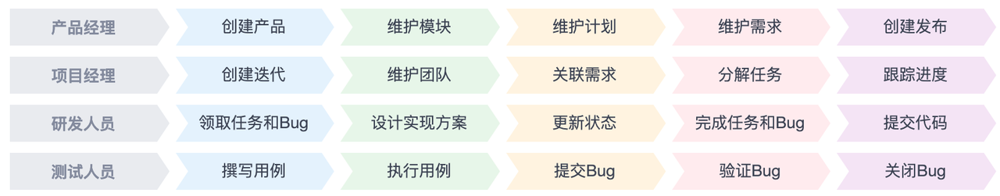
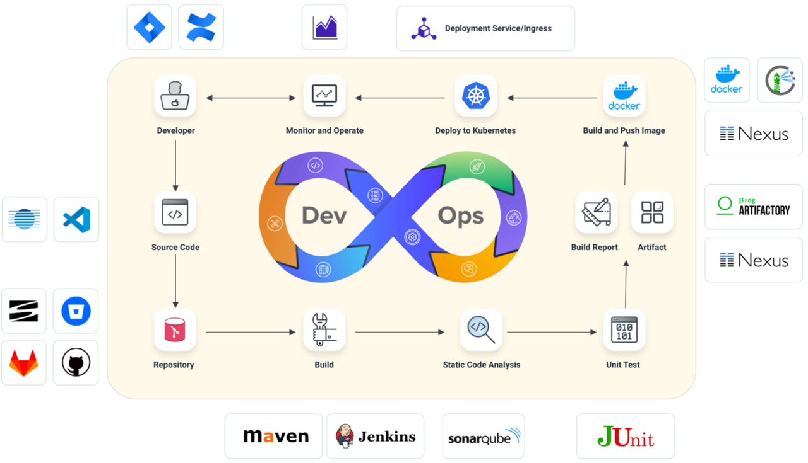
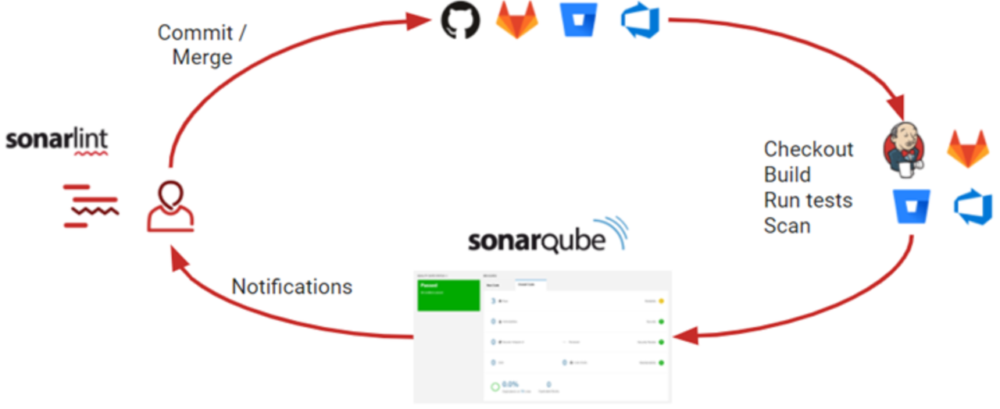
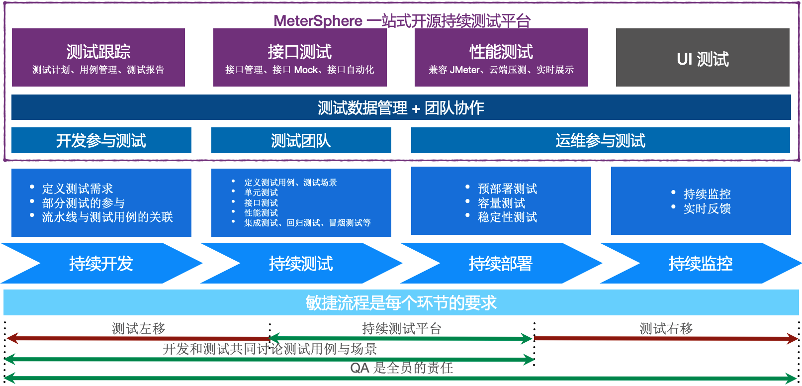

工具平台
============= 

- [工具平台](#工具平台)
    - [（一）产品准备期](#（一）产品准备期)
      - [1. 需求及研发任务管理：禅道或Jira](#1需求及研发任务管理：禅道或jira)
    - [（二）产品交付期](#（二）产品交付期)
      - [1. 部署流水线：KubeSphere](#1部署流水线：kubesphere)
      - [2.  CI&CD 系统：Jenkins](#2-ci-cd系统：jenkins)
      - [3. 代码质量管理：SonarQube](#3代码质量管理：sonarqube)
        - [2.1 多语言支持](#2-1多语言支持)
        - [2.2 七个维度检测代码质量](#2-2七个维度检测代码质量)
        - [2.3 执行流程](#2-3执行流程)
      - [4. 持续测试平台：MeterSphere](#4持续测试平台：metersphere)
      - [5. 容器镜像制品库：Harbor](#5容器镜像制品库：harbor)
        - [让镜像分发更高效](#让镜像分发更高效)
        - [让镜像分发更安全](#让镜像分发更安全)
        - [优雅的资源清理和垃圾回收](#优雅的资源清理和垃圾回收)
        - [多种HA方案](#多种ha方案)
    - [(三）产品运营期](#三）产品运营期)
       - [1. 服务器及应用监控：KubeSphere + Prometheus + 公有云自带](#1服务器及应用监控：kubesphere-prometheus-公有云自带)
      - [2. 业务监控及运营：自研智能运营分析系统](#2业务监控及运营：自研智能运营分析系统)

### （一）产品准备期
#### 1. 需求及研发任务管理：[禅道](https://www.zentao.net/)或[Jira](https://www.atlassian.com/zh/software/jira)

图 需求及研发任务管理

禅道的核心功能呈现的是一种软件工程思想，最终是为了管理优化研发过程，保证团队/每个人的工作能够按时保质完成。

### （二）产品交付期
#### 1. 部署流水线：[KubeSphere](https://kubesphere.com.cn/)
自动检出 (Checkout) 代码、测试、分析、构建、部署并发布

图 KubeSphere

#### 2.  CI&CD 系统：[Jenkins](https://www.jenkins.io/zh/)
Jenkins是一款开源 CI&CD 软件，用于自动化各种任务，包括构建、测试和部署软件。

#### 3. 代码质量管理：[SonarQube](https://www.sonarqube.org/)
##### 3.1 多语言支持
Java、Kotlin、Objective-C、JavaScript、CSS、C/C++、Go……
##### 3.2 七个维度检测代码质量
- **复杂度分布(complexity)**：代码复杂度过高将难以理解
- **重复代码(duplications)**：程序中包含大量复制、粘贴的代码而导致代码臃肿，sonar可以展示源码中重复严重的地方
- **单元测试统计(unit tests)**：统计并展示单元测试覆盖率，开发或测试可以清楚测试代码的覆盖情况
- **代码规则检查(coding rules)**：通过Findbugs, PMD, CheckStyle等检查代码是否符合规范
- **注释率(comments)**：若代码注释过少，特别是人员变动后，其他人接手比较难接手；若过多，又不利于阅读
- **潜在的Bug(potential bugs)**：通过Findbugs,PMD,CheckStyle等检测潜在的bug
- **结构与设计(architecture & design)**：找出循环，展示包与包、类与类之间的依赖、检查程序之间耦合度
##### 3.3 执行流程

图 sonar

- 用户本地使用IDE的插件进行代码分析
- 用户上传到源代码版本控制服务器
- 持续集成，使用Sonar Scanner进行扫描
- 将扫描结果上传到SonarQube服务器
- SonarQube server将结果写入db
- 用户通过web ui查看扫描结果
- SonarQube导出结果到其他需要的服务

#### 4. 持续测试平台：[MeterSphere](https://metersphere.io/)
MeterSphere是一站式的开源持续测试平台，涵盖测试跟踪、接口测试、UI 测试和性能测试等功能，全面兼容 JMeter、Selenium 等主流开源标准，有效助力开发和测试团队充分利用云弹性进行高度可扩展的自动化测试，加速高质量的软件交付。

图 meterSphere

#### 5. 容器镜像制品库：[Harbor](https://goharbor.io/)
Harbor 是一个用于存储和分发Docker镜像的企业级Registry服务器，由vmware开源，是一个可信的云原生制品仓库，用来存储、签名、管理相关的内容。
##### 让镜像分发更高效

（1）基于策略的内容复制机制
Harbor支持多种过滤器（镜像库、标签等）与多种触发模式（手动、定时等）来实现镜像的推送和拉取。

（2）提供项目级别的缓存能力

（3）可以使用P2P进行镜像预热
##### 让镜像分发更安全

（1）对镜像进行签名

（2）对镜像进行漏洞扫描

（3）通过策略限制不安全镜像分发

（4）通过规则来限制Tag不被覆盖或删除
##### 优雅的资源清理和垃圾回收
（1）可以通过策略保留需要的TAG
（2）可以通过垃圾清理来释放空间
##### 多种HA方案

（1）基于内容复制能力的HA

（2）基于外部共享服务的HA

（3）在Kubernetes集群中的多实例HA

（4）Harbor Operator基于Kubernetes的all-in-one HA

（5）多数据中心的HA

### (三）产品运营期
#### 1. 服务器及应用监控：[KubeSphere](https://kubesphere.com.cn/) + [Prometheus](https://prometheus.io/) + 公有云自带

#### 2. 业务监控及运营：自研智能运营分析系统
