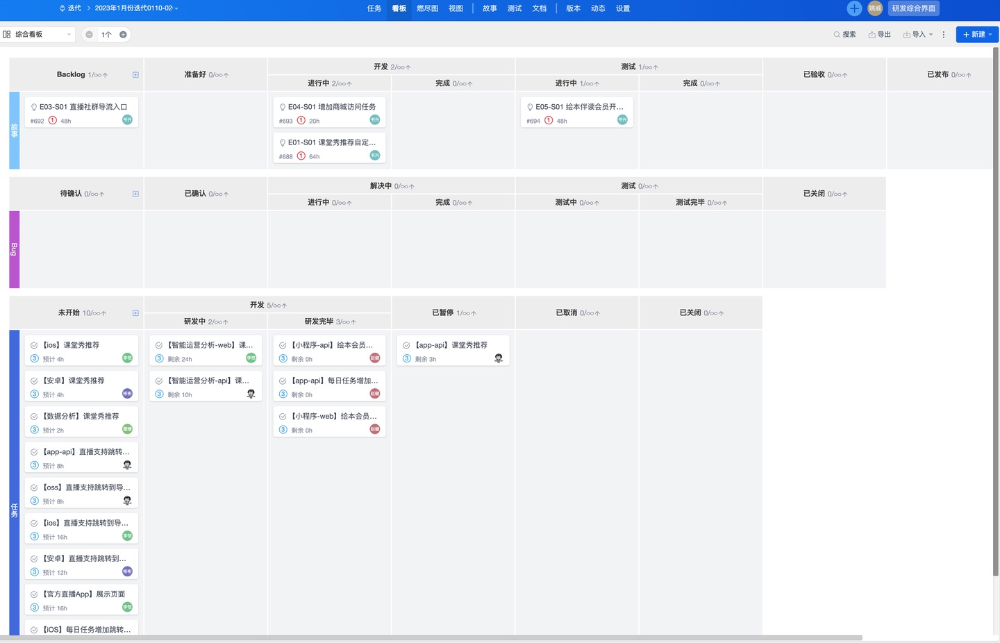
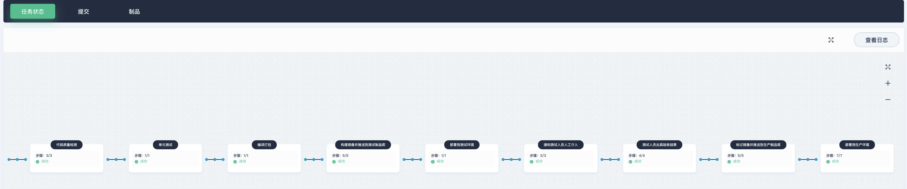
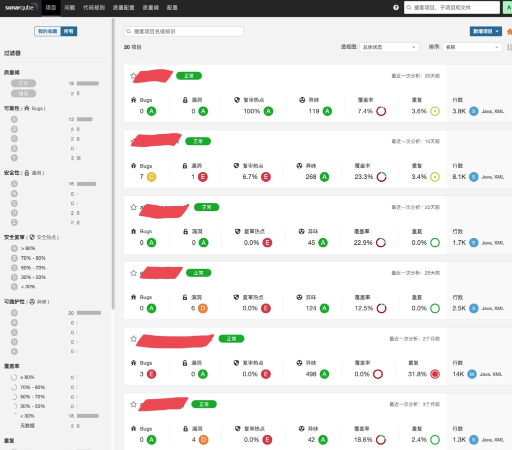
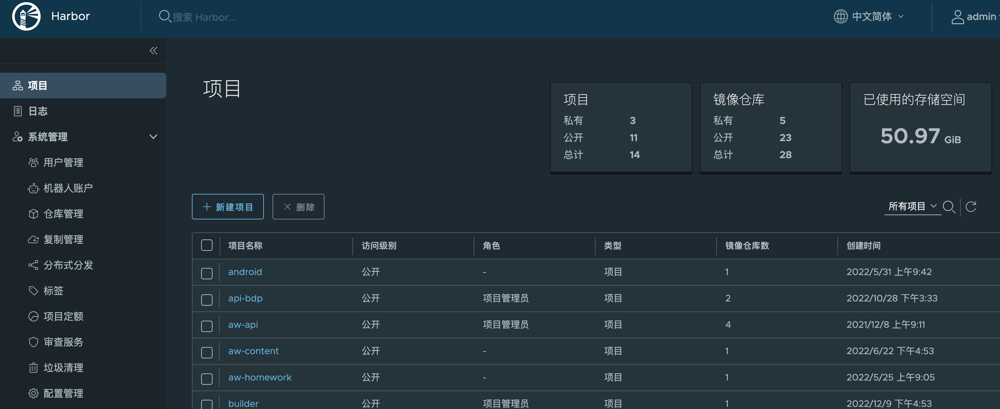
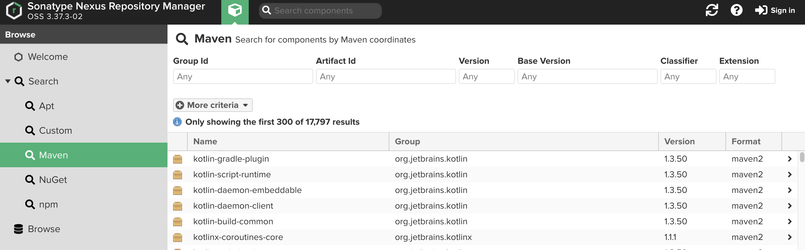

工具平台
============= 

### （一）产品准备期
#### 1. 需求及研发任务管理：[禅道](https://www.zentao.net/) 或 [Jira](https://www.atlassian.com/zh/software/jira)

图 需求及研发任务管理

禅道的核心功能呈现的是一种软件工程思想，最终是为了管理优化研发过程，保证团队/每个人的工作能够按时保质完成。

图 看板图例

### （二）产品交付期
#### 1. 部署流水线：[KubeSphere](https://kubesphere.com.cn/)
自动检出 (Checkout) 代码、测试、分析、构建、部署并发布

图 KubeSphere

#### 2.  CI&CD 系统：[Jenkins](https://www.jenkins.io/zh/)
Jenkins是一款开源 CI&CD 软件，用于自动化各种任务，包括构建、测试和部署软件。与 KubeSphere 集成实现部署流水线。

图 流水线图例

#### 3. 代码质量管理：[SonarQube](https://www.sonarqube.org/)
SonarQube 是一个静态代码分析平台，用来持续分析和评测代码的质量，支持检测 Java、JavaScript、C#、C、C++ 等二十几种编程语言。通过 SonarQube 可以检测出项目中潜在的**Bug、漏洞、代码规范、重复代码、缺乏单元测试的代码**等问题，并提供了 UI 界面进行查看和管理。
##### 3.1 SonarQube 简介
1. 代码质量的安全扫描和分析平台。
2. 多维度分析代码：代码量、安全隐患、编写规范隐患、重复度、复杂度、代码增量、测试覆盖率等。
3. 支持多种编程语言的代码扫描和分析，包含java、python、C#、javascript、go、C++等。
4. 涵盖了编程语言的静态扫描规则：代码编写规范+安全规范。
5. 能够与代码编辑器、CI/CD平台完美集成。
6. 能够与SCM（Source Control Management 源代码管理工具）集成，可以直接在平台上看到代码问题是由哪位开发人员提交。

##### 3.2 执行流程

图 sonar 执行流程

- 用户本地使用IDE的插件进行代码分析
- 用户上传到源代码版本控制服务器
- 持续集成，使用Sonar Scanner进行扫描
- 将扫描结果上传到SonarQube服务器
- SonarQube server将结果写入db
- 用户通过web ui查看扫描结果
- SonarQube导出结果到其他需要的服务

图 sonar图例

#### 4. 持续测试平台：[MeterSphere](https://metersphere.io/)
MeterSphere是一站式的开源持续测试平台，涵盖测试跟踪、接口测试、UI 测试和性能测试等功能，全面兼容 JMeter、Selenium 等主流开源标准，有效助力开发和测试团队充分利用云弹性进行高度可扩展的自动化测试，加速高质量的软件交付。

图 meterSphere

#### 5. 制品库
##### （1）容器镜像制品库：[Harbor](https://goharbor.io/)
Harbor 是由 VMware 开源的一款云原生制品仓库，Harbor 的核心功能是存储和管理 Artifact。Harbor 允许用户用命令行工具对容器镜像及其他 Artifact 进行推送和拉取，并提供了图形管理界面帮助用户查看和管理这些 Artifact。在 Harbor 2.0 版本中，除**容器镜像**外，Harbor 对符合 OCI 规范的 Helm Chart、CNAB、OPA Bundle 等都提供了更多的支持。

图 Harbor图例

##### （2）Nexus 制品库：[Nexus](https://help.sonatype.com/docs)
Nexus是一个存储库管理器，可存储和检索制品。它极大地简化了本地内部仓库的维护和外部仓库的访问，支持管理Maven、npm、NuGet、Yum、PyPI 等工具包。（新版本的 Nexus3.x 全面支持 Docker 的私有镜像存储。）

图 Nexus图例

### (三）产品运营期
#### 1. 服务器及应用监控
[KubeSphere](https://kubesphere.com.cn/) + [Prometheus](https://prometheus.io/) + 公有云自有监控组件

#### 2. 业务监控及运营：
自研《智能运营分析系统》
