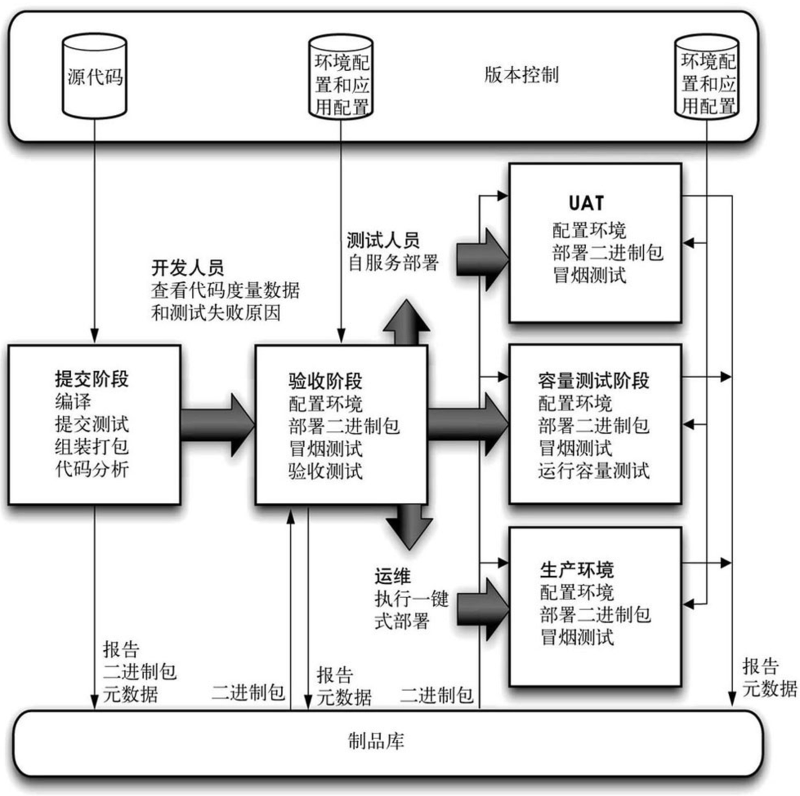

DevOps文化
=============
- [DevOps文化](#devops文化)
    - [DevOps的组织文化](#devops的组织文化)
      - [1.交付“价值”](#1交付“价值”)
      - [2. 允许失败、获得反馈、持续改善](#2允许失败、获得反馈、持续改善)
      - [3. 持续学习、彼此信任](#3持续学习、彼此信任)
    - [DevOps的研发文化](#devops的研发文化)
      - [目标：高质量、低风险地快速发布软件价值](#目标：高质量、低风险地快速发布软件价值)
      - [核心模式](#核心模式)
      - [核心原则](#核心原则)

###  DevOps的组织文化
#### 1.交付“价值”

**研发组织交付的不仅仅是可工作的软件，而是对企业的商业价值和对用户的需求价值**。
> 交付“价值”往往是绝大多数研发组织所没有意识到，或者消极地认为主导全权在于产品组织，自身对此完全不可控。其实在产品准备期（产品探索），研发组织应该参与进“业务需求协作管理”环节，和产品人员一起对业务目标进行理解（商业价值/用户价值）；进行业务领域角色与流程识别（用户故事），探索解决方案；进行重大风险识别与验证（可行性）；最后与产品人员精炼并达成最小可行方案的共识；并最终对最小可行解决方案进行初步的工作量与时间评估，制订相应的交付计划；然后再进入研发主导的产品交付期。
> 
>在这个过程中，研发组织不再是被动的任务接受者，而是核心的价值参与者。比如对于“用户想要快速达到目的地”的需求，产品组织限于专业技术认知也许只知道提供给客户一匹跑得更快的马，但是研发组织却可能已经具备了造汽车的技术。
>
>另外对于组织中的个体而言，当他们的个人目标和明确的价值紧密关联时，他们会更有激情和干劲，也会对工作的全貌有深刻的理解，知道各个不同部分是如何互动工作的，从而能主动改善工作。
>
#### 2. 允许失败、获得反馈、持续改善
**虽然无法保证每个方案、每个探索活动、每个流程动作都会获得成功。但是，我们可以获得反馈，从失败中学习，从而构建安全、可靠的工作体系。**
>在常见的管理文化中，对失败的恐惧常常笼罩在每个人身上，所以经常出现对责任的推脱、争执情况，让团队趋于保守；也造成了整个研发流程的黑盒化，造成了潜在的隐患。作为研发管理者需要让高层管理，同级协作组织意识到错误是事物演变过程中的自然连带部分，打造允许犯错，但不容忍罔顾教训、一错再错的文化.
>
#### 3. 持续学习、彼此信任
**我们要打造出一种教学相长的学习方式和高度信任的文化，并将对组织的改进和创新作为日常工作的一部分**。
>不论是通过传统的说教方式（如上课、培训），还是通过更具实验性或开放式的方法（例如会议、工作坊、指导），动态的学习文化都不仅能为每个人创造学习条件，还能创造教学的机会。我们可以投入专门的组织时间来促进这种教和学。
>

### DevOps的研发文化
**DevOps的研发文化也就是“持续交付”文化**
#### 目标：高质量、低风险地快速发布软件价值
部署流水线是指软件从版本控制库到用户手中这一过程的自动化表现形式。

图 部署流水线

#### 核心模式
部署流水线
#### 核心原则
  - **质量内建**；
    - 测试前置，在产品准备期的“业务需求协作管理”环节，便需要梳理出测试用例，确定产品交付标准以及指导代码编写；
    - 在部署流水线的整个环节进行自动化的单元测试、组件测试、集成测试等；
    - 测试也不纯粹或主要是测试人员的领域。交付团队的每个人都应该对产品的质量负责。
  - **小批量开发**；
  - **尽可能将所有事情自动化**，让计算机做重复的事情，而人来解决问题；
  - **可度量，持续不断且不遗余力地改进**；
>对于工作过程、工作成果、组织能力而言……，可度量才可以知道差距和改进的方向
>
  - **交付是所有人的责任**。