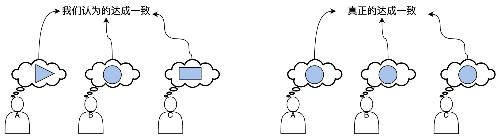
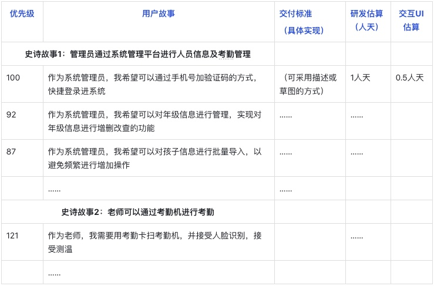

一、产品准备期
=============
- [一、产品准备期](#一、产品准备期)
    - [0.业务需求协作管理](#0业务需求协作管理)
    - [1.需求拆分（产品组织主导）](#1需求拆分（产品组织主导）)
      - [1.1 需求拆分的好处](#1-1需求拆分的好处)
      - [1.2 需求拆分的方法](#1-2需求拆分的方法)
        - [1.2.1 以用户故事进行需求拆分](#1-2-1以用户故事进行需求拆分)
        - [1.2.2 用户故事的拆分原则（INVEST）](#1-2-2用户故事的拆分原则（-invest）)
    - [2. 研发准备工作（研发组织）](#2研发准备工作（研发组织）)
      - [2.1 研发任务拆分](#2-1研发任务拆分)
      - [2.2 测试用例编写](#2-2测试用例编写)
      - [2.3 系统架构梳理](#2-3系统架构梳理)
        - [2.3.1 架构的设计原则](#2-3-1架构的设计原则)
        - [2.3.2 涉及遗留架构的改造策略](#2-3-2涉及遗留架构的改造策略)

**产品准备期主要是做“业务需求协作管理”工作，关键决策点是确定产品的最小可行化解决方案，并且要有交付时间和交付标准的约束**。

## 业务需求协作管理
1. **业务目标阐述与理解**：通过产品人员了解此次产品迭代的商业价值/用户价值，以及相关的业务上下文。
2. **业务领域角色与流程识别，及解决方案的探索**：共同讨论并识别该业务问题所涉及的主要业务流程与流程中的业务角色，并找到尽可能多的解决方案。 
3. **重大风险识别与验证**：识别方案中的业务与技术风险，并且组织人员对那些影响决策的重大风险进行快速验证。 
4. **精炼并达成最小可行方案共识**：从多种解决方案中挑选并确定最小可行解决方案。 
5. **评估与计划** :对最小可行解决方案进行交付标准、初步的工作量与时间评估，制订相应的交付计划。

### 1.需求拆分（产品组织来主导）
在产品准备期，对于产品人员其中一项重要工作是对需求进行详细拆分，拆分后的细粒度需求可以让研发团队更早地进行集成和质量验证工作，及时发现潜在的问题与缺陷，并在每个迭代结束时都能够交付包含相应功能的可工作软件。 
#### 1.1 需求拆分的好处
- **建立共识，协调工作**

图 建立共识

- **小批量交付，加速价值流动**
- **低成本拥抱变化**
>在分批交付过程上，一旦在开发过程中遇到突发情况（例如市场需求发生了变化，需要插入更高优先级的需求），团队可以快速将手中的任务完成（或放弃），然后投入新插入的高优先级需求。 
- **多次快速集成，及时反馈质量**

#### 1.2 需求拆分的方法
##### 1.2.1 以用户故事进行需求拆分
用户故事是基于用户场景、站在用户的视角和立场上对需求的拆分，能更好的的体现用户的真实需求。
>**样例**
>1. 图中有两个史诗级故事，每个史诗级故事包括多个用户故事（需求拆分）。 
>2. 每个用户故事都是按照“作为一个**，我希望可以……”的格式书写。 
>3. 每个用户故事都有一个业务优先级。 
>

图 用户故事图示

##### 1.2.2 用户故事的拆分原则（INVEST）
- **independent（独立）**：用户故事必须彼此独立，低耦合。 
- **negotiable（可协商）**：用户故事的内容是可以协商的，以便找到更好的需求满足方式。
- **valuable（有价值）**：用户故事对用户或客户来讲必须是重要的，有价值的。 
- **estimable（可估算）**：开发团队必须能够估算完成用户故事所需的工作量。 
- **small（短小）**：用户故事必须足够小，尽可能要在一个迭代内完成。
- **testable（可验证）**：用户故事必须是可以被验证的，以便确认其完成度。

### 2. 研发准备工作（研发组织）
#### 2.1 研发任务拆分

图 研发任务拆分

如图所示进行开发任务拆分，一个故事可能有一个或多个开发任务构成，任务拆分后进入交付过程看板管理。
> **基于用户故事拆任务的意义：**
> 
> 1、改变研发人员的底层思维，以用户为中心，以交付价值为目标而非交付功能。其实这也是做人做事的思维，行有价值的事，做有价值的人，免做无用功。
> 
> 2、基于每一个用户故事都有交付标准和用例，可以进行持续交付和持续测试，把测试过程并行化，而不是最后一股脑的塞给测试。
> 
> 3、即使节点结束有未完成的用户故事，已完成的用户故事也可以作为价值进行交付。

#### 2.2 测试用例编写
采用TDD（测试驱动开发）的理念，在这个阶段进行测试用例的编写，一方面可以确定交付物的质量标准，另外可以指导研发人员的代码编写。

#### 2.3 系统架构梳理
##### 2.3.1 架构的设计原则
- 为测试而设计；
- 为部署而设计；
- 为监控而设计；
- 为扩展而设计
>这里的扩展性指两个方面，一是支持团队成员规模的扩展；二是支持系统自身的扩展
- 为失效而设计。
##### 2.3.2 涉及遗留架构的改造策略
- 拆迁者模式：一次性重写所有代码。
>不建议使用
- 绞杀者模式：不改变或少改变原有遗留系统，而通过增加新的服务（新的服务用新架构）来不断替代遗留系统的功能。
- 修缮者模式：通过迭代，对原有遗留系统进行逐步改造，同时开发新的功能。
>建议使用“绞杀者模式”、“修缮者模式”

&nbsp;

[ 下一章节：《产品交付期》 ](./产品交付期.md)