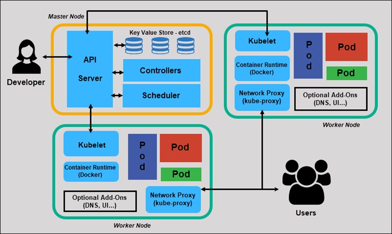

kubernetes 概述
=============
- [kubernetes 概述](#kubernetes概述)
  - [一、kubernetes 基本介绍](#一、kubernetes基本介绍)
  - [二、kubernetes 功能和架构](#二、kubernetes功能和架构)
    - [2.1 kubernetes 功能简介](#2-1-kubernetes功能简介)
    - [2.2 kubernetes 集群架构](#2-2-kubernetes集群架构)
  - [三、kubernetes的核心概念：API对象](#三、kubernetes的核心概念：api对象)
    - [节点（Node）](#节点（node）)
    - [Pod](#pod)
    - [副本控制器（Replication Controller，RC）](#副本控制器（replication-controller，rc）)
    - [副本集（Replica Set，RS）](#副本集（replica-set，rs）)
    - [部署（Deployment）](#部署（deployment）)
    - [服务（Service）](#服务（service）)
    - [自动缩扩容（HPA HorizontalPodAutoscaling）](#自动缩扩容（hpa-horizontalpodautoscaling）)
    - [任务（Job）](#任务（job）)
    - [定时任务（Cron Job）](#定时任务（cron-job）)
    - [有状态服务集（StatefulSet）](#有状态服务集（statefulset）)
    - [后台守护服务集（DaemonSet）](#后台守护服务集（daemonset）)
    - [存储卷（Volume）](#存储卷（volume）)
    - [持久存储卷（Persistent Volume，PV）](#持久存储卷（persistent-volume，pv）)
    - [持久存储卷声明（Persistent Volume Claim，PVC）](#持久存储卷声明（persistent-volume-claim，pvc）)
    - [密钥（Secret）](#密钥（secret）)
    - [ConfigMap](#configmap)
    - [命名空间（Namespace）](#命名空间（namespace）)
    - [基于角色的访问控制（RBAC Role-Based Access Control）](#基于角色的访问控制（rbac-role-based-access-control）)
    - [存活探针（liveness probe）](#存活探针（liveness-probe）)
    - [就绪探针（readiness probe）](#就绪探针（readiness-probe）)
    - [集群联邦（Federation）](#集群联邦（federation）)
  - [四、总结](#四、总结)
  - [参考资料](#参考资料)


## 一、kubernetes 基本介绍
* Kubernetes是Google开源的一个容器编排引擎，提供了⾯向应⽤的容器集群部署和管理。
* Kubernetes的⽬标旨在消除编排物理/虚拟计算，⽹络和存储基础设施的负担，并使应⽤程序运营商和开发⼈员完全将重点放在以容器为中⼼的原语上进⾏⾃助运营。
* Kubernetes也提供稳定、兼容的基础（平台），⽤于构建定制化的工作流和更⾼级的⾃动化任务。 
## 二、kubernetes 功能和架构
### 2.1 kubernetes 功能简介
Kubernetes具备完善的集群管理能⼒，包括多层次的安全防护和准⼊机制、多租户应⽤⽀撑能⼒、透明的服务注册和服务发现机制、内建负载均衡器、故障发现和⾃我修复能⼒、服务滚动升级和在线扩容、可扩展的资源⾃动调度机制、多粒度的资源配额管理能⼒。Kubernetes还提供完善的管理⼯具，涵盖开发、部署测试、运维监控等各个环节。
* **服务发现和负载均衡**

Kubernetes 可以使用DNS或IP地址来暴露容器，并且使用负载均衡机制平衡网络流量。
* **存储编排**

Kubernetes 允许我们挂载自选存储系统，例如本地存储、公共云存储等。
* **自动部署和回滚容器**

我们可以指定期望的容器部署状态（如缩扩容），Kubernetes 可以自动化的达成和调整我们所期望的容器部署状态。
* **资源的自动调度**

Kubernetes 允许我们指定每个容器所需的 CPU 和内存（RAM）。自动化的为容器分配期望的资源。
* **自我修复**

Kubernetes 将重新启动失败的容器、替换容器、杀死不响应用户定义的运行状况检查的容器，并且在准备好服务之前不将其通告给客户端。

* **密钥与配置管理**

Kubernetes 允许我们存储和管理敏感信息，例如密码、OAuth 令牌和 ssh 密钥。 我们可以在不重建容器镜像的情况下部署和更新密钥和应用程序配置，也无需在堆栈配置中暴露密钥。


### 2.2 kubernetes 集群架构

<p align="center">图 kubernetes集群架构（来源于网络）</p>

* **Master**：是集群控制节点（包含控制平面相关组件），对集群进行调度管理，接受集群外用户去集群操作请求
    * **etcd**：兼顾一致性与高可用性的键值数据库，可以作为保存 Kubernetes 所有集群数据的后台数据库； 
    * **kube-apiserver**：提供了资源操作的唯⼀⼊⼝，并提供认证、授权、访问控制、API注册和发现等机制； 
    * **kube-scheduler**：负责资源的调度，按照预定的调度策略将Pod调度到相应的机器上；
    * **kube-controller-manager**：负责维护集群的状态，维持副本期望数目，⽐如故障检测、⾃动扩展、滚动更新等；
        * **节点控制器（Node Controller）**：负责在节点出现故障时进行通知和响应；
        * **任务控制器（Job Controller）**：监测代表一次性任务的 Job 对象，然后创建 Pods 来运行这些任务直至完成；
        * **端点控制器（Endpoints Controller）**：填充端点（Endpoints）对象（即加入 Service 与 Pod） ；
        * **服务帐户和令牌控制器（Service Account & Token Controllers）**：为新的命名空间创建默认帐户和 API 访问令牌；
    * **cloud-controller-manager**：是指嵌入特定云的控制逻辑的控制平面组件，允许你将你的集群连接到云提供商的API之上。
        * **节点控制器（Node Controller）**：用于在节点终止响应后检查云提供商以确定节点是否已被删除；
        * **路由控制器（Route Controller）**：用于在底层云基础架构中设置路由；
        * **服务控制器（Service Controller）**：用于创建、更新和删除云提供商负载均衡器

* **Worker Node** 集群工作节点，运行用户业务应用容器；
    * **kubelet**：负责维护容器的⽣命周期，同时也负责Volume（CSI 容器存储接口）和⽹络（CNI 容器网络接口）的管理；
    * **kube-proxy**：负责为 Service 提供 cluster 内部的服务发现和负载均衡；
    * **Container runtime**：负责镜像管理以及 Pod 和容器的真正运⾏（CRI 容器运行时接口），例如 Docker； 
 
* **其他插件**
    * **CoreDNS**：负责为整个集群提供 DNS 服务，可以为集群中的 SVC 创建一个域名IP的对应关系解析；
    * **Ingress Controller**：为服务提供外⽹⼊⼝，INGRESS 可以实现七层协议代理；
    * **Prometheus**：提供集群的资源监控能力； 
    * **Dashboard**：提供 Web 页面，给 kubernetes 集群提供一个 GUI 的访问管理系统； 
    * **Federation**：提供跨可⽤区的多 kubernetes 集群统一管理能力。

## 三、kubernetes的核心概念：API对象
API 对象是 Kubernetes 集群中的管理操作单元。Kubernetes 集群系统每⽀持⼀项新功能，引⼊⼀项新技术，⼀定会新引⼊对应的API对象，⽀持对该功能的管理操作。

Kubernetes对象是“**声明式 目标性记录**”：意味着对象创建后，Kubernetes 系统将不断工作以确保其达到我们所定义对象的期望状态（Desired State）。

操作 Kubernetes 对象，无论是创建、修改，或者删除，需要使用 Kubernetes API。 比如，当使用 kubectl 命令行接口（CLI）时，CLI 会调用必要的 Kubernetes API； 也可在程序中使用客户端库，来直接调用 Kubernetes API。

* 一个 Deployment 对象的 yaml 示例文件
```
apiVersion: apps/v1
kind: Deployment            # 说明创建资源对象的类型是 Deployment
metadata:
  name: nginx-deployment    # Deployment 的名称，全局唯一
spec:
  selector:                 # Deployment 对应的Pod标签，用来给Pod分类
    matchLabels:
      app: nginx
  replicas: 3               # Pod 副本的期待数量
  template:                 # Pod 模版，用这个模版来创建Pod
    metadata:
      labels:
        app: nginx          # Pod 副本的标签
    spec:
      containers:           # 容器定义部分
      - name: nginx
        image: nginx:1.14.2     # 容器对应的 DockerImage
        ports:
        - containerPort: 80     # 容器应用监听的端口号
```
* **apiVersion**：创建该对象所使用的 Kubernetes API 的版本

每个API对象都有3⼤类属性：元数据（metadata）、规约（spec）和状态（status）。
* **metadata**：是⽤来标识 API 对象的，包括一个 name 字符串、UID 和可选的 namespace；除此以外还有各种各样的标签labels⽤来标识和匹配不同的对象。
* **spec**：描述了⽤户期望Kubernetes集群中的分布式系统达到的理想状态（Desired State），例如⽤户可以指定对象 Deployment 运行3个 Pod 副本；
* **status**：描述了系统实际当前达到的状态 ，例如系统当前实际的 Pod 副本数为2；那么复制控制器当前的程序逻辑就是⾃动启动新的 Pod，争取达到副本数为3。

### 节点（Node）

Kubernetes集群中的计算能⼒由 Node 提供。Kubernetes 集群中的 Node 也就等同于Mesos 集群中的 Slave 节点，是所有 Pod 运⾏所在的⼯作主机，可以是物理机也可以是虚拟机。不论是物理机还是虚拟机，⼯作主机的统⼀特征是上⾯要运⾏ kubelet 管理节点上运⾏的容器。

### Pod
Pod 是 Kubernetes 的最重要的概念，是 kubernetes 系统中可以创建和管理的最小单元，是资源对象模型中由用户创建或部署的最小资源对象模型，也是在 kubernetes 上运行容器化应用的资源对象，其他的资源对象都是用来支撑或者扩展 Pod 对象功能的，比如控制器对象是用来管控 Pod 对象的，Service 或者 Ingress Gateway 资源对象是用来暴露 Pod 引用对象的，PersistentVolume 资源对象是用来为 Pod 提供存储等等，kubernetes 不会直接处理容器，而是 Pod，Pod 是由一个或多个 container 组成。

**（1）Pod vs 应用**

每个 Pod 都是应用的一个实例，有专用的 IP 

**（2）Pod vs 容器**

一个 Pod 中可以有多个容器，彼此间共享网络和存储资源，每个 Pod 中有一个 Pause 容器保存所有的容器状态，通过管理 pause 容器，达到管理 pod 中所有容器的效果

### 副本控制器（Replication Controller，RC）
当我们定义了一个 RC 并提交到 Kubernetes 集群中以后，Master 节点上的 Controller Manager 组件就得到通知， 定期检查系统中存活的 Pod，并确保目标 Pod 实例的数量刚好等于 RC 的预期值，如我们可以通过修改 RC 的副本 数量，来实现 Pod 的动态缩放功能。

例：``` kubectl scale rc nginx --replicas=5 ```

### 副本集（Replica Set，RS） 
ReplicaSet 跟 ReplicationController 没有本质的不同，只是名字不一样，并且 ReplicaSet 支持集合式的 selector（ReplicationController 仅支持等式）。 Kubernetes 官方强烈建议避免直接使用 ReplicaSet，而应该通过 Deployment 来创建 RS 和 Pod。由于 ReplicaSet 是 ReplicationController 的代替物，因此用法基本相同，唯一的区别在于 ReplicaSet 支持集合式的 selector。

### 部署（Deployment）
Deployment 为 Pod 和 ReplicaSet 提供了一个声明式定义 (declarative) 方法，用来替代以前的 Replication Controller 来方便的管理应用。典型的应用场景包括：
* 定义 Deployment 来创建 Pod 和 ReplicaSet 
* 滚动升级和回滚应用 
* 扩容和缩容 
* 暂停和继续 Deployment

### 服务（Service）
Service 是 Kubernetes 非常核心的概念，通过创建 Service，可以为一组具有相同功能的容器应用提供一个统一的入口地址，并且将请求负载分发到后端的各个容器应用上。

### 自动缩扩容（HPA HorizontalPodAutoscaling）
Horizontal Pod Autoscaling 仅适用于 Deployment 和 ReplicaSet ，在 V1 版本中仅⽀持根据 Pod 的 CPU 利⽤率扩缩容，在 v1alpha 版本中，⽀持根据内存和⽤户⾃定义的 metric 扩缩容。

### 任务（Job）
Job 负责批处理任务，即仅执行一次的任务，单 Pod 型任务有⼀个 Pod 成功就标志完成；多 Pod 任务保证有 N 个任务全部成功才标志完成；⼯作队列型任务根据应⽤确认的全局成功⽽标志成功。

### 定时任务（Cron Job）
管理基于时间的 Job，即： 
* 在给定时间点只运行一次 
* 周期性地在给定时间点运行

### 有状态服务集（StatefulSet）
StatefulSet 是为了解决有状态服务的问题（对应 Deployments 和 ReplicaSets 是为无状态服务而设计），其应用场景包括：
* 稳定的持久化存储，即 Pod 重新调度后还是能访问到相同的持久化数据，基于 PVC 来实现
* 稳定的网络标志，即 Pod 重新调度后其 PodName 和 HostName 不变，基于 Headless Service （即没有 Cluster IP 的 Service ）来实现
* 有序部署，有序扩展，即 Pod 是有顺序的，在部署或者扩展的时候要依据定义的顺序依次依次进行（即从 0 到 N-1，在下一个 Pod 运行之前所有之前的 Pod 必须都是 Running 和 Ready 状态）， 基于 init containers 来实现
* 有序收缩，有序删除（即从 N-1 到 0）

### 后台守护服务集（DaemonSet）
DaemonSet 确保全部（或者一些）Node 上运行一个此类 Pod。当有 Node 加入集群时，也会为他们新增一个此类 Pod 。当有 Node 从集群移除时，这些 Pod 也会被回收。删除 DaemonSet 将会删除它创建的所有 Pod

使用 DaemonSet 的一些典型用法：

* 运行集群存储 daemon，例如在每个 Node 上运行 glusterd、ceph。 
* 在每个 Node 上运行日志收集 daemon，例如 fluentd、logstash。 
* 在每个 Node 上运行监控 daemon，例如 Prometheus Node Exporter

### 存储卷（Volume）
Volume 是 Pod 中能够被多个容器访问的共享目录。Kubernetes 的 Volume 定义在 Pod 上， 它被一个 Pod 中的多个容器挂载到具体的文件目录下。Volume 与 Pod 的生命周期相同。

Kubernetes ⽀持⾮常多的存储卷类型，如公有云平台的存储，包括 AWS，Google 和Azure 云；⽀持多种分布式存储包括 GlusterFS 和 Ceph ；也⽀持较容易使⽤的主机本地⽬录 emptyDir, hostPath 和 NFS。

### 持久存储卷（Persistent Volume，PV）
PersistentVolume（PV）是集群中由管理员配置的一段网络存储。它是集群中的资源，就 像节点是集群资源一样。 PV 是容量插件，如 Volumes，但其生命周期独立于使用 PV 的任 何单个 pod。

### 持久存储卷声明（Persistent Volume Claim，PVC）
PersistentVolumeClaim（PVC）是由用户进行存储的请求，允许用户使用抽象存储资源。 它类似于 pod。 Pod 消耗节点资源，PVC 消耗 PV 资源。Pod 可以请求特定级别的资源（CPU 和内存）。声明可以请求特定的大小和访问模式（例如，可以一次读/写或多次只读）。

### 密钥（Secret）
Secret 是⽤来保存和传递密码、密钥、认证凭证这些敏感信息的对象。使⽤ Secret 的好处是可以避免把敏感信息明⽂写在配置⽂件⾥。在 Kubernetes 集群中配置和使⽤服务不可避免的要⽤到各种敏感信息实现登录、认证等功能。

Secret 有三种类型
* Service Account :用来访问 Kubernetes API,由 Kubernetes 自动创建，并且会自动挂载到 Pod 的 /run/secrets/kubernetes.io/serviceaccount 目录中
* Opaque : base64 编码格式的 Secret ,用来存储密码、密钥等
* kubernetes.io/dockerconfigjson ：用来存储私有 docker registry 的认证信息

### ConfigMap 
ConfigMap 功能在 Kubernetes1.2 版本中引入，许多应用程序会从配置文件、命令行参数或环境变量中读取配置信息。ConfigMap API 给我们提供了向容器中注入配置信息的机 制，ConfigMap 可以被用来保存单个属性，也可以用来保存整个配置文件或者 JSON 二进 制大对象。

### 命名空间（Namespace）
Namespace 在很多情况下用于实现多用户的资源隔离，通过将集群内部的资源对象分配到不同的 Namespace 中， 形成逻辑上的分组，便于不同的分组在共享使用整个集群的资源同时还能被分别管理。Kubernetes 集群在启动后，会创建一个名为"default"的 Namespace， 如果不特别指明 Namespace ，则用户创建的 Pod、RC、Service 都将被系统创建到这个默认的名为 default 的 Namespace 中。

### 基于角色的访问控制（RBAC Role-Based Access Control）
RBAC在 kubernetes v1.5 中引入，在 v1.6 版 本时升级为 Beta 版本，并成为 kubeadm 安装方式下的默认选项，相对于其他访问控制方式， 新的 RBAC 具有如下优势： 

（1）对集群中的资源和非资源权限均有完整的覆盖 

（2）整个 RBAC 完全由几个 API 对象完成，同其他 API 对象一样，可以用 kubectl 或 API 进行操作
 
（3）可以在运行时进行调整，无需重启 API Server 要使用 RBAC 授权模式，需要在 API Server 的启动参数中加上--authorization-mode=RBAC

### 存活探针（liveness probe）
用于判断容器是否存活，即 Pod 是否为 running 状态，如果 LivenessProbe 探针探测到容器不健康，则 kubelet 将 kill 掉容器，并根据容器的重启策略是否重启。kubernetes 提供 livenessProbe 来检测应用程序是否正常运行，并且对相应状况进行相应的补救措施。

### 就绪探针（readiness probe）
用于判断容器是否启动完成，即容器的 Ready 是否为 True，可以接收请求，如果 ReadinessProbe 探测失败，则容器的 Ready 将为 False，控制器将此 Pod 的 Endpoint 从对应的 service 的 Endpoint 列表中移除，从此不再将任何请求调度此 Pod 上，直到下次探测成功。通过使用 Readiness 探针，Kubernetes 能够等待应用程序完全启动，然后才允许服务将流量发送到新副本。

### 集群联邦（Federation）
Kubernetes 的设计定位是单⼀集群在同⼀个地域内，因为同⼀个地区的⽹络性能才能满⾜Kubernetes 的调度和计算存储连接要求。⽽联合集群服务就是为提供跨地区跨服务商Kubernetes 集群服务⽽设计的。（Kubernetes 在1.3版本以后）

## 四、总结
**Kubernetes 是一款用于管理容器化工作负载和服务的可移植、可扩展的开源平台，拥有庞大、快速发展的生态系统，它面向基础设施，将计算、网络、存储等资源进行紧密整合，为容器提供最佳运行环境，并面向应用提供封装好的、易用的工作负载与服务编排接口，以及运维所需的资源规格、弹性、运行参数、调度等配置管理接口，是新一代的云原生基础设施平台。**

## 参考资料
* <https://kubernetes.io/>
* <https://lib.jimmysong.io/>
* [【尚硅谷】Kubernetes（kubernetes）入门到实战教程](https://www.bilibili.com/video/BV1GT4y1A756?spm_id_from=333.1007.top_right_bar_window_custom_collection.content.click&vd_source=4e9c1efc93607bc946493aeb6aa7e795)
* [《七张图了解Kubernetes内部的架构》](https://xie.infoq.cn/article/b038313b4589a72937500068b)

