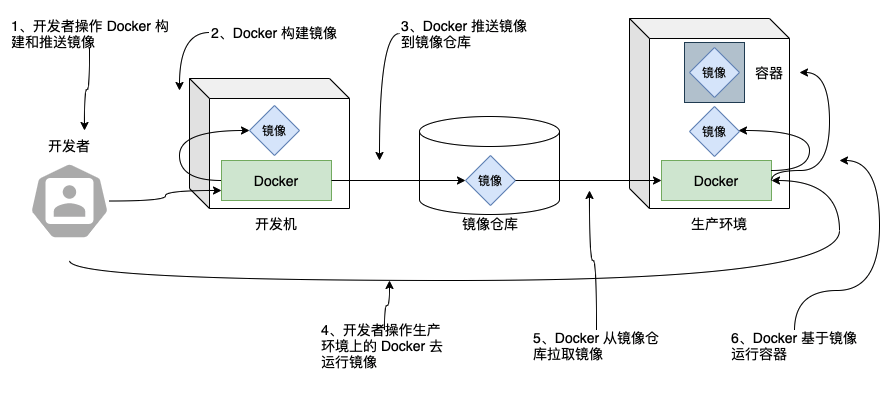
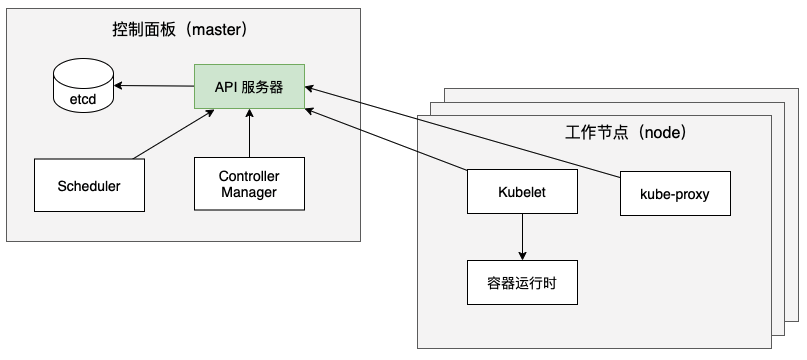
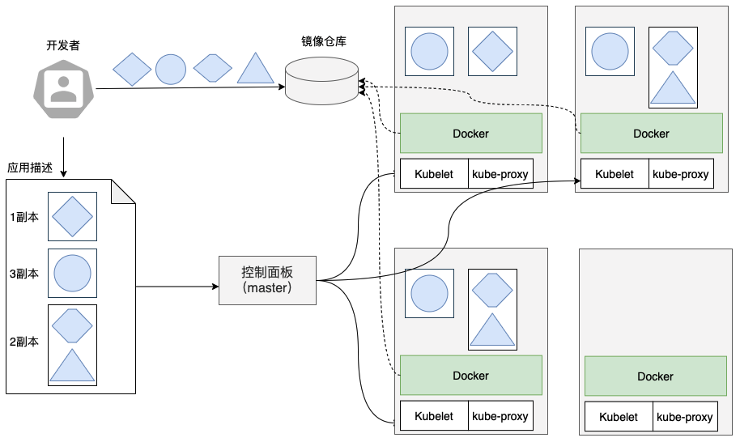

深入浅出了解 Kubernetes
=============

## 一、应用开发和部署的历史发展
#### 1. 过去的单体应用
* 以大型的单体应用实现业务需求，多以单个进程或几个进程的方式运行于几台服务器之上。
* 这些应用的开发、交付、上线周期长，很难适应频繁迭代的需求。

#### 2. 现在的微服务应用
如今，我们将大型的单体应用逐渐分解成小的、可独立运行的微服务组件。这些服务彼此之间解耦，从而可以被独立开发、部署、升级、伸缩。微服务的出现支撑了应用根据市场变化频繁迭代的需求。

#### 但是
在每个发布周期始终不变的是——开发者会把应用程序打好包后交付给运维团队，运维人员再处理部署、监控等事宜，过程中多以手动的方式参与处理种种运维问题，随着部署组件的增多和数据中心的增长，让整个应用集群正常运行变得越来越困难。另外，我们需要人工决定如何灵活部署组件来提高基础设施资源的利用率并降低成本。

#### 所以我们需要
自动化的设施来自动地处理应用的调度、配置、监管和故障管理。

#### Kubernetes 的出现
Kubernetes 使开发者可以在没有运维人员参与的情况下自主部署应用，控制部署的频率。同时，它能让运维团队监控整个系统，并且在出现 IaaS 故障时重新调度应用。SRE（网站/服务可靠性工程师）的工作重心，从监管应用转移到了监管 Kubernetes，监管系统资源，因为 Kubernetes 会帮助监管所有的应用。

### 简要概括 Kubernetes
Kubernetes 抽象了数据中心的基础设施，使其对外暴露为一个巨大的资源池。它让我们在部署和运行众多微服务应用时，不用关注底层的服务器。它自动会为每个组件都选择一个合适的服务器，部署之后它能够保证每个应用可以轻易地发现其他应用，并彼此之间实现通信。

Kubernetes 不仅可以用在企业私有（云）部署的场景下，也可以用在企业公有云部署的场景下，对于想“云厂商”企业，它更是提供给开发者一个可部署且可运行任何类型应用的简易化云平台。现在，越来越多的企业提出了支持私有部署、公有云部署、混合云部署的需求，而 Kubernetes 恰恰帮助企业标准化了无论是云端部署还是内部部署的应用交付方式。

#### 一些体会：
> 1、作为一个有过数年微服务编写、运维经历的工程师，我认为使用 Kubernetes 可以最大化增益微服务的可靠性及服务治理工作。
>  
> 2、作为一个有过数年在团队提倡和推行 DevOps 持续交付理念的技术管理者，在使用 Kubernetes 后才真正在团队落地了 DevOps 全流程。
> 
> 3、在这些过程中，我和团队还有一个更大的体会： Kubernetes 极大的提升了大家的研发效率并降低了诸多研发成本（开发成本、手工成本、时间成本），大大提升了我们幸福感。

## 二、容器技术
Kubernetes 使用 Linux 容器技术来提供应用的隔离，容器技术的了解，请参见文档 [《容器技术介绍》](../容器/容器技术介绍.md)

### Docker容器平台
虽然 Docker 不是唯一的容器技术平台，但它一定是当今最流行的准行业标准化容器平台。 Docker 是使容器能在不同机器之间移植的系统。 它不仅简化了打包应用的流程， 也简化了打包应用的库和依赖， 甚至整个操作系统的文件系统能被打包成一个简单的可移植的包， 这个包可以被用来在任何其他运行 Docker 的机器上使用。

如上所属，Docker 是一个打包、 分发和运行应用程序的平台。我们需要理解三个主要的概念：

* **镜像**——Docker 镜像里包含了我们打包的应用程序及其所依赖的环境。它也包含应用程序可用的文件系统和其他元数据，如镜像运行时的可执行文件路径。
* **镜像仓库**——Docker 镜像仓库用于存放 Docker 镜像，以及促进不同人和不同电脑之间共享这些镜像。当我们编译完镜像后，可以在编译它的电脑上运行，也可以先上传镜像到 一个镜像仓库，然后下载到其他台电脑上运行。某些仓库是公开的，比如[ dockerhub ](https://hub.docker.com/)，有些镜像仓库是私有的，比如我们基于[ Harbor ](https://goharbor.io/)搭建的企业自己的镜像仓库。
* **容器**—— Docker 容器通常是一个 Linux 容器，它基于 Docker 镜像被创建。 一个运行中的容器是一个运行在 Docker 主机上的进程，但它和主机，以及所有运行在主机上的其他进程都是隔离的。这个进程也是资源受限的，意味着它只能访问和使用分配给它的资源(CPU、 内存等）。
#### 构建、分发和运行 Dcoker 镜像

流程示意图 

## 三、了解 Kubernetes
Kubernetes 是一个软件系统，它允许我们在其上很容易地部署和管理容器化的应用。 它依赖于 Linux 容器的特性来运行异构应用，而无须知道这些应用的内部详情，也不需要手动将这些应用部署到每台机器 。

Kubernetes 使我们在众多服务器节点上运行应用时就像所有这些节点是单个大节点一样。它将底层基础设施抽象，同时简化了应用的开发、部署， 以及对开发和运维团队的管理。如下图所示：

 Kubernetes系统图 

Kubernetes 系统由一个主节点和若干个工作节点组成。开发者把一个应用列表提交到主节点， Kubernetes 会将它们部署到集群的工作节点，也包括了服务发现、扩容、负载均衡、自恢复等管理工作。组件被部署在哪个节点对于开发者和系统管理员来说都不用关心，Kubernetes 能在自动迁移应用并通过混合和匹配应用来获得比手动调度高很多的资源利用率。

可以明显看出，**Kubernetes 能够帮助开发者聚焦于应用的业务功能开发，帮助运维团队获取更高的资源利用率。**

### Kubernetes 集群架构
在硬件级别，一个 Kubernetes 集群由很多节点组成，这些节点被分成以下两种类型： 
* 主节点 ，它承载着 Kubernetes 控制和管理整个集群系统的控制面板 
* 工作节点， 它们运行用户实际部署的应用

 Kubernetes集群架构 

#### 控制面板
控制面板用于控制集群并使它工作。它包含多个组件，组件可以运行在单个主节点上或者通过副本分别部署在多个主节点以确保高可用性。
* **Kubernetes API 服务器**：我们和其他控制面板组件都要和它通信
* **Scheculer**，它调度我们的应用，为应用的每个部署分配一个工作节点
* **Controller Manager**，它执行集群级别的功能，如复制组件、持续跟踪工作节点、 处理节点失败等
* **etcd**，一个可靠的分布式数据存储，它能持久化存储集群的各种配置

#### 工作节点
工作节点是运行容器化应用的机器。运行、监控和管理应用服务的任务是由以下组件完成的：
* **kubelet**：它与 API 服务器通信， 并管理它所在节点的容器
* **kube-proxy（Kubernetes Service Proxy）**：负责组件之间的负载均衡网络流量
* **Container runtime**：负责镜像管理以及 Pod 和容器的真正运⾏（CRI 容器运行时接口），例如 Docker；

### 在 Kubernetes 中运行应用
在 Kubernetes 中运行应用，首先需要将应用打包进一个或多个容器镜像，再将那些镜像推送到镜像仓库，然后将应用的描述发布到 Kubernetes API 服务器。

 Kubernetes中运行应用 

#### 应用描述指明成为一个怎样的运行容器
如上图所示，应用描述符列出了四个容器，并将它们分为三组（这些集合被称为 pod）。 前两个 pod 只包含一个容器，而最后一个包含两个容器。这意味着两个容器需要协作运行。 在每个 pod 旁边的数字，表示需要并行运行的每个 pod 的副本数量。在向 Kubernetes 提交描述符之后，它将把每个 pod 的指定副本数量调度到可用的工作节点上。节点上的Kubelets 将告知 Docker 从镜像仓库中拉取容器镜像井运行容器。

#### 保障容器按照描述信息持续运行
一旦应用程序运行起来，Kubernetes 会不断地确认应用程序的部署状态始终与我们提供的描述相匹配。例如，上图中我们需要运行的3副本 pod 实例，Kubernetes 会总是保持正好运行3个实例。如果实例之一停止了正常工作，比如当进程崩溃或停止响应时，Kubernetes 将自动重启它。同样，如果所在工作节点本身死亡或无法访问， Kubernetes 将为在故障节点上运行的所有容器选择新节点，并在新选择的节点上运行它们。

#### 扩展副本数量
当应用程序运行时，可以决定要增加或减少副本量，而 Kubernetes 将分别增加附加的或停止多余的副本。甚至可以把决定最佳副本数目的工作交给 Kubernetes。它可以根据实时指标（如 CPU 负载、内存消耗、或自定义应用指标）自动调整副本数。

#### 如何在容器发生位置变化时找到目标
为了让客户端能够轻松地找到提供特定服务的容器，可以告诉 Kubernetes 哪些容器提供相同的服务，而 Kubernetes 将通过一个静态 IP 地址暴露所有容器，并将该地址暴露给集群中运行的所有应用程序。这是通过环境变量完成的，但客户端也可以通过 DNS 查找服务 IP。kube-proxy 将确保到服务的连接可跨提供服务的容器实现负载均衡。由于服务的 IP 地址保持不变，因此客户端始终可以连接到它的容器，即使它们在集群发生位置或规模变化。

## 四、使用 Kubernetes 带来了哪些好处
从上面的分析中，可以看出使用 Kubernetes 后可以给我们带来的好处：
* 简化了应用程序的部署
* 更好的利用硬件（云服务器）资源
* 可进行应用的健康检查和自修复
* 能够实现服务的自动缩扩容

## 附：
参考书籍：《Kubernetes in Action》

