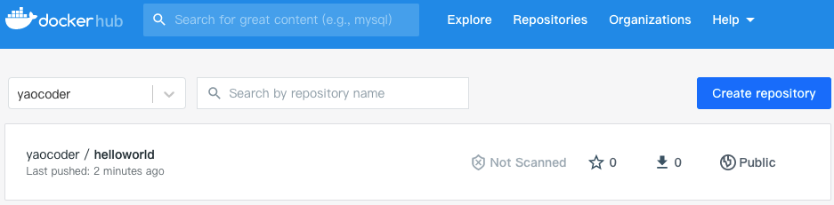

容器应用示例
=============
- [容器应用示例](#容器应用示例)
    - [1、创建一个简单的 “Hello world” python 应用](#1、创建一个简单的“-hello-world”-python应用)
    - [2、为镜像创建 Dockerfile](#2、为镜像创建-dockerfile)
    - [3、构建容器镜像](#3、构建容器镜像)
    - [4、运行容器镜像](#4、运行容器镜像)
    - [5、停止和删除容器](#5、停止和删除容器)
    - [6、向镜像仓库推送镜像](#6、向镜像仓库推送镜像)
    - [7、在其他机器上运行镜像](#7、在其他机器上运行镜像)
    - [附：Dockerfile命令](#附：dockerfile命令)


### 1、创建一个简单的 “Hello world” python 应用

```
from flask import Flask

app = Flask(__name__)

@app.route('/')
def hello_world():
    return 'Hello World!\n'

if __name__ == '__main__':
    app.run(host='0.0.0.0', port=80)
```

### 2、为镜像创建 Dockerfile

```
# 使用官方提供的 Python3 开发镜像作为基础镜像
FROM python:3

# 将工作目录切换至 /usr/src/app
WORKDIR /usr/src/app

# 使用 pip3 命令安装这个应用所需要的依赖
RUN pip3 install  --trusted-host pypi.python.org  Flask

# 将当前目录下的所有文件复制到 /usr/src/app
COPY . .

# 允许外界访问容器的80端口
EXPOSE 80

# 设置此应用的启动命令为python3 ./helloworld.py
CMD [ "python3", "./helloworld.py" ]
```

### 3、构建容器镜像
```
# docker build -t helloworld . 
```
基于当前目录（注意命令结尾的点）构建一个叫 helloworld 的镜像， Docker 会在目录中 寻找 Dockerfile， 然后基于其中的指令构建镜像。
> 查看本地的镜像
```
# docker images | grep helloworld 

REPOSITORY  TAG     IMAGE ID      CREATED       SIZE
helloworld  latest  094719b43011  4 hours ago   928MB

```
### 4、运行容器镜像
```
# docker run --name helloworld-container -p 3000:80 -d helloworld
```
基于 helloworld 镜像创建一个叫 helloworld-container 的新容器。这个容器与命令行分离 (-d标志），意味着在后台运行。本机上的3000端口会被映射到容器内的80端口(-p 3000:80）
> 测试
```
# curl localhost:3000/
Hello World!
```
> 列出运行中的容器
```
# docker ps 
# docker ps -a  查看所有容器，包括停止的
```
> 获取更多容器信息
```
# docker inspect helloworld-container
```
> 在容器内部运行 shell
```
# docker exec -it helloworld-container bash
root@9cbc6114f488:/usr/src/app# 
```
在运行中的 helloworld-container 容器内部运行bash
* -i，确保标准输入流保待开放。需要在 shell 中输入命令。
* -t，分配一个伪终端(TTY) 。
> 在容器中列出进程
> 在容器内部运行 shell
```
root@9cbc6114f488:/usr/src/app# ps aux
USER       PID %CPU %MEM    VSZ   RSS TTY      STAT START   TIME COMMAND
root         1  0.0  0.6 107116 24212 ?        Ss   12:06   0:00 python3 ./helloworld.py
root         9  0.0  0.0   5976  2076 pts/0    Ss   12:22   0:00 bash
root        16  0.0  0.0   8576  1628 pts/0    R+   12:27   0:00 ps aux
```

### 5、停止和删除容器
> 停止容器
```
# docker stop helloworld-container
```
> 删除容器
```
# docker rm helloworld-container
```

### 6、向镜像仓库推送镜像
为了在任何机器上都可以使用，把镜像推送到一个外部的镜像仓库（可以选择 Docker Hub http://hub.docker.com）作为公共的镜像中心。
> 在推送之前， 需要重新根据 Docker Hub 的规则标注镜像。 Docker Hub 允许向以自己的 Docker Hub ID 开头的镜像仓库推送镜像。 可以在 http://hub.docker.com 上注 册 Docker Hub ID。
```
# docker tag helloworld:latest yaocoder/helloworld
```
> 向 Docker Hub 推送镜像
```
# docker push yaocoder/helloworld
```
<div align=center>

</div>


### 7、在其他机器上运行镜像
```
docker run -p 3000:80 yaocoder/helloworld
```

### 附：Dockerfile命令
[《编写Dockerfile的常用命令》 ](./编写Dockerfile的常用命令.md)