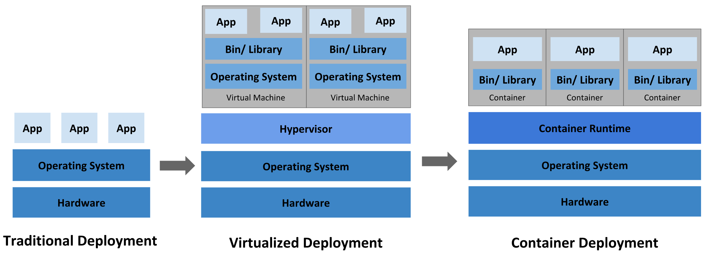

容器技术介绍
=============
- [容器技术介绍](#容器技术介绍)
    - [一、应用部署方式的历史回溯](#一、应用部署方式的历史回溯)
      - [1. 传统部署：](#1传统部署：)
      - [2. 虚拟化部署：](#2虚拟化部署：)
      - [3. 容器部署：](#3容器部署：)
    - [二、容器技术简介](#二、容器技术简介)
      - [1. 概述](#1概述)
      - [2. 使用容器开发和部署应用程序的好处](#2使用容器开发和部署应用程序的好处)
    - [三、容器管理引擎：Docker](#三、容器管理引擎：docker)
      - [1. Docker架构](#1-docker架构)
        - [1.1 核心概念](#1-1核心概念)
        - [1.2 图中示例](#1-2图中示例)
      - [2. Docker 的底层实现](#2-docker的底层实现)
        - [2.1 namespace](#2-1-namespace)
        - [2.2 cgroup](#2-2-cgroup)
      - [3. 实践学习](#3实践学习)

### 一、应用部署方式的历史回溯

图 应用部署方式演化

#### 1. 传统部署：
早期，我们在服务器上部署运行应用程序，会遇到两个比较常见的问题
- 由于无法限制在服务器中运行的应用程序资源使用，因此会导致多应用资源分配冲突或浪费的问题。
- 由于应用之间端口、版本、依赖资源等冲突问题，无法同一台服务器上部署运行有以上冲突的多个应用程序。
>例如，如果在服务器上运行多个应用程序， 则可能会出现一个应用程序占用大部分资源的情况，而导致其他应用程序的性能下降，造成了彼此间的互相影响； 一种解决方案是将每个应用程序都运行在不同的服务器上， 但是当某个应用程序资源利用率不高时，剩余资源便被浪费， 而且维护许多服务器的综合成本很高。
#### 2. 虚拟化部署：
在虚拟化技术被引入后，虚拟化技术允许我们在单个服务器的 CPU 上运行多台虚拟机（VM：每个 VM 都可被看做一台完整的服务器，在虚拟化硬件之上运行所有组件，包括其自己的操作系统），从而能使应用程序在不同 VM 之间被彼此隔离，不仅避免了资源冲突且能提供一定程度的安全性。另外，虚拟化技术能够更好地利用服务器的资源，具有更高的可伸缩性，以及降低硬件成本等等的好处。
#### 3. 容器部署：
容器类似于 VM，但是不同于 VM，容器的本质是进程（使用了 Namespace 做隔离，Cgroups 做限制， rootfs 做文件系统的特殊进程），容器之间可以共享操作系统内核；容器比起 VM 更加轻量。且与 VM 类似，每个容器都具有自己的文件系统、CPU、内存、进程空间等，可以跨云和操作系统发行版本进行移植。

### 二、容器技术简介
#### 1. 概述
- 容器是一种相对于虚拟机来说更加轻量的虚拟化技术，能为我们提供一种可移植、可重用的方式来打包、分发和运行应用程序。
- 容器的基本思想就是将需要执行的所有软件打包到一个可执行程序包。例如，将一个 Java 虚拟机、Tomcat 服务器以及应用程序本身打包进一个容器镜像。用户可以在基础设施环境中使用这个容器镜像启动容器并运行应用程序，还可以将以容器化运行的应用程序与基础设施环境隔离。
- 容器具有高度可移植性，用户可以轻松地在开发环境、测试环境、预发布环境或生产环境中运行相同的容器。
- 如果应用程序被设计为支持水平扩缩容，就可以根据当前业务的负载情况启动或停止容器的多个实例。
#### 2. 使用容器开发和部署应用程序的好处
- **应用程序的创建和部署过程更加敏捷**：与虚拟机镜像相比，使用应用程序的容器镜像更简便和高效。
- **可持续开发、集成和部署**：借助容器镜像的不可变性，可以快速更新或回滚容器镜像版本，进行可靠且频繁的容器镜像构建和部署。
- **提供环境一致性**：标准化的容器镜像可以保证开发、测试和生产环境的一致性，不必为不同环境的差别而苦恼。
- **提供应用程序的可移植性**：标准化的容器镜像可以保证应用程序运行于 Ubuntu 、CentOS  等各种 Linux 内核操作系统或云环境下。
- **为应用程序的松耦合架构提供基础设置**：应用程序可以被分解成更小的独立组件，可以很方便地进行组合和分发。资源利用率更高。
- **实现了资源隔离**：容器应用程序与主机之间的隔离、容器应用程序之间的隔离可以为运行应用程序提供一定的安全保证。

### 三、容器管理引擎：Docker
Docker 是一个开源的应用容器引擎，实现了上述的容器功能效果，Docker 可以让开发者打包他们的应用以及依赖包到一个轻量级、可移植的容器中，然后发布到任何流行的 Linux 机器上，也可以实现虚拟化。
>Docker项目只是容器技术的其中一种实现，因为它是管理容器的最流行的工具，所以成为了容器技术的代名词，其他著名的容器工具还包括：rkt, Podman，LXC，containerd，Buildah 等。

#### 1. Docker架构

图 docker架构示意图

##### 1.1 核心概念
- **镜像（Image）**：Docker镜像里包含了打包的应用程序及其所依赖的环境、可用的文件系统和其他元数据。
- **容器（Container）**：类似于一个轻量级的沙盒，可以将其看作一个极简的 Linux 系统环境（包括 root 权限、进程空间、用户空间和网络空间等）。基于 Docker 镜像被创建，镜像是静态的定义，容器是镜像运行时的实体；容器可以被创建、启动、停止、删除、暂停等。
- **仓库（Repository）**：Docker 镜像仓库用于存放 Docker 镜像，以促进不同人和不同电脑之间共享这些镜像。可以上传镜像到一个镜像仓库，然后下载到另外一台电脑上并 运行它。
>Docker Hub 是一个 Docker 官方维护的公共仓库, Docker 默认从 Docker Hub 来查找镜像。我们也可以维护自己私有的镜像托管服务。
- **Docker daemon**：Docker daemon ( dockerd )监听 Docker API 请求并管理 Docker 对象，如镜像、容器、网络和卷。 
> 例如：接收并处理 docker client 发送的请求。daemon 在后台启动一个server，server 负责接受docker client 发送的请求；接受请求后，server 通过路由与分发调度，找到相应的 handler 来执行请求。
- **Docker client**：Docker client ( docker )通过命令行或者其他工具使用 Docker API/SDK与 Docker daemon 通信。例如：当使用docker run 命令时，Docker client 将其发送到 dockerd 来实现相应的功能。Docker client 可以与多个 Docker daemon 进行交互。
##### 1.2 图中示例
- 我们编写好Dockerfile文件后，通过在 Docker client 中发送 docker build <Dockerfile>  命令至 Docker daemon，Docker daemon 根据dockerfile 构建出 image。
- 接下来使用命令 docker run <image>  ，Docker daemon 接收到该指令后运行image，运行起来的 image 就是 Container。
- 我们还可以使用命令 docker pull <image> ，docker daemon 接收到该指令后向docker registry 发送该 image 下载请求，下载后存放在本地，这样我们就可以使用 image 了。

#### 2. Docker 的底层实现 
docker 本质就是宿主机的一个进程，docker 是基于 Linux 内核 namespace 机制实现资源隔离，通过 cgroup 机制实现资源限制，通过rootfs 做文件系统，通过写时复制技术（copy-on-write）实现了高效的文件操作。
##### 2.1 namespace
namespace机制是一种资源隔离方案，隔离的资源如下
| namespace | &emsp;隔离内容&emsp; |
|  ----  | ----  |
|  UTS  |  **主机名与域名**  | 
|  IPC  |  **信号量、消息队列和共享内存**  |
|  PID  |  **进程ID**  |  
|  NETWORK  |  **网络设备、网络栈、端口等**  |
|  MOUNT  |  **挂载（文件系统）**  |
|  USER  |  **用户和用户组（内核版本3.8以上支持）**  |   
##### 2.2 cgroup
namespace 机制实现了资源的隔离，cgroup（control groups）机制则实现了对资源的管理。

* **资源限制**：可以对任务使用的资源总额(CPU、内存、磁盘、网络带宽等）进行限制
* **优先级分配**：通过分配的 cpu 时间片数量以及磁盘 IO 带宽大小，实际上相当于控制了任务运行优先级
* **资源统计**：可以统计系统的资源使用量，如 cpu 时长，内存用量等
* **任务控制**：cgroup 可以对任务执行挂起、恢复等操作

##### 2.3 rootfs
**rootfs**（根文件系统）是挂载在容器根目录上用来为容器进程提供隔离后执行环境的文件系统，也就是所谓的“容器镜像”。它只是一个操作系统的所有文件和目录，并不包含内核，最多几百兆字节。

结合使用 Mount Namespace 和 rootfs，容器就能为进程构建出一个完善的文件系统隔离环境。另外，在 rootfs 的基础上，Docker 提出使用多个增量 rootfs 联合挂载一个完整 rootfs 的方案，形成了容器镜像中层的概念。

通过“分层镜像”的设计，容器镜像的操作是增量式的，这样每次镜像拉取、推送的内容，比原本多个完整的操作系统镜像要小得多；而共享层的存在，使得所有这些容器镜像需要的总空间也比每个镜像总和要小。

#### 3. 实践
[《容器应用示例》 ](./容器应用示例.md)