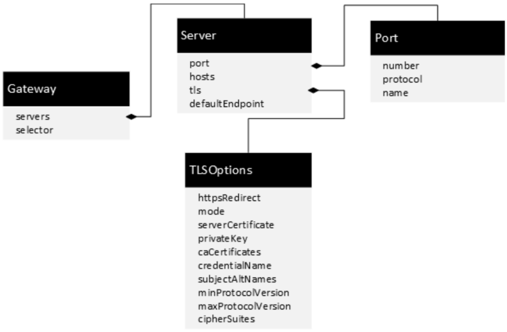

Istio Gateway
=============

### Istio Gateway 定义
与 Kubernetes Ingress API 这种控制进入系统流量的机制不同，Istio Gateway 可以充分利用流量路由的强大能力和灵活性。Istio Gateway 可以配置 4-6 层的负载均衡属性，如对外暴露的端口、TLS 设置等。并配合绑定 VirtualService 到网关来配置（L7）层流量，Gateway 配置被用于运行在网格边界的独立 Envoy 代理，可以像管理网格中其他数据平面的流量一样去管理 Gateway 流量。Istio Gateway 即可以用于管理进入的流量，也可以配置出口网关。

### Gateway 和 VirtualService 配合使用
Gateway 一般和 VirtualService 配合使用。Gateway 定义了服务从外面怎样访问；VirtualService 定义了匹配到的内部服务怎么流转。从而解耦服务的外部入口和服务的内部路由。在一个 VirtualService 上定义的路由既可以对接 Gateway 应用到外部访问，也可以作为内部路由规则应用到网格内的服务间调用。

**提示：** 以下均以 Istio 官方提供的 Bookinfo 为示例

<div align=center>

</div>
<p align="center">图 Istio 官方示例 Bookinfo </p>

>如下配置指明： 使用istio gateway 资源，通过 http 的80端口访问网格内的服务（通过 istio-ingressgateway 通过 nodePort 方式映射的端口），配合绑定 VirtualService 来进行流量路由。

```
apiVersion: networking.istio.io/v1alpha3
kind: Gateway
metadata:
  name: bookinfo-gateway
spec:
  selector:
    istio: ingressgateway # use istio default controller
  servers:
  - port:
      number: 80
      name: http
      protocol: HTTP
    hosts:
    - "*"
---
apiVersion: networking.istio.io/v1alpha3
kind: VirtualService
metadata:
  name: bookinfo
spec:
  hosts:
  - "*"
  gateways:
  - bookinfo-gateway # 绑定上述网关
  http:
  - match:
    - uri:
        exact: /productpage
    - uri:
        prefix: /static
    - uri:
        exact: /login
    - uri:
        exact: /logout
    - uri:
        prefix: /api/v1/products
    route:
    - destination:
        host: productpage
        port:
          number: 9080
```
### Gateway 规则定义

<div align=center>

</div>
<p align="center">图 Gateway的规则定义（图源 《云原生服务网格Istio》） </p>

> 因为版本更新可能导致的改变，具体可参见 Istio 官方文档的详细定义 [《Gateway》](https://istio.io/latest/zh/docs/reference/config/networking/gateway/#Gateway)

| 属性字段 |类型 |描述|   是否必选 |
|--------|---------------|--------|---------------|
|**servers**|Server[]|必选字段，表示开放的服务列表，是 Gateway 的关键内容信息，是一个数组，每个元素都是Server类型。|是|
|**selector**|map<string, string>	| 表示 Gateway 负载实现，为入口处的 Envoy 运行的 Pod 的标签，通过这个标签来找到执行 Gateway 规则的 Envoy。|是|

### Gateway的典型应用
| 场景 |Gateway 认证模式|服务端认证文件的保存位置| 服务端的认证文件 |Istio 的角色| 使用场景 |
|--------|--------|--------|--------|--------|--------|
| **将网格内的HTTP服务发布为HTTP外部访问** |不涉及|不涉及| 不涉及 |通过Gateway 发布入口 HTTP 服务 | 服务自身是 HTTP 服务，对外部访问的安全性要求不高 |
| **将网格内的HTTPS服务发布为HTTPS外部访问** |PASSTHROUGH|在业务容器中| 服务端证书、密钥 |Istio 只是将内部入口处的 HTTPS 服务通过 Gateway 开放出去。HTTPS 由业务程序维护 | 服务自身是 HTTPS 服务，要发布为对外访问 |
| **将网格内的HTTP服务发布为HTTPS外部访问** |SIMPLE|在 Gateway 容器中| 服务端证书、密钥 |Istio 在 Gateway 上为入口的访问建立 HTTPS 的安全通道。HTTPS 在 Gateway 处终结。内部访问的依然是 HTTP | 网格内入口是 HTTP 服务，对外访问安全性要求高，需要对外提供 HTTPS 访问 |
| **将网格内的HTTP服务发布为双向HTTPS外部访问** |MUTUAL|在 Gateway 容器中| 服务端证书、密钥、CA |Istio 在 Gateway 上为入口的访问建立双向 HTTPS 的安全通道。HTTPS 在 Gateway 处终结。内部访问的依然是 HTTP | 网格内入口是 HTTP 服务，对外访问安全性要求高，并且访问的客户端可以提供客户端认证 |
| **将网格内的HTTP服务发布为HTTPS外部访问和HTTPS内部访问** |SIMPLE|在 Gateway 容器中| 服务端证书、密钥 |Istio 在 Gateway 上为入口的访问建立 HTTPS 的安全通道。HTTPS 在 Gateway 处终结。网格内部的 HTTPS 通道由 Istio 维护，对用户业务透明 | 网格内入口是 HTTP 服务，对外访问安全性要求高，内部服务间的安全性要求较高|
```
apiVersion: networking.istio.io/v1alpha3
kind: Gateway
metadata:
  name: my-gateway
  namespace: some-config-namespace
spec:
  selector:
    app: my-gateway-controller
  servers:
  - port:  # 1、将网格内的HTTP服务发布为HTTP外部访问
      number: 80
      name: http
      protocol: HTTP
    hosts:
    - uk.bookinfo.com
    - eu.bookinfo.com
    tls:
      httpsRedirect: true # sends 301 redirect for http requests
  - port: # 3、将网格内的HTTP服务发布为HTTPS外部访问（mode: SIMPLE）
      number: 443
      name: https-443
      protocol: HTTPS
    hosts:
    - uk.bookinfo.com
    - eu.bookinfo.com
    tls:
      mode: SIMPLE # enables HTTPS on this port
      serverCertificate: /etc/certs/servercert.pem
      privateKey: /etc/certs/privatekey.pem
  - port:
      number: 9443
      name: https-9443
      protocol: HTTPS
    hosts:
    - "bookinfo-namespace/*.bookinfo.com"
    tls:
      mode: SIMPLE # enables HTTPS on this port
      credentialName: bookinfo-secret # fetches certs from Kubernetes secret
  - port:
      number: 9080
      name: http-wildcard
      protocol: HTTP
    hosts:
    - "*"
  - port:
      number: 2379 # to expose internal service via external port 2379
      name: mongo
      protocol: MONGO
    hosts:
    - "*"

```
