Istio 技术解析
=============
> **注**：因为造不出更优秀的轮子，所以以下内容多从书籍《云原生服务网格Istio：原理、实践、架构与源码解析》和 Istio 官网综合总结而来 ，个人认为这些资料是学习Istio的最佳资料，常读常新，希望大家能够购买阅读此书，并且在B站上有华为Istio培训课程，也是上述书籍团队主讲的，希望大家关注学习！

## 一、Istio 简介
Istio 是 Service Mesh 实现中最成熟也最受欢迎的项目，由 Google、IBM 和 Lyft 开源。可以简单理解为：
* **Istio 是一个用于服务治理的开放平台。**
* 进一步：**Istio 是一个 Service Mesh 形态的用于服务治理的开放平台。**
* 再进一步：**Istio 是一个与 Kubernetes 紧密结合的适用于云原生场景的 Service Mesh 形态的用于服务治理的开放平台。**

### 1.1 Istio 服务治理涉及：

**连接（Connect）、安全（Secure）、策略执行（Control）和可观察性（Observe）**
* **连接**：Istio 通过集中配置的流量规则控制服务间的流量和调用，实现负载均衡、熔断、故障注入、重试、重定向等服务治理功能。从而使我们可以轻而易举的执行如 A/B 测试、金丝雀发布和按流量百分比划分的分阶段发布等任务。
* **安全**：Istio 提供透明的认证机制、通道加密、服务访问授权等安全能力，可增强服务访问的安全性。Istio 的安全特性解放了开发人员，使其只需要专注于应用程序级别的安全。
* **策略执行**：Istio 通过可动态插拔、可扩展的策略实现访问控制、速率限制、配额管理、服务计费等能力。
* **可观察性**：动态获取服务运行数据和输出，提供强大的调用链、监控和调用日志收集输出的能力。配合可视化工具，可方便运维人员了解服务的运行状况，发现并解决问题。

### 1.2 Istio 提供的重要能力：
* **使服务运行具备可观察性**：监控应用及网络相关数据，将相关指标与日志记录发送至相应收集、聚合与查询系统中以实现功能扩展，追踪分析性能热点并对分布式故障模式进行诊断。
* **弹性与效率**：提供了统一的方法配置重试、负载均衡、流量控制和断路器等来解决网络可靠性低所造成的各类常见故障，更轻松地运维高弹性服务网格。
* **提高研发人员生产力**：确保研发人员专注于基于已选择的编程语言构建业务功能，不用在代码中处理分布式系统的问题，从而极大地提升生产能力。
* **策略驱动型运维**：解耦开发和运维团队的工作，在无须更改代码的前提下提升安全性、监控能力、扩展性与服务拓扑水平。运维人员能够不依赖开发提供的能力精确控制生产流量。
* **提供安全基础设施**：允许运营人员配置 TLS 双向认证并保护各服务之间的所有通信，并且开发人员和运维人员不用维护证书，以应对分布式计算中经常存在的大量网络安全问题。
* **演进使用**：允许团队按照自己的节奏和需求逐步使用各项功能，例如先观察服务运行情况再进行服务治理等。

### 1.3 Istio 与微服务
微服务作为一种架构风格，更是一种敏捷的软件工程实践，是一套方法论；与之对应的 Istio 等服务网格则是一种完整的实践——**微服务是一套理论，Istio 是一种实践**。

**Istio 是一款设计良好的具有较好集成及可扩展能力的可落地的服务治理工具和平台**。

>从场景来看，Istio 管理的对象大部分是微服务化过的，但这不是必需的要求。对于一个或多个大的单体应用，只要存在服务间的访问要进行治理，Istio 也适用。

### 1.4 Istio 与服务网格
**Istio 是 Service Mesh 实现中最成熟也最受欢迎的项目，Istio的早期版本使用Envoy V1版本的 API，即 Restful 方式，其新版本使用Envoy V2版本的 API，即 gRPC 协议**。

标准的控制面 API 解耦了控制面和数据面的绑定。Nginx 的 nginMesh、F5 Networks 的Aspen Mesh 等多种数据面代理支持 Istio 的控制面。

在数据面的竞争上，Istio 的标准数据面Envoy 是由 Lyft 内部于2016年开发的，比 Linkerd 更早。2016年9月，Envoy 开源并发布了 1.0.0 版本；2017年9月，Envoy 加入 CNCF，成为第2个 Service Mesh 项目；2018年11月，Envoy 从 CNCF 毕业，标志着其趋于成熟。
* 从开发语言上看，Envoy是使用 C++ 开发的，其性能和资源占用比用 Rust 开发的 Linkerd Proxy 要更好，更能满足服务网格中对透明代理的轻量高性能要求；
* 从能力上看，Envoy 提供 L3/L4 过滤器、HTTP L7 过滤器，支持 HTTP/2、HTTP L7路由及 gRPC、MongoDB、DynamoDB 等协议，有服务发现、健康检查、高级 LoadBalance 、前端代理等能力，具有极好的可观察性、动态配置功能；
* 从架构实现上看，Envoy 是一个可高度定制化的程序，通过 Filter 机制提供了高度扩展性，还支持热重启，其代码基于模块化编码，易于测试。

除了在 Istio 中应用，Envoy 在其他 Service Mesh 框架中也被广泛应用，**渐渐成为Service Mesh 的数据平面标准**。

### 1.5 Istio 与 Kubernetes
Istio 项目在发起时已经确认了将云原生生态系统中的容器作为核心打包和运行时，将Kubernetes 作为管理容器的编排系统，由 Istio 管理在容器平台上运行的服务之间的交互，包括控制访问、安全、运行数据收集等。

<div align=center>
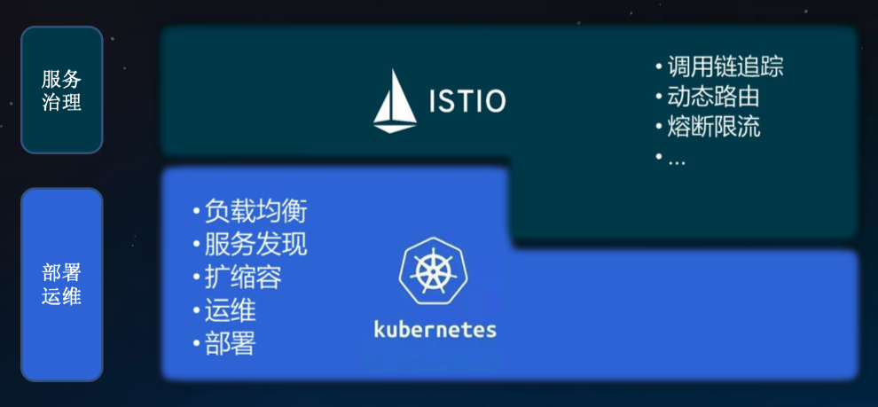
</div>
<p align="center">图 Istio与Kubernetes（图源 华为Istio培训课程） </p>

Istio 最大化地利用了 Kubernetes 这个基础设施，与之叠加在一起形成了一个更强大的用于进行服务运行和治理的基础设施，并提供了更透明的用户体验。
| &emsp;&emsp;&emsp;&emsp;&emsp;&emsp; | Istio  | 
|  ----  | ----  | 
|  **架构设计** | 基于 Kubernetes 能力构建 | 
|  **服务发现** | 使用 Kubernetes 服务名，使用和 Kubernetes 一致的服务发现机制 |
|  **使用体验** | 完全的 Kubernetes 使用体验。Sidecar 自动 Pod 注入，业务无感知，和部署普通 Kubernetes 负载无差别 |  
|  **控制面** | 无需额外的 APIServer 和规则策略定义，基于 Kubernetes CRD 扩展，Istio 的 APIServer 就是 Kubernetes 的 APIServer | 

> Istio 不仅数据面 Envoy 跑在 Kubernetes 的 Pod 里，其控制面也运行在 Kubernetes 集群中，其控制面组件本身存在的形式也是 Kubernetes Deployment 和 Service，基于 Kubernetes 扩展和构建。

<div align=center>
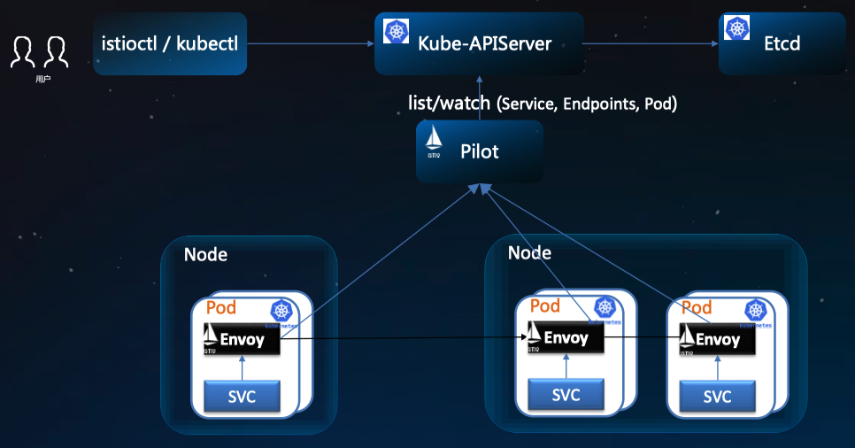
</div>
<p align="center">图 Istio与Kubernetes 架构的关系 （图源 华为Istio培训课程）</p>

## 二、Istio 架构
Istio 的架构如下图所示，分为控制面和数据面两部分。可以看到，控制面主要包括 Pilot、Mixer、Citadel 服务组件构成；数据面由伴随每个应用程序部署的 Proxy 代理程序 Envoy 组成

<div align=center>
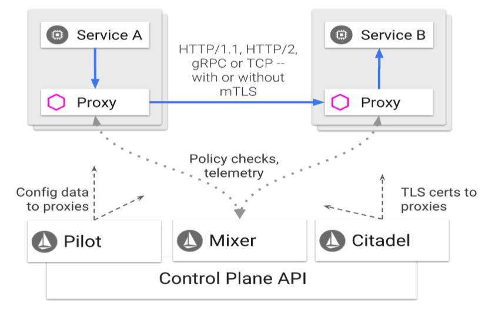
</div>
<p align="center">图 Istio架构图 </p>

### 2.1 Istio的工作机制
<div align=center>
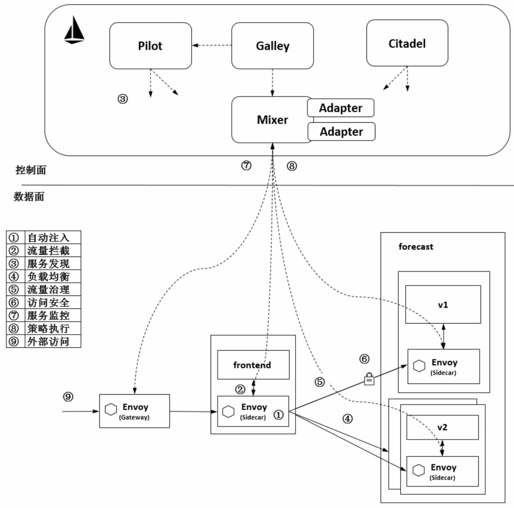
</div>
<p align="center">图 Istio 的工作机制示意图 （图源 《云原生服务网格Istio》）</p>

>  如上图：本文档采用《云原生服务网格Istio》书籍中的业务示例——天气预报应用

1. **自动注入**：指在创建应用程序时自动注入 Sidecar 代理。在 Kubernetes 场景下创建 Pod 时，Kube-apiserver 调用管理面组件的 Sidecar-Injector 服务，自动修改应用程序的描述信息并注入 Sidecar。在真正创建 Pod 时，在创建业务容器的同时在 Pod 中创建 Sidecar 容器。
2. **流量拦截**：在 Pod 初始化时设置 iptables 规则，当有流量到来时，基于配置的iptables 规则拦截业务容器的 Inbound 流量和 Outbound 流量到 Sidecar 上。应用程序感知不到 Sidecar 的存在，还以原本的方式进行互相访问。如上图中，流出frontend 服务的流量会被 frontend 服务侧的 Envoy 拦截，而当流量到达forecast 容器时，Inbound 流量被 forecast 服务侧的 Envoy 拦截。
3. **服务发现**：服务发起方的 Envoy 调用管理面组件 Pilot 的服务发现接口获取目标服务的实例列表。在上图中，frontend 服务侧的 Envoy 通过 Pilot 的服务发现接口得到 forecast 服务各个实例的地址，为访问做准备。
4. **负载均衡**：服务发起方的 Envoy 根据配置的负载均衡策略选择服务实例，并连接对应的实例地址。在上图中，数据面的各个 Envoy 从 Pilot 中获取 forecast 服务的负载均衡配置，并执行负载均衡动作。
5. **流量治理**：Envoy 从 Pilot 中获取配置的流量规则，在拦截到 Inbound 流量和Outbound 流量时执行治理逻辑。在上图中，frontend 服务侧的 Envoy 从 Pilot 中获取流量治理规则，并根据该流量治理规则将不同特征的流量分发到 forecast 服务的v1 或 v2 版本。这只是 Istio 流量治理的场景之一。
6. **访问安全**：在服务间访问时通过双方的 Envoy 进行双向认证和通道加密，并基于服务的身份进行授权管理。在上图中，Pilot 下发安全相关配置，在 frontend 服务和forecast 服务的 Envoy 上自动加载证书和密钥来实现双向认证，其中的证书和密钥由另一个管理面组件 Citadel 维护。
7. **服务遥测**：在服务间通信时，通信双方的 Envoy 都会连接管理面组件 Mixer 上报访问数据，并通过 Mixer 将数据转发给对应的监控后端。在上图中，frontend 服务对 forecast 服务的访问监控指标、日志和调用链都可以通过这种方式收集到对应的监控后端。
8. **策略执行**：在进行服务访问时，通过 Mixer 连接后端服务来控制服务间的访问，判断对访问是放行还是拒绝。在上图中，Mixer 后端可以对接一个限流服务对从 frontend 服务到 forecast 服务的访问进行速率控制。
9. **外部访问**：在网格的入口处有一个 Envoy 扮演入口网关的角色。在上图中，外部服务通过 Gateway 访问入口服务 frontend，对 frontend 服务的负载均衡和一些流量治理策略都在这个Gateway上执行。

### 2.2 Istio的服务模型
Istio 的服务、服务版本和服务实例等几个对象构成了 Istio 的服务模型。Istio 支持将由服务、服务版本和服务实例构造的抽象模型映射到不同的平台上，基于Kubernetes 的场景, Istio 的这几个资源对象就是基于 Kubernetes 的相应资源对象构建的，加上部分约束（端口命名、服务关联、Deployment 使用 app 和 version 标签）来满足 Istio 服务模型的要求。

#### 2.2.1、Istio的服务
**从逻辑上看**，服务是 Istio 主要管理的资源对象，是一个抽象概念，主要包含 HostName 和 Ports 等属性，并指定了 Service 的域名和端口列表。每个端口都包含端口名称、端口号和端口的协议。

**从物理层面看**，Istio 服务的存在形式就是 Kubernetes 的 Service，在启用了 Istio 的集群中创建 Kubernetes 的 Service 时只要满足以上约束，就可以转换为 Istio 的 Service 并配置规则进行流量治理。
> Service 是 Kubernetes 的一个核心资源，用户通过一个域名或者虚拟的 IP 就能访问到后端 Pod，避免用户使用不固定 Pod 地址的问题。在 Kubernetes 中，Pod 作为一个资源创建、调度和管理的最小部署单元的封装，是动态变化的，在节点删除、资源变化等多种情况下都可能被重新调度，Pod 的后端地址也会随之变化。

**一个Istio Service 示例**

```
apiversion: v1
kind: Service         # 指定创建资源的类型
metadata:
  name: forecast      # Service名称
spec:                 # Service的规格信息
  ports:
  - port: 3002        # 服务端口信息，Service能够将传入的的port映射到targetPort，推荐port与targetPort配置为相同的值
    tagetPort: 3002   # 容器访问端口 
    name: http        # Istio 服务的约束，在端口名称上指定协议
  selector:           # 标签选择器，定义Service如何查找要管理的Pods。
    app: forecast     # 依据标签"app"管理相应Pods  
```
在 Istio 中，Service 是治理的对象，可以将其理解为一个定义了服务的工作负载（Deployment），Kubernetes 的 Service 定义就是 Istio 服务的元数据。

#### 2.2.2 Istio 的服务版本
在 Istio 中多个版本的定义是将一个 Service 关联到多个 Deployment ，每个Deployment 都对应服务的一个版本。
<div align=center>
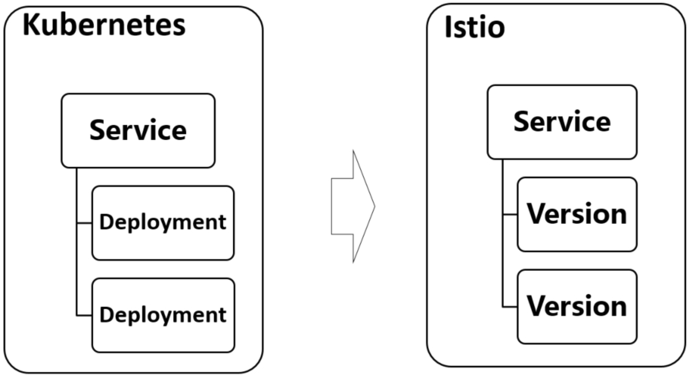
</div>
<p align="center">图  Istio的服务版本 （图源 《云原生服务网格Istio》）</p>

> forecast-v1 和 forecast-v2 这两个 Deployment 对应服务下管理的两个负载

```
# v1版本的forecast
apiVersion: app/v1
kind: Deployment
metadata:
  name: forecast-v1
  labels:
    app: forecast
    version: v1
  spec:
    replicas: 2
    template:
      metadata:
        labels:
          app: forecast
          version: v1
      spec:
        containers:
        - name: forecasts
          image: ***
          ports:
          - containerPort: 3002 
```
```
# v2版本的forecast
apiVersion: app/v1
kind: Deployment
metadata:
  name: forecast-v2
  labels:
    app: forecast
    version: v2
  spec:
    replicas: 2
    template:
      metadata:
        labels:
          app: forecast
          version: v2
      spec:
        containers:
        - name: forecast
          image: ***
          ports:
          - containerPort: 3002 
```
* **这两个 Deployment 都有相同的“app：forecast”标签**，正是这个标签和 Service 的标签选择器一致，才保证了 Service 能关联到两个 Deployment 对应的 Pod。
* 这两个 Deployment 都有不同的镜像版本，因此各自创建的 Pod 也不同；这两个 Deployment 的 version 标签也不同，分别为 v1 和 v2，表示这是服务的不同版本，**这个不同的版本标签用来定义不同的 Destination，进而执行不同的路由规则**。

#### 2.2.3 Istio的服务实例
服务实例是真正处理服务请求的后端，Istio 的ServiceInstance 主要包括 Endpoint、Service、Labels、AvailabilityZone 和 ServiceAccount 等属性，Endpoint 是其中最主要的属性，表示这个实例对应的网络后端（ip：port），Service 表示这个服务实例归属的服务。
> Istio 的服务实例对应Kubernetes的Endpoint

<div align=center>
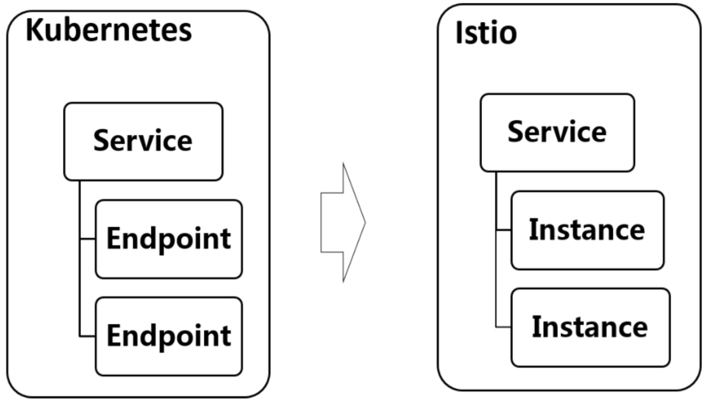
</div>
<p align="center">图  Istio的服务实例（图源 《云原生服务网格Istio》）</p>


### 2.3 Istio的主要组件
#### 1. istio-pilot
istio-pilot是 Istio 的控制中枢 Pilot 服务，和传统的微服务架构对比，Pilot 至少涵盖服务注册中心和 Config Server 等管理组件的功能。
##### 服务发现
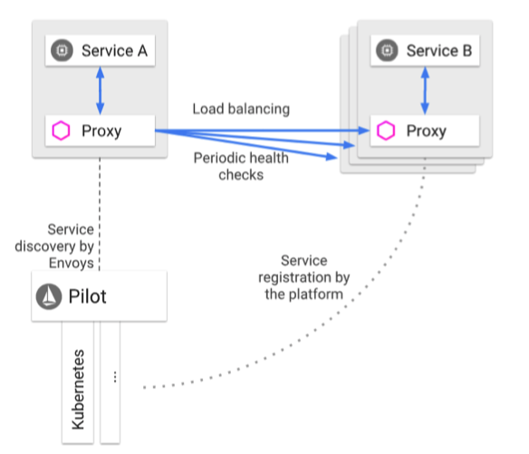
<p align="center">图 Pilot 的服务发现功能 （图源 华为Istio培训课程）</p>

1. **服务注册表**：Pilot 从平台获取服务发现数据，并提供统一的服务发现接口。
2. **服务注册**：无须进行服务注册，底层 Kubernetes 平台负责（这种抽象模型解耦了Pilot和底层平台的不同实现，可支持Kubernetes、Consul等平台）
3. **服务发现**：Envoy 实现服务发现，动态更新负载均衡池。在服务请求时使用对应的负载均衡策略将请求路由到对应的后端。

##### 服务配置

除了上述服务发现，Pilot 更重要的一个功能是向数据面下发规则，包括 VirtualService、DestinationRule、Gateway、ServiceEntry 等流量治理规则，也包括认证授权等安全规则。Pilot 负责将各种规则转换成 Envoy 可识别的格式，通过标准的 xDS 协议发送给 Envoy，指导 Envoy 完成动作。在通信上，Envoy 通过 gRPC 流式订阅 Pilot 的配置资源。
> **注**：xDS是一类发现服务的总称，包含LDS，RDS，CDS，EDS以及 SDS。Envoy通过xDS API可以动态获取Listener（监听器）， Route（路由），Cluster（集群），Endpoint（集群成员）以 及Secret（证书）配置。

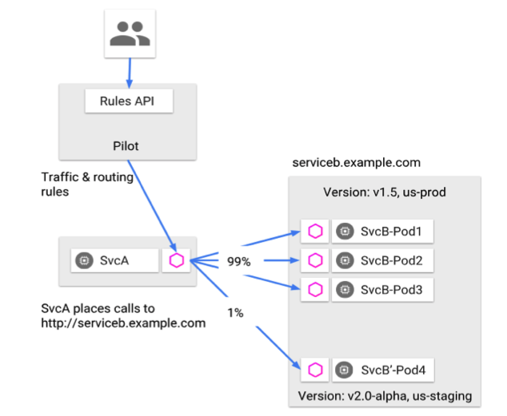
<p align="center">图 Istio 服务访问规则维护和工作机制 （图源 华为Istio培训课程）</p>

1. **配置**：管理员通过 Pilot 配置治理规则

2. **下发**：Envoy 从 Pilot 获取治理规则

3. **执行**：在流量访问的时候执行治理规则

#### 2. istio Mixer
Mixer 在 Istio 中的作用
* 功能上：**负责策略控制和遥测收集**
* 架构上：**提供插件模型，可以扩展和定制**

在部署上，Istio 控制面部署了两个 Mixer 组件：**istio-telemetry 和 istio-policy**，分别处理遥测数据的收集和策略的执行。

##### istio-telemetry

如下图所示，当网格中的两个服务间有调用发生时，服务的代理 Envoy 就会上报遥测数据给 istio-telemetry 服务组件，istio-telemetry 服务组件则根据配置将生成访问 Metric 等数据分发给后端的遥测服务。数据面代理通过 Report 接口上报数据时访问数据会被批量上报。在架构上，Mixer 作为中介来解耦数据面和不同后端的对接，以提供灵活性和扩展能力。运维人员可以动态配置各种遥测后端，来收集指定的服务运行数据。

<div align=center>
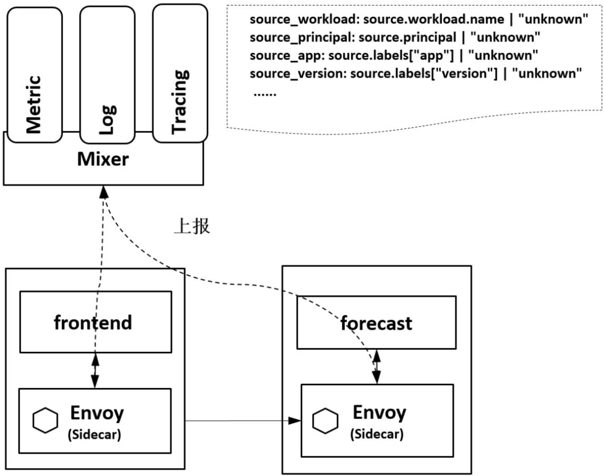
</div>
<p align="center">图 Mixer 遥测 （图源 《云原生服务网格Istio》）</p>

##### istio-policy

istio-policy是另外一个Mixer服务。如下图，数据面在转发服务的请求前调用 istio-policy 的 Check 接口检查是否允许访问，Mixer 根据配置将请求转发到对应的 Adapter 做对应检查，给代理返回允许访问还是拒绝。可以对接如配额、授权、黑白名单等不同的控制后端，对服务间的访问进行可扩展的控制。

<div align=center>
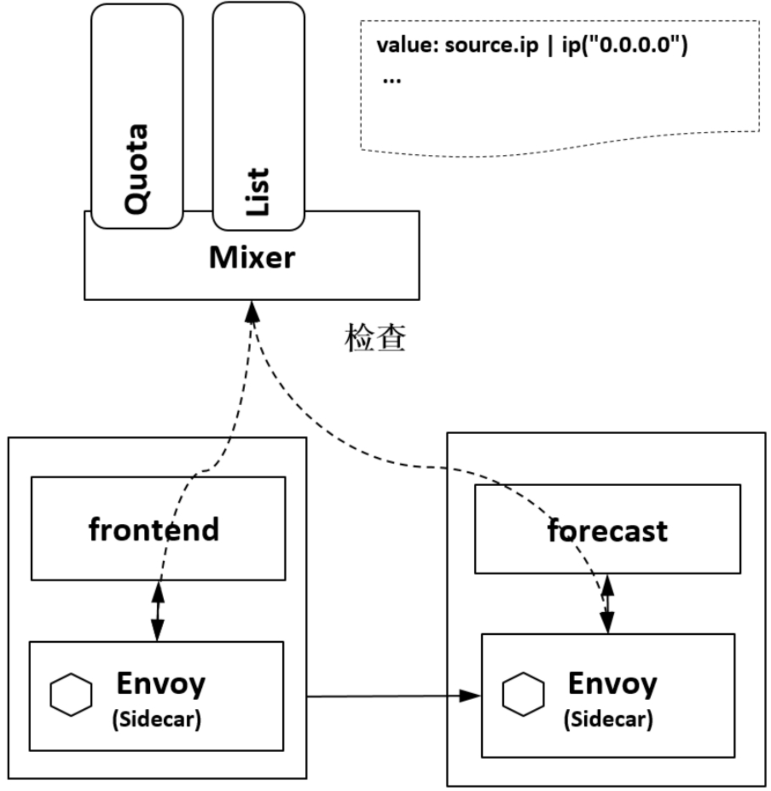
</div>
<p align="center">图 Mixer 策略控制 （图源 《云原生服务网格Istio》）</p>

#### 3. istio-citadel

istio-citadel 是 Istio 的核心安全组件，提供了自动生成、分发、轮换与撤销密钥和证书功能。Citadel 一直监听 Kube-apiserver，以 Secret 的形式为每个服务都生成证书密钥，并在 Pod 创建时挂载到 Pod 上，代理容器使用这些文件来做服务身份认证，进而代理两端服务实现双向 TLS 认证、通道加密、访问授权等安全功能，这样用户就无需在代码里面维护证书密钥了。如下图所示

<div align=center>
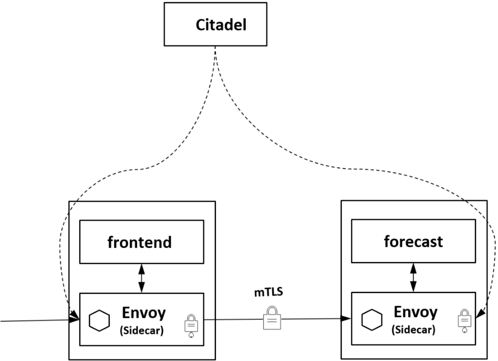
</div>
<p align="center">图 Citadel 密钥证书维护 （图源 《云原生服务网格Istio》）</p>

#### 4. istio-galley

istio-galley 并不直接向数据面提供业务能力，而是在控制面上向其他组件提供支持。Galley 作为负责配置管理的组件，验证配置信息的格式和内容的正确性，并将这些配置信息提供给管理面的 Pilot 和 Mixer 服务使用，这样其他管理面组件只用和 Galley 打交道，从而与底层平台解耦。

#### 5. istio-sidecar-injector

istio-sidecar-injector 是负责自动注入的组件，只要开启了自动注入，在Pod创建时就会自动调用 istio-sidecar-injector 向 Pod 中注入 Sidecar 容器。

在 Kubernetes 环境下，根据自动注入配置，Kube-apiserver 在拦截到 Pod 创建的请求时，会调用自动注入服务 istio-sidecar-injector 生成 Sidecar 容器的描述并将其插入原 Pod 的定义中，这样，在创建的 Pod 内除了包括业务容器，还包括 Sidecar 容器。**这个注入过程对用户透明**。

#### 6. istio-proxy

在 Istio 的描述中，Envoy、Sidecar、Proxy 只是术语混着用，其实都表示 Istio 数据面的轻量代理。查看 Pod 的详细信息，会发现这个容器的正式名字是 istio-proxy，不是通用的 Envoy 镜像，而是叠加了 Istio 的 Proxy 功能的一个扩展版本。另外，在istio-proxy 容器中除了有 Envoy，还有一个 pilot-agent 的守护进程。

> Envoy 是用 C++ 开发的非常有影响力的轻量级高性能开源服务代理。作为服务网格的数据面，Envoy 提供了动态服务发现、负载均衡、TLS、HTTP/2 及 gRPC 代理、熔断器、健康检查、流量拆分、灰度发布、故障注入等功能，Istio 大部分治理能力最终都落实到 Envoy 的实现上。

#### 7. istio-ingressgateway

在Istio中，Gateway控制着网格边缘的服务暴露。istio-ingressgateway 就是入口处的 Gateway，从网格外访问网格内的服务就是通过这个 Gateway 进行的。istio-ingressgateway 比较特别，是一个 Loadbalancer 类型的 Service，不同于其他服务组件只有一两个端口，istio-ingressgateway 开放了一组端口，这些就是网格内服务的外部访问端口。

Gateway 根据流入流出方向分为 ingress gateway 和 egress gateway
* **Ingress gateway**: 控制外部服务访问网格内服务，配合VirtualService

* **Egress gateway**:控制网格内服务访问外部服务, 配合DestinationRule ServiceEntry使用
>网格入口网关 istio-ingressgateway 的负载和网格内的 Sidecar 是同样的执行体，也和网格内的其他 Sidecar 一样从 Pilot 处接收流量规则并执行。


#### 8. 其他组件
除了以“ istio ”为前缀的以上几个 Istio 自有的组件，在集群中一般还安装 **Jaeger-agent、Jaeger-collector、Jaeger-query、Kiali、Prometheus、Tracing、Zipkin** 组件，这些组件提供了 Istio 的调用链、监控等功能，可以在安装时选择来完成完整的服务监控管理功能。

[ 下一章节：《Istio流量治理》 ](./Istio的流量治理.md)
