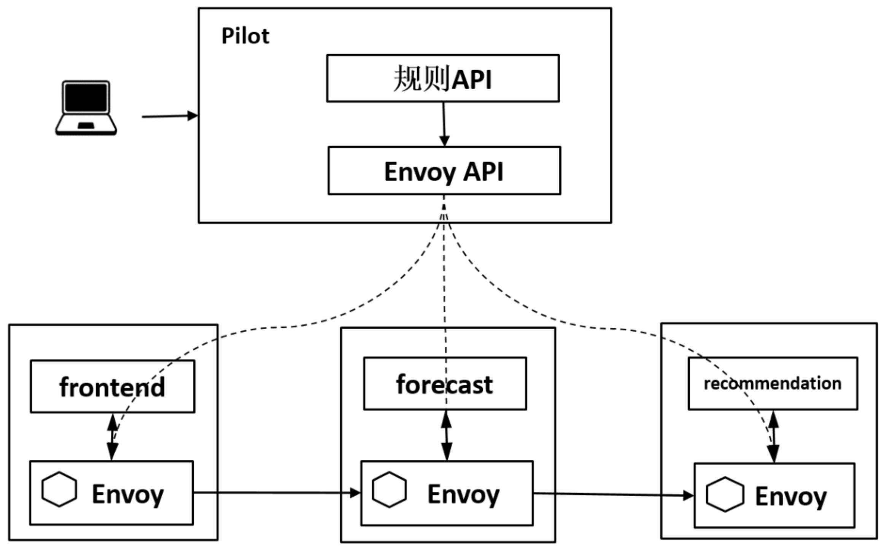
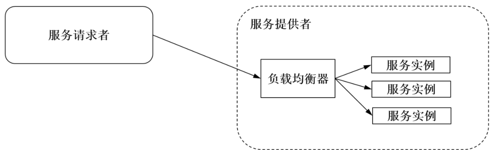
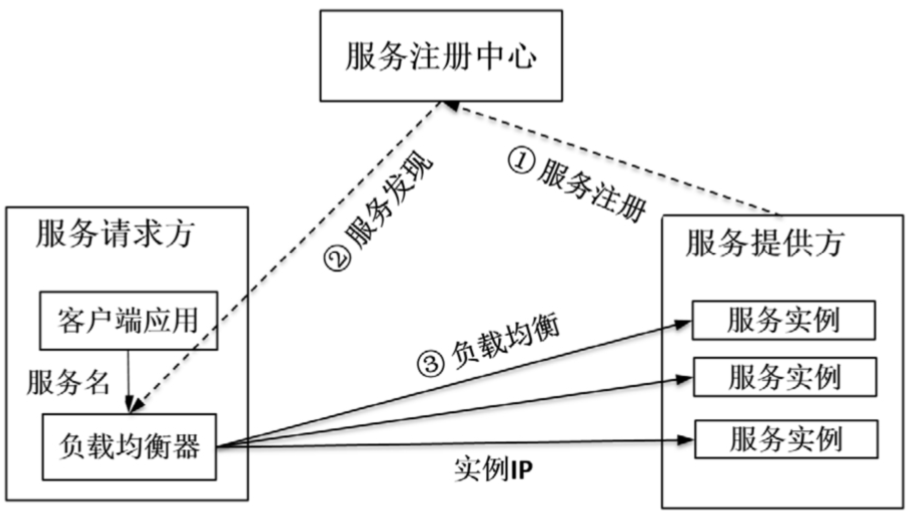
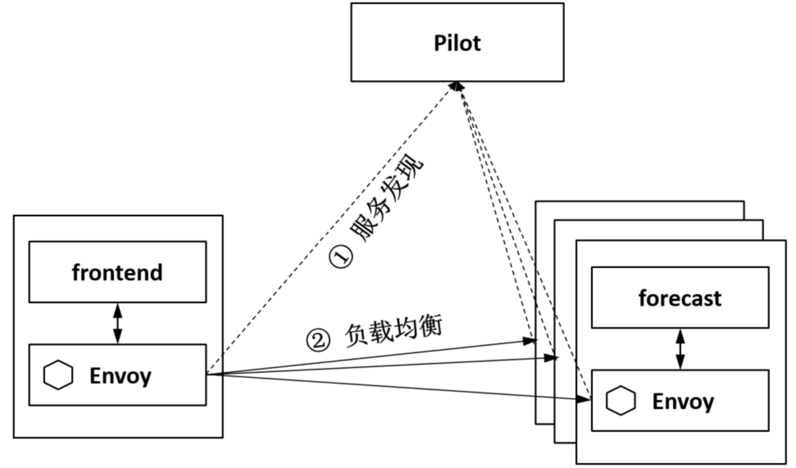
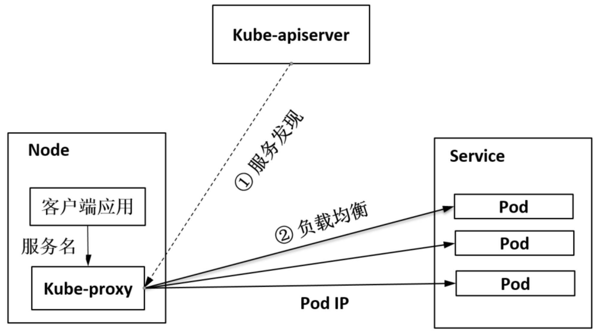
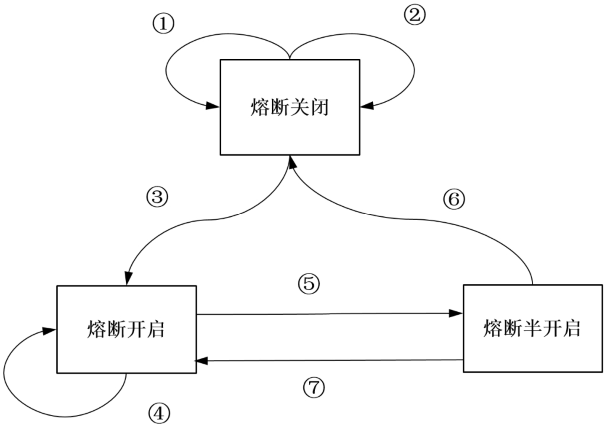
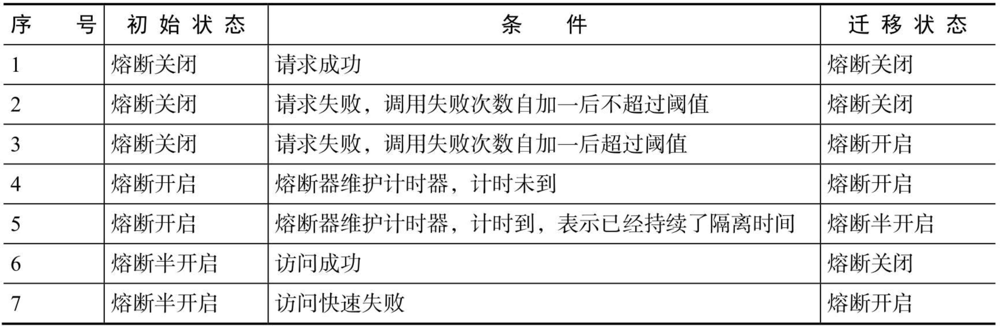
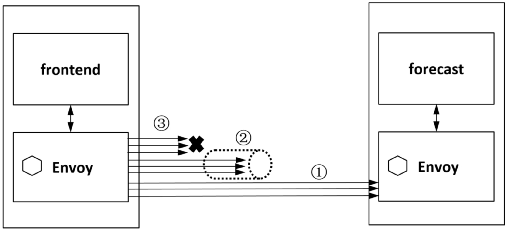
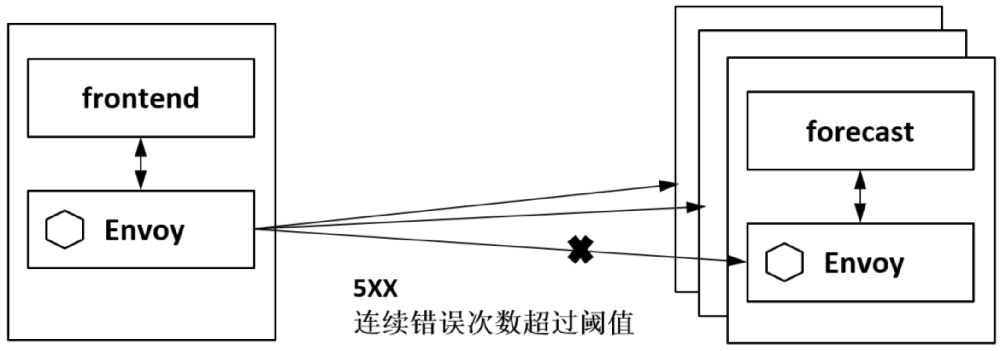
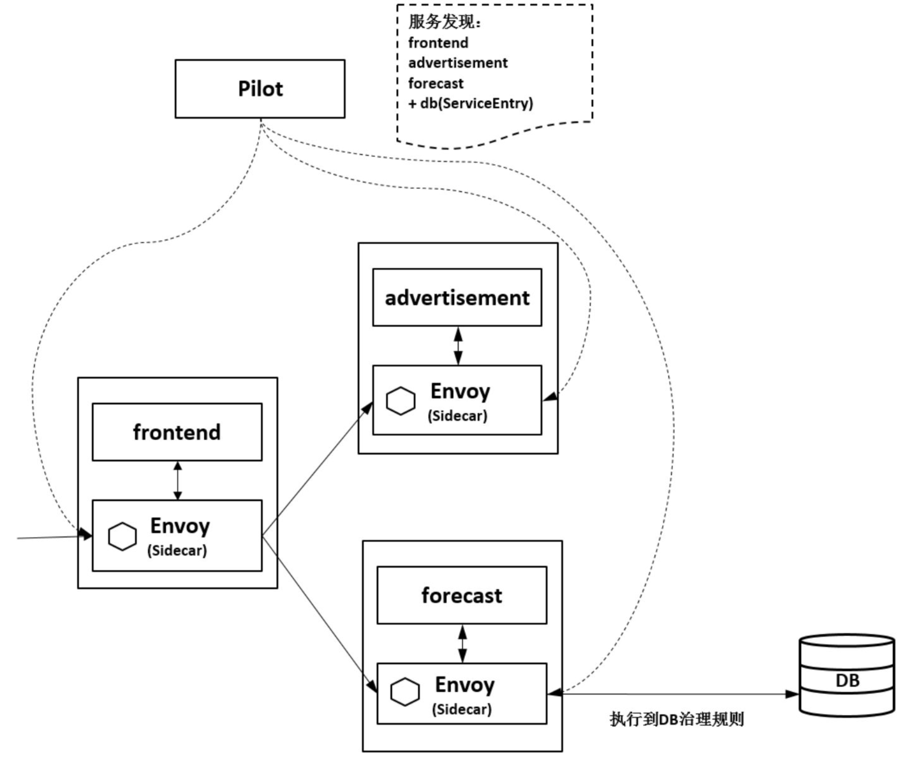

Istio 流量治理
=============
- [Istio 流量治理](#istio流量治理)
  - [Istio 流量治理的原理](#istio流量治理的原理)
    - [流量治理可以做什么？](#流量治理可以做什么？)
    - [Istio流量治理的特点](#istio流量治理的特点)
    - [Istio流量治理的概要流程](#istio流量治理的概要流程)
  - [一、负载均衡](#一、负载均衡)
    - [负载均衡的原理](#负载均衡的原理)
    - [微服务场景下服务发现和负载均衡的工作流程](#微服务场景下服务发现和负载均衡的工作流程)
    - [Istio 负载均衡的流程](#istio负载均衡的流程)
    - [Kubernetes 负载均衡的流程](#kubernetes负载均衡的流程)
  - [二、服务熔断](#二、服务熔断)
    - [服务熔断的原理](#服务熔断的原理)
    - [Istio 熔断](#istio熔断)
      - [1、连接池管理](#1、连接池管理)
      - [2、异常实例隔离](#2、异常实例隔离)
  - [三、故障注入](#三、故障注入)
    - [基于 Istio 的故障注入模拟应用的故障场景](#基于istio的故障注入模拟应用的故障场景)
      - [1、状态码故障注入](#1、状态码故障注入)
      - [2、延时故障注入](#2、延时故障注入)
  - [四、灰度发布](#四、灰度发布)
    - [灰度发布的场景](#灰度发布的场景)
    - [灰度发布的常见机制](#灰度发布的常见机制)
    - [基于 Istio 的灰度发布](#基于istio的灰度发布)
  - [五、服务访问入口](#五、服务访问入口)
    - [1、kubernetes 服务的访问入口](#1、kubernetes服务的访问入口)
    - [2、Istio 服务访问入口](#2、istio服务访问入口)
    - [3、外部接入服务治理](#3、外部接入服务治理)

## Istio 流量治理的原理
### 流量治理可以做什么？
* 动态修改服务间访问的负载均衡策略，比如根据某个请求特征做会话保持；
* 同一个服务有两个版本在线，将一部分流量切到某个版本上；
* 对服务进行保护，例如限制并发连接数、限制请求数、隔离故障服务实例等；
* 动态修改服务中的内容，或者模拟一个服务运行故障等。

### Istio流量治理的特点
在 Istio 中实现这些服务治理功能时无须修改任何应用的代码。较之微服务的 SDK 方式，Istio 以一种更轻便、透明的方式向用户提供了这些功能。用户可以用自己喜欢的任意语言和框架进行开发，专注于自己的业务，完全不用嵌入任何治理逻辑。只要应用运行在 Istio 的基础设施上，就可以使用这些治理能力。

一句话总结 Istio 流量治理的目标：**以基础设施的方式提供给用户非侵入的流量治理能力，用户只需关注自己的业务逻辑开发，无须关注服务访问管理。**

### Istio流量治理的概要流程

图 Istio流量治理的概要流程 （图源 《云原生服务网格Istio》）

在控制面会经过如下流程：
1. 管理员通过命令行或者 API 创建流量规则；
2. Pilot 将流量规则转换为 Envoy 的标准格式；
3. Pilot 将规则下发给 Envoy。

在数据面会经过如下流程：
1. Envoy 拦截 Pod 上本地容器的 Inbound 流量和 Outbound 流量；
2. 在流量经过 Envoy 时执行对应的流量规则，对流量进行治理。

## 一、负载均衡
### 负载均衡的原理
传统的负载均衡一般是在服务端提供的，例如用浏览器或者手机访问一个 Web 网站时，一般在网站入口处有一个负载均衡器来做请求的汇聚和转发。服务的虚拟 IP 和后端实例一般是通过静态配置文件维护的，负载均衡器通过健康检查保证客户端的请求被路由到健康的后端实例上。

图 负载均衡原理图 （图源 《云原生服务网格Istio》）

### 微服务场景下服务发现和负载均衡的工作流程

图 服务发现和负载均衡的工作流程 （图源 《云原生服务网格Istio》）

1. **服务注册**。各服务将服务名和服务实例的对应信息注册到服务注册中心。
2. **服务发现**。在消费者端发起服务访问时，以同步或者异步的方式从服务注册中心获取服务对应的实例列表。
3. **负载均衡**。根据配置的负载均衡算法从实例列表中选择一个服务实例。

### Istio 负载均衡的流程

图 Istio负载均衡流程 （图源 《云原生服务网格Istio》）

在 Istio 中，Pilot 负责维护服务发现数据。如上图所示为 Istio 负载均衡的流程，Pilot 将服务发现数据通过 Envoy 的标准接口下发给数据面 Envoy，Envoy 则根据配置的负载均衡策略选择一个实例转发请求。Istio 当前支持的主要负载均衡算法包括：轮询、随机和最小连接数算法。

### Kubernetes 负载均衡的流程

图 Kubernetes负载均衡流程 （图源 《云原生服务网格Istio》）

在 Kubernetes 上支持 Service 的重要组件 Kube-proxy ，实际也是运行在工作节点的一个网络代理和负载均衡器，它实现了 Service 模型，默认通过轮询等方式把 Service 访问转发到后端实例 Pod 上。

## 二、服务熔断
### 服务熔断的原理
熔断指的是故障检测和处理逻辑，防止临时故障或意外导致系统整体不可用，最典型的应用场景是防止网络和服务调用故障级联发生，限制故障的影响范围，防止故障蔓延导致系统整体性能下降或雪崩。

熔断主要应用于微服务场景下的分布式调用中：在远程调用时，请求在超时前一直挂起，会导致请求链路上的级联故障和资源耗尽；熔断器封装了被保护的逻辑，监控调用是否失败，当连续调用失败的数量超过阈值时，熔断器就会跳闸，在跳闸后的一定时间段内，所有调用远程服务的尝试都将立即返回失败；同时，熔断器设置了一个计时器，当计时到期时，允许有限数量的测试请求通过；如果这些请求成功，则熔断器恢复正常操作；如果这些请求失败，则维持断路状态。

图 熔断状态机 （图源 《云原生服务网格Istio》）

### Istio 熔断
#### 1、连接池管理
在 Istio 中通过限制某个客户端对目标服务的连接数、访问请求数等，避免对一个服务的过量访问，如果超过配置的阈值，则快速断路请求。还会限制重试次数，避免重试次数过多导致系统压力变大并加剧故障的传播；

Istio 的连接池管理工作机制对 TCP 提供了最大连接数、连接超时时间等管理方式，对HTTP 提供了最大请求数、最大等待请求数、最大重试次数、每连接最大请求数等管理方式，它控制客户端对目标服务的连接和访问，在超过配置时快速拒绝。

图 Istio熔断连接池管理示例 （图源 《云原生服务网格Istio》）

图 Istio异常点检查示例 （图源 《云原生服务网格Istio》）

图  Istio和Hystrix熔断的简单对比 （图源 《云原生服务网格Istio》）
 熔断功能本来就是叠加上去的服务保护，并不能完全替代代码中的异常处理。业务代码本来也应该做好各种异常处理，在发生异常的时候通知调用方的代码或者最终用户

## 三、故障注入
>对于开发人员来说，他们在开发代码时需要用20%的时间写80%的主要逻辑，然后留出80%的时间处理各种非正常场景；对于测试人员来说，除了需要用80%的时间写20%的异常测试项，更要用超过80%的时间执行这些异常测试项，并构造各种故障场景。

故障注入是一种评估系统可靠性的有效方法，最早在硬件场景下将电路板短路来其观察对系统的影响，在软件场景下也是使用一种手段故意在待测试的系统中引入故障，从而测试其健壮性和应对故障的能力，例如异常处理、故障恢复等。只有当系统的所有服务都经过故障测试且具备容错能力时，整个应用才健壮可靠。

### 基于 Istio 的故障注入模拟应用的故障场景
#### 1、状态码故障注入
对某种请求注入一个指定的HTTP Code（如 503， 404），这样，对于访问的消费端来说，就跟服务提供者发生异常一样。

#### 2、延时故障注入
对某种请求注入一个指定的延时，这样，对于访问的消费端来说，就跟服务提供者发生异常一样。

## 四、灰度发布
### 灰度发布的场景
蓝绿发布、AB测试、金丝雀发布

### 灰度发布的常见机制
* **基于负载均衡器的灰度发布**：在入口的负载均衡器上配置流量策略
* **基于 Kubernetes 的灰度发布**：基于 Pod 的数量比例分配流量
* **基于 Istio 的灰度发布**：是 Istio 流量治理规则的一种典型应用，在进行灰度发布时，只要写个简单的流量规则配置即可。

### 基于 Istio 的灰度发布
* **基于流量比例的灰度发布**：Istio 在每个 Pod 里都注入了一个 Envoy，因而只要在控制面配置分流策略，对目标服务发起访问的每个 Envoy 便都可以执行流量策略，完成灰度发布功能。
* **基于请求内容的灰度发布**：如浏览器、请求的Headers等请求内容在Istio中都可以作为灰度发布的特征条件。根据Header的内容将请求分发到不同的后端服务版本上。

## 五、服务访问入口
一组服务组合在一起可以完成一个独立的业务功能，一般都会有一个入口服务，从外部可以访问，主要是接收外部的请求并将其转发到后端的服务，有时还可以定义通用的过滤器在入口处做权限、限流等功能。

### 1、kubernetes 服务的访问入口
* 在 Kubernetes 中可以将服务发布成 Loadbalancer 类型的 Service，通过一个   外部端口就能访问到集群中的指定服务，如下图所示，从外部进来的流量不用经过过滤和多余处理，就被转发到服务上。这种方式直接、简单，在云平台上部署的服务一般都可以依赖云厂商提供的 Loadbalancer 来实现。

图  Kubernetes Loadbalancer 类型的 Service （图源 《云原生服务网格Istio》）

图  Istio 服务访问入口Gateway （图源 《云原生服务网格Istio》）

图  通过Open Service Broker API管理外部服务 （图源 《云原生服务网格Istio》）

图  以ServiceEntry方式接入外部服务 （图源 《云原生服务网格Istio》）</p

