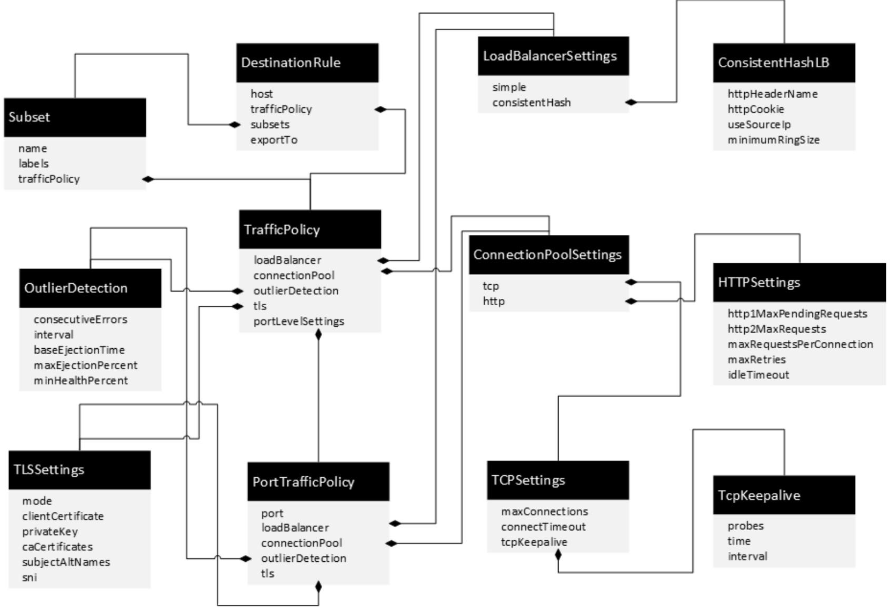

Istio目标规则配置：DestinationRule
=============

### DestinationRule 定义
与 VirtualService 一样，DestinationRule 也是 Istio 流量路由功能的关键部分。我们可以将 VirtualService 视为将流量如何路由到给定目标地址，然后使用 DestinationRule 来配置该目标的流量。

特别的，我们可以使用 DestinationRule 来指定命名的 subset （服务子集），例如按版本为所有给定服务的实例分组。然后可以在 VirtualService 的路由规则中使用这些服务子集来控制到服务不同实例的流量。

### VirtualService 和 DestinationRule 的区别
DestinationRule 经常和 VirtualService 结合使用，VirtualService 用到的服务子集 subset在 DestinationRule 上定义。同时，在 VirtualService 上定义了一些规则，在DestinationRule上也定义了一些规则。

**VirtualService 描述的是满足什么条件的流量被哪个后端服务处理。而 DestinationRule 描述的是这个请求到达某个后端服务后怎么去处理，是所谓目标的规则。**

**提示：** 以下均以 Istio 官方提供的 Bookinfo 为示例

<div align=center>

</div>
<p align="center">图 Istio 官方示例 Bookinfo </p>

> DestinationRule 示例：定义了 reviews 服务的两个版本子集 v1 和 v2 ，并对两个版本分别配置了随机和轮询的负载均衡策略。
```
apiVersion: networking.istio.io/v1alpha3
kind: DestinationRule
metadata:
  name: reviews-dr
spec:
  host: reviews
  subsets:
  - name: v1
    labels:
      version: v1
    trafficPolicy:
      loadBalancer:
        simple: RANDOM
  - name: v2
    labels:
      version: v2
    trafficPolicy:
      loadBalancer:
        simple: ROUND_ROBIN  
  - name: v3
    labels:
      version: v3
```
### DestinationRule 规则定义

<div align=center>

</div>
<p align="center">图 DestinationRule规则定义 （图源 《云原生服务网格Istio》） </p>

> 因为版本更新可能导致的改变，具体可参见 Istio 官方文档的详细定义 [《Destination Rule》](https://istio.io/v1.11/zh/docs/reference/config/networking/destination-rule/)

#### DestinationRule上的重要属性如下。
1. **host**：必选字段，表示规则的适用对象，取值是在服务注册中心中注册的服务名，可以是网格内的服务，也可以是以ServiceEnrty方式注册的网格外的服务。
2. **trafficPolicy**：是规则内容的定义，包括负载均衡、连接池策略、异常点检查等。
3. **subsets**：是定义的一个服务的子集，经常用来定义一个服务版本，和VirtualService 结合使用。
4. **exportTo**：用于控制 DestinationRule 跨命名空间的可见性，这样就可以控制在一个命名空间下定义的资源对象是否可以被其他命名空间下的 Sidecar 执行。如果未赋值，则默认全局可见。“.”表示仅应用到当前命名空间，“*”表示应用到所有命名空间。

### 1、流量策略（TrafficPolicy）
* **loadBalancer**：LoadBalancerSettings 类型，描述服务的负载均衡算法。
* **connectionPool**：ConnectionPoolSettings类型，描述服务的连接池配置。
* **outlierDetection**：OutlierDetection，描述服务的异常点检查。
* **tls**：TLSSettings类型，描述服务的TLS连接设置。
* **PortTrafficPolicy类型的portLevelSettings**：表示对每个端口的流量策略。

### 2、负载均衡设置（LoadBalancerSettings）
* **ROUND_ROBIN**：轮询算法，如果未指定，则默认采用这种算法。
* **LEAST_CONN**：最少连接算法，算法实现是从两个随机选择的服务后端选择一个活动请求数较少的后端实例。
* **RANDOM**：从可用的健康实例中随机选择一个。
* **PASSTHROUGH**：直接转发连接到客户端连接的目标地址，即没有做负载均衡。
* **consistentHash**: 只对 HTTP 有效，在实现上基于 HTTP Header、Cookie 的取值来进行哈希。负载均衡器会把哈希一致的请求转发到相同的后端实例上，从而实现一定的会话保持。
> cookie：user 上进行一致性哈希的会话保持

```
trafficPolicy:
      loadBalancer:
        consistentHash:
          httpCookie:
            name: user
            ttl: 0s
```

### 3、连接池设置（ConnectionPoolSettings）
| 字段 |    类型     |  描述  | 是否必需 |
|--------|---------------|--------|--------|
|**tcp**|TCPSettings|HTTP和TCP上游连接通用的设置|否|
|**http**|HTTPSettings|HTTP连接池设置|否|
#### （1）TCP连接池配置（TCPSettings）
| 配置项 |   描述  |
|--------|---------------|
|**maxConnections**| 服务的所有实例建立的最大连接数，默认是2^32-1，只用于 TCP 和 HTTP/1.1，因为 HTTP/2对每个主机都使用单个连接。|
|**connectTimeout**|TCP连接超时，表示主机网络连接超时。配置此项可以改善因调用服务变慢导致整个链路变慢的情况 |
|**tcpKeepalive**|设置TCP keepalives|


#### （2）HTTP连接池配置（HTTPSettings）
| 配置项 |   描述  |
|--------|---------------|
|**http1MaxPendingRequests**| 最大等待 HTTP 请求数，默认值是 2^32-1，只适用于HTTP/1.1 的服务，因为 HTTP/2 协议的请求在到来时会立即复用连接，不会在连接池等待。|
|**http2MaxRequests**|最大请求数，默认是 2^32-1。只适用于 HTTP/2 服务，HTTP/1.1 使用最大连接数 maxConnections 即可，表示上游服务的所有实例处理的最大请求数。 |
|**maxRequestsPerConnection**|每个连接的最大请求数。HTTP/1.1和HTTP/2连接池都遵循此参数。如果没有设置则默认为0，意味着没有限制，可以到2^29。设置为 1 时表示每个连接只处理一个请求，也就是禁用了 Keep-alive 特性。|
|**maxRetries**|在给定的时间内，集群中所有主机可以进行的最大重试次数。默认为2^32-1。如果调用端因为偶尔抖动导致请求直接失败，则可能会带来业务损失，一般建议配置重试，若重试成功则可正常返回数据，只不过比原来响应得慢一点，但重试次数太多会影响性能，要谨慎使用。|
|**idleTimeout**|空闲超时，定义在多长时间内没有活动请求则关闭连接。如果不设置，默认为1小时。|

> HTTP 连接池配置一般和对应的 TCP 设置配合使用，下述配置指明在 TCP 连接池管理基础上增加对 HTTP 的连接池控制，为 reviews 服务配置最大 100 个连接，只允许最多有1000个并发请求，每个连接的请求数不超过10个，连接超时是1秒：
```
apiVersion: networking.istio.io/v1alpha3
kind: DestinationRule
metadata:
  name: reviews-dr
spec:
  host: reviews
  trafficPolicy:
    connectionPool:
      tcp:
        maxConnections: 100
        connectTimeout: 1s
      http:
        http2MaxRequests: 1000
        maxRequestsPerConnection: 10
```
### 4、异常实例检测设置（OutlierDetection）
异常实例检查就是定期考察被访问的服务实例的工作情况，如果连续出现访问异常，则将服务实例标记为异常并进行隔离，在一段时间内不为其分配流量。过一段时间后，被隔离的服务实例会再次被解除隔离，尝试处理请求，若还不正常，则被隔离更长的时间。

| 配置项 |   描述  |
|--------|---------------|
|**consecutiveErrors**|实例被驱逐前的连续错误次数，默认是 5。对于 HTTP 服务，返回 502、503 和 504 的请求会被认为异常；对于 TCP 服务，连接超时或者连接错误事件会被认为异常。|
|**interval**|驱逐的时间间隔，默认值为10秒，要求大于1毫秒，单位可以是时（h）、分（m）、毫秒（ms）。|
|**baseEjectionTime**|最小驱逐时间。一个实例被驱逐的时间等于这个最小驱逐时间乘以驱逐的次数。这样一个因多次异常被驱逐的实例，被驱逐的时间会越来越长。默认值为30秒，要求大于1毫秒，单位可以是时、分、毫秒。|
|**maxEjectionPercent**|指负载均衡池中可以被驱逐的故障实例的最大比例，默认是10%，设置这个值是为了避免太多的服务实例被驱逐导致服务整体能力下降。|
|**minHealthPercent**|最小健康实例比例。当负载均衡池中的健康实例数的比例大于这个比例时，异常点检查机制可用；当可用实例数的比例小于这个比例时，异常点检查功能将被禁用，所有服务实例不管被认定为健康还是不健康，都可以接收请求。该阈值可以设置为0%来禁用。默认值是0%，它通常不适用于拥有很少pods的服务情况。|

> 下述配置指明将连接池大小设置为100个HTTP1连接，且每个连接允许不超过10个到 reviews 服务的请求。此外，它设置了1000个 HTTP2 请求的限制，并配置每5分钟扫描一次服务实例，连续7次失败且错误码为502、503或504的主机将被驱逐15分钟。

```
apiVersion: networking.istio.io/v1alpha3
kind: DestinationRule
metadata:
  name: reviews-dr
spec:
  host: reviews
  trafficPolicy:
    connectionPool:
      tcp:
        maxConnections: 100
      http:
        http2MaxRequests: 1000
        maxRequestsPerConnection: 10
    outlierDetection:
      consecutiveErrors: 7
      interval: 5m
      baseEjectionTime: 15m
```
### 5、端口流量策略设置（PortTrafficPolicy）
端口流量策略是将上述4种流量策略应用到每个服务端口上。
> 下述配置指明为 reviews 服务配置了最大 tcp 连接数为 50，但端口3002的最大连接数可以为80

```
apiVersion: networking.istio.io/v1alpha3
kind: DestinationRule
metadata:
  name: reviews-dr
spec:
  host: reviews
  trafficPolicy:
    connectionPool:
      tcp:
        maxConnections: 50
    portLevelSettings:
    - port:
       number: 3002
      connectionPool:
        tcp:
          maxConnections: 80
```
### 6、服务子集（Subset）
Subset 的一个重要用法是定义服务的子集，包含若干后端服务实例。如，通过 Subset 定义一个版本，在 VirtualService 上可以给版本配置流量规则，将满足条件的流量路由到这个 Subset 的后端实例上。要在 VirtualService 中完成这种流量规则，就必须先通过DestinationRule 对 Subset 进行定义。

| 属性字段 |类型 |描述|   是否必选 |
|--------|---------------|--------|---------------|
|**name**|string|Subset的名字，通过 VirtualService 引用的就是这个名字。|是|
|**labels**|map<string, string>|Subset上的标签，通过一组标签定义了属于这个Subset的服务实例。比如最常用的标识服务版本的Version标签。|否|
|**trafficPolicy**|trafficPolicy|应用到这个Subset上的流量策略|否|

>如下配置指明：给 reviews 服务全局配置 RANDOM 的 loadBalancer 策略，但是给 v2 版本的子集（Deployment）配置 ROUND_ROBIN 的 loadBalancer 策略
```
apiVersion: networking.istio.io/v1alpha3
kind: DestinationRule
metadata:
  name: reviews
spec:
  host: reviews
  trafficPolicy:
    loadBalancer:
      simple: RANDOM
  subsets:
  - name: v1
    labels:
      version: v1
  - name: v2
    labels:
      version: v2
    trafficPolicy:
      loadBalancer:
        simple: ROUND_ROBIN 
```
### 7、TLS 认证配置（TLSSettings）
Todo……

[ 下一章节：《Istio Gateway》 ](./IstioGateway.md)