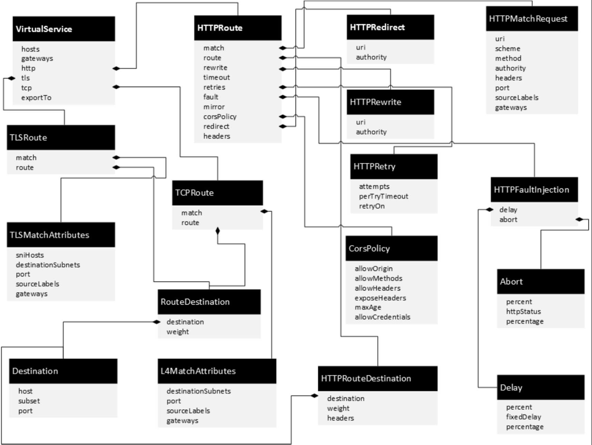
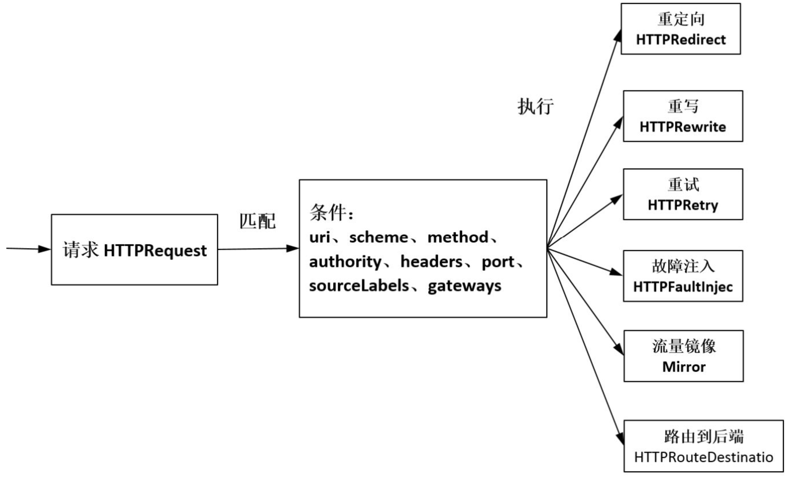
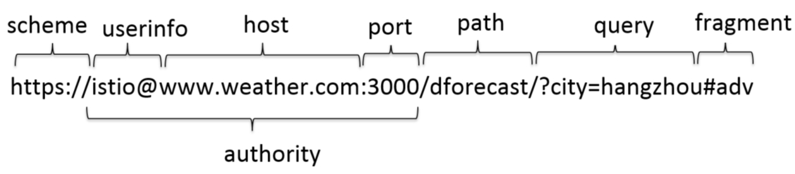

Istio路由规则配置：VirtualService 
=============

## VirtualService
VirtualService 是 Istio 流量治理的核心配置，虚拟服务可以配置如何在服务网格内将请求路由到服务，这基于 Istio 和平台提供的基本的连通性和服务发现能力。**每个虚拟服务包含一组路由规则，Istio 按顺序评估它们，Istio 将每个给定的请求匹配到虚拟服务指定的实际目标地址**。我们的网格可以有多个虚拟服务，也可以没有，取决于我们的使用场景。
> 如果没有虚拟服务，Envoy 会在所有的服务实例中使用轮询的负载均衡策略分发请求。

**提示：** 以下均以 Istio 官方提供的 Bookinfo 为示例

<div align=center>

</div>
<p align="center">图 Istio 官方示例 Bookinfo </p>

### VirtualService 路由规则配置示例
> 根据请求是否来自特定的用户，把它们路由到服务的不同版本，如将用户 jason 的请求转发至服务 reviews 的 v2 版本。 将其他请求都转发到服务的 v1 版本上。
```
apiVersion: networking.istio.io/vlalpha3
kind: VirtualService
metadata:
  name: reviews-vs
spec:
  hosts: 
  - reviews  # 目标服务地址
  http:
  - match:
    - headers:
        end-user:
          exact: jason
    route:
    - destination:
        host: reviews
        subset: v2  # 在 DestinationRule 中定义
  - route:
    - destination:
        host: reviews
        subset: v3 
```
> 注意：在路由的目标对象 Destination 中大多包含表示 Service子集的 subset 字段，这个服务子集是通过 DestinationRule 定义的

### 路由规则定义
VirtualService 定义了对特定目标服务的一组流量规则。VirtualService 在形式上表示一个虚拟服务，将满足条件的流量都转发到对应的服务后端，这个服务后端可以是一个服务，也可以是在 DestinationRule 中定义的服务的子集。

**VirtualService 中的一些术语**
> 参见[《Istio技术解析》章节 ](./Istio技术解析.md)
* **Service**：服务 
* **Service Version**：服务版本
* **Source**：发起调用的服务
* **Host**：服务调用方连接和调用目标服务时使用的地址。

通过 VirtualService 的配置，应用在访问目标服务时，只需要指定目标服务的地址即可，不需要额外指定其他目标资源的信息。虚拟服务主机名可以是 IP 地址、DNS 名称，或者依赖于平台的一个简称（例如 Kubernetes 服务的短名称），隐式或显式地指向一个完全限定域名（FQDN）。您也可以使用通配符（“*”）前缀，创建一组匹配所有服务的路由规则。

VirtualService 在形式上表示一个虚拟服务，将满足条件的流量都转发到对应的服务后端，**这个服务后端可以是一个服务，也可以是在 DestinationRule 中定义的服务的子集**。

<div align=center>

</div>
<p align="center">图 VirtualService路由规则图示 （图源 《云原生服务网格Istio》）</p>

从上图中可以看到，除了 hosts、gateways 等通用字段，规则的主体是 http、tcp 和 tls，都是复合字段，分别对应 HTTPRoute、TCPRoute 和 TLSRoute，表示 Istio 支持的 HTTP、TCP 和 TLS 协议的流量规则。

1. **hosts**：是一个重要的必选字段，表示流量发送的目标。可以将其理解为VirtualService 定义的路由规则的标识，用于匹配访问地址，可以是一个 DNS 名称或    IP 地址。
2. **gateways**：表示应用这些流量规则的 Gateway。服务只是在网格内访问的，gateways 字段可以省略。服务只是在网格外访问的，配置要关联的 Gateway，表示对应 Gateway 进来的流量执行在这个 VirtualService 上定义的流量规则。
3. **http**：是一个与 HTTPRoute 类似的路由集合，用于处理 HTTP 的流量，是 Istio中内容最丰富的一种流量规则。
4. **tls**：是一个 TLSRoute 类型的路由集合，用于处理非终结的 TLS 和 HTTPS 的流量。
5. **tcp**：是一个 TCPRoute 类型的路由集合，用于处理 TCP 的流量，应用于所有其他非 HTTP 和 TLS 端口的流量。如果在 VirtualService 中对 HTTPS 和 TLS 没有定义对应的 TLSRoute，则所有流量都会被当成 TCP 流量来处理，都会走到 TCP 路由集合上。
> 因为版本更新可能导致的改变，具体可参见 Istio 官方文档的详细定义 [《Virtual Service》](https://istio.io/latest/zh/docs/reference/config/networking/virtual-service/#VirtualService)

### 1.  HTTP路由（HTTPRoute）

#### 1.1 HTTPRoute规则解析
HTTPRoute 规则的功能是：满足 HTTPMatchRequest 条件的流量都被路由到HTTPRouteDestination，执行重定向（HTTPRedirect）、重写（HTTPRewrite）、重试（HTTPRetry）、故障注入（HTTPFaultInjection）、跨站（CorsPolicy）策略等。HTTP 不仅可以做路由匹配，还可以做一些写操作来修改请求本身。
<div align=center>

</div>
<p align="center">图 HTTPRoute规则 （图源 《云原生服务网格Istio》）</p>

#### 1.2 HTTP匹配规则（HTTPMatchRequest）
<div align=center>

</div>

（1）**uri、scheme、method、authority**：4个字段都是 StringMatch 类型，在匹配请求时都支持 exact、prefix 和 regex 三种模式的匹配，分别表示完全匹配输入的字符串，前缀方式匹配和正则表达式匹配。

（2）**headers**：匹配请求中的 Header，是一个 Map 类型。对于每一个 Header 的值，都可以使用精确、前缀和正则三种方式进行匹配。
```
 http:
  - match:
    - headers:
        end-user:
          exact: jason
```
（3）**sourceLabels**：是一个 map 类型的键值对，表示请求来源的负载匹配标签。对于每一个 Header 的值，都可以使用精确、前缀和正则三种方式进行匹配。
```
http:
- match:
  - sourceLabels:
      app: productpage  # productpage 是调用 reviews 的来源
      version: v2
```
要注意的是，在 VirtualService 中 **match 字段都是数组类型**。HTTPMatchRequest 中的诸多属性如 uri、headers、method 等是“与”逻辑，而数组中几个元素间的关系是“或”逻辑。

在下面的示例中，match 包含两个 HTTPMatchRequest 元素，其条件的语义是：headers中的 end-user 取值为 “jason”，并且 uri 以“/static”开头的请求，或者 uri 以“/api/v1/products”开头的请求。
```
- match:
  - headers:
      end-user:
        exact: jason
    uri:
      prefix: "/static"
  - uri:
      prefix: "/api/v1/products"
```
#### 1.3 HTTP路由目标（HTTPRouteDestination）
在 HTTPRouteDestination 中主要有三个字段：**destination（请求目标）、weight（权重）和headers（HTTP头操作）**，destination 和 weight 是必选字段。

>如果一个route只有一个destination，那么可以不用配置weight，默认就是100。如下示例为将全部流量都转到这一个destination上：
```
……
spec:
  hosts: 
  - reviews  # 目标服务地址
  http:
  - match:
    - headers:
        end-user:
          exact: jason
    route:
    - destination:
        host: reviews
        subset: v2  # 在 DestinationRule 中定义
  - route:
    - destination:
        host: reviews
        subset: v3 
```
    
>  75%的流量到v1版本，25%的流量到v1版本，在 A/B 测试和金丝雀发布中非常有用：
```
……
spec:
  hosts:
  - reviews
  http:
  - route:
    - destination:
        host: reviews
        subset: v1
      weight: 75
    - destination:
        host: reviews
        subset: v2
      weight: 25
```
#### 1.4 HTTP重定向（HTTPRedirect）
```
apiVersion: networking.istio.io/v1alpha3
kind: VirtualService
metadata:
  name: reviews-vs
spec:
  hosts:
  - reviews
  http:
  - match:
    - uri:
       prefix: /productpage
    redirect:
      uri: /***
      authority: new-productpage
```
#### 1.5 HTTP重写（HTTPRewrite）
```
apiVersion: networking.istio.io/v1alpha3
kind: VirtualService
metadata:
  name: reviews-vs
spec:
  hosts:
  - reviews
  http:
  - match:
    - uri:
       prefix: /productpage
    rewrite:
      uri: /……
    route:
    - destination:
        host: reviews
```
#### 1.6 HTTP重试（HTTPRetry）
HTTPRetry可以定义请求失败时的重试策略。重试策略包括重试次数、超时、重试条件等，这里分别描述相应的三个字段。
* **attempts**：必选字段，定义重试的次数。
* **perTryTimeout**：每次重试的超时时间，单位可以是毫秒（ms）、秒（s）、分钟（m）和小时（h）。
* **retryOn**：进行重试的条件，可以是多个条件，以逗号分隔。其中，重试条件retryOn的取值包括以下几种。
* **5xx**：在上游服务返回5xx应答码，或者在没有返回时重试。
* **gateway-error**：类似5xx异常，只对502、503和504应答码进行重试。
* **connect-failure**：在连接上游服务失败时重试。
```
apiVersion: networking.istio.io/v1alpha3
kind: VirtualService
metadata:
  name: reviews-vs
spec:
  hosts:
  - reviews
  http:
  - route:
    - destination:
        host: reviews
    retries:
      attempts: 5
      perTryTimeout: 3s
      retryOn: 5xx,connect-failure
```

#### 1.7 HTTP流量镜像（Mirror）
> 如下示例：把到reviews v1 版本的流量镜像到 v2版本上
```
apiVersion: networking.istio.io/v1alpha3
kind: VirtualService
metadata:
  name: reviews-vs
spec:
  hosts:
  - reviews
  http:
  - route:
    - destination:
        host: reviews
        subset: v1
    mirror:
      host: reviews
      subset: v2
```

#### 1.8 HTTP故障注入（HTTPFaultInjection）
##### 1. 延迟故障注入
HTTPFaultInjection 中的延迟故障使用 HTTPFaultInjection.Delay 类型描述延时故障，表示在发送请求前进行一段延时，模拟网络、远端服务负载等各种原因导致的失败，主要有如下两个字段。
* **fixedDelay**：一个必选字段，表示延迟时间，单位可以是毫秒、秒、分钟和小时，要求时间必须大于1毫秒。
* **percentage**：配置的延迟故障作用在多少比例的请求上，通过这种方式可以只让部分请求发生故障。
> 如下例所示将 reviews 服务 v1 版本上百分之10的请求产生5秒的延迟
```
apiVersion: networking.istio.io/v1alpha3
kind: VirtualService
metadata:
  name: reviews-vs
spec:
  hosts:
  - reviews
  http:
  - route:
    - destination:
        host: reviews
        subset: v1
    fault:
      delay: 
        percentage:
          value: 10
        fixedDelay: 5s
```
##### 2. 请求中止故障注入
HTTPFaultInjection 使用 HTTPFaultInjection.Abort 描述中止故障，模拟服务端异常，给调用的客户端返回预先定义的错误状态码，主要有如下两个字段。
* **httpStatus**：是一个必选字段，表示中止的HTTP 状态码。
* **percentage**：配置的中止故障作用在多少比例的请求上，通过这种方式可以只让部分请求发生故障，用法同延迟故障。
> 如下例所示将 reviews 服务 v1 版本上百分之10的请求返回500错误
```
apiVersion: networking.istio.io/v1alpha3
kind: VirtualService
metadata:
  name: reviews-vs
spec:
  hosts:
  - reviews
  http:
  - route:
    - destination:
        host: reviews
        subset: v1
    fault:
      delay: 
        percentage:
          value: 10
        httpStatus: 500
```

#### 1.9 HTTP跨域资源共享（CorsPolicy）
Todo……

### 3.TLS路由（TLSRoute）
Todo……

### 4.TCP路由（TCPRoute）
Todo……

## VirtualService 的典型应用
#### 1、多个服务的组合
VirtualService是一个广义的Service，在配置中可以将一个 BookInfo 应用的多个服务组装成一个大的虚拟服务。根据访问路径的不同，对 BookInfo 服务的访问会被转发到不同的内部服务上。
#### 2、路由规则的优先级
路由规则按从上到下的顺序选择，虚拟服务中定义的第一条规则有最高优先级。
#### 3、复杂条件路由
灰度发布等分流规则一般有两种用法：一种是基于请求的内容切分流量，另一种是按比例切分流量。实际上，根据需要也可以结合使用这两种用法。
#### 4、特定版本间的访问规则
> 字段 sourceLabels，该通用字段可以用于过滤访问来源。如下配置只对 productpage 服务的 v2 版本到 reviews 服务的 v1 版本的请求设置20秒的延迟
```
apiVersion: networking.istio.io/vlalpha3
kind: VirtualService
metadata:
  name: reviews-vs
spec:
  hosts: 
  - reviews  # 目标服务地址
  http:
  - match:
    - sourceLabels:
        app: productpage
        version: v2
    fault:
      delay:
        fixedDelay: 20s
  - route:
    - destination:
        host: reviews
        subset: v1
```

[ 下一章节：《Istio目标规则配置：DestinationRule》 ](./Istio目标规则配置：DestinationRule.md)


