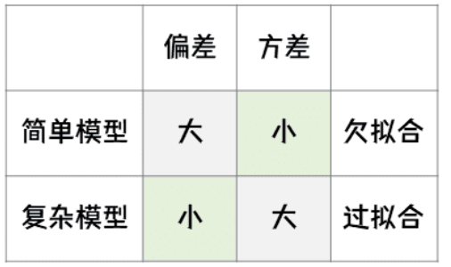
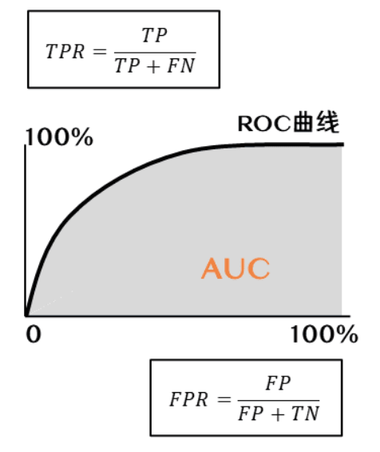
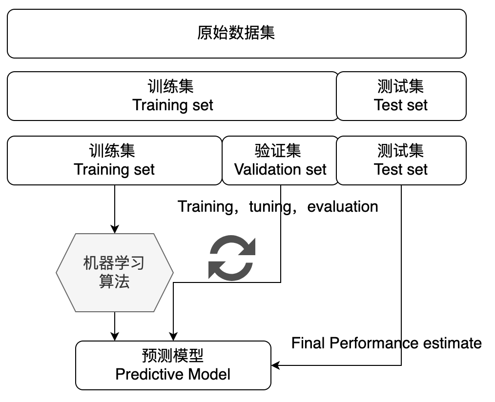

# 机器学习基础知识
- [机器学习基础知识](#机器学习基础知识)
  - [一、机器学习概述](#一、机器学习概述)
    - [1、什么是机器学习](#1、什么是机器学习)
      - [人工智能（Artificial intelligence）](#人工智能（artificial-intelligence）)
      - [机器学习（Machine learning）](#机器学习（machine-learning）)
      - [机器学习的定义](#机器学习的定义)
      - [深度学习](#深度学习)
    - [2、机器学习三要素](#2、机器学习三要素)
      - [数据](#数据)
      - [算法](#算法)
      - [模型](#模型)
    - [3、机器学习基本流程](#3、机器学习基本流程)
    - [4、机器学习的核心应用场景](#4、机器学习的核心应用场景)
  - [二、机器学习的基本名词](#二、机器学习的基本名词)
  - [三、机器学习的算法分类](#三、机器学习的算法分类)
    - [机器学习算法依托的问题场景](#机器学习算法依托的问题场景)
    - [监督学习](#监督学习)
      - [1、分类问题](#1、分类问题)
      - [2、回归问题](#2、回归问题)
    - [无监督学习](#无监督学习)
      - [1、聚类问题](#1、聚类问题)
      - [2、降维问题](#2、降维问题)
  - [四、机器学习模型评估与选择](#四、机器学习模型评估与选择)
    - [1、数据拟合](#1、数据拟合)
    - [2、训练集与数据集](#2、训练集与数据集)
    - [3、经验误差](#3、经验误差)
    - [4、过拟合](#4、过拟合)
    - [5、偏差](#5、偏差)
    - [6、方差](#6、方差)
    - [7、偏差与方差的平衡](#7、偏差与方差的平衡)
    - [8、性能度量指标](#8、性能度量指标)
      - [（1）回归问题](#（1）回归问题)
      - [（2）分类问题](#（2）分类问题)
    - [9、评估方法](#9、评估方法)
      - [（1）留出法（Hold-out）](#（1）留出法（hold-out）)
      - [（2）交叉验证法（ Cross Validation）](#（2）交叉验证法（-cross-validation）)
      - [（3）自助法（Bootstrap）](#（3）自助法（bootstrap）)
    - [10、模型调优与选择准则](#10、模型调优与选择准则)
      - [（1）验证集评估选择](#（1）验证集评估选择)
      - [（2）网格搜索/随机搜索交叉验证](#（2）网格搜索随机搜索交叉验证)
      - [（3）贝叶斯优化](#（3）贝叶斯优化)

## 一、机器学习概述
### 1、什么是机器学习

#### 人工智能（Artificial intelligence）
简而言之，人工智能可以被描述为试图将通常由人类完成的智力任务自动化。因此，人工智能是一个综合领域，不仅包括机器学习和深度学习，还包括更多不涉及学习的方法。

#### 机器学习（Machine learning）
让计算机有效工作的常用方法是，由人类程序员编写规则（计算机程序），计算机遵循这些规则将输入数据转换为适当的答案。如下图所示——经典的程序设计

图 经典的程序设计

机器学习把这个过程反了过来：机器读取输入数据和相应的答案，然后找出应有的规则，如下图所示——机器学习。机器学习系统是训练出来的，而不是明确地用程序编写出来的。将与某个任务相关的许多示例输入机器学习系统，它会在这些示例中找到统计结构，从而最终找到将任务自动化的规则。

图 机器学习

**机器学习与数理统计相关，但二者在几个重要方面有所不同**
* 与统计学不同，机器学习经常要处理复杂的大型数据集（比如包含数百万张图片的数据集，每张图片又包含数万像素），用经典的统计分析（比如贝叶斯分析）来处理这种数据集是不切实际的。因此，机器学习（尤其是深度学习）呈现出相对较少的数学理论（可能过于少了），从根本上来说是一门**工程学科**。
* 与理论物理或数学不同，机器学习是一门**非常注重实践的学科，由经验发现所驱动，并深深依赖于软硬件的发展。**
> 机器学习大概在上世纪80年代开始蓬勃发展，诞生了一大批数学统计相关的机器学习模型。

#### 机器学习的定义
**其中一个工程化的概念**

一个计算机程序利用经验E来学习任务T，性能是P，如果针对任务T的性能P随着经验E不断增长，则称为机器学习。 比如一个电商领域的应用
* T：将用户可能购买的商品推荐给用户；
* E：用户查看、忽略或购买了某商品；
* P：用户成功购买商品的比率；

**机器学习算法**

对于一项数据处理任务，给定预期输出的示例，机器学习系统可以发现执行任务的规则。
* 输入数据。如果任务是语音识别，那么输入数据可能是记录人们说话的声音文件。如果任务是为图像添加标签，那么输入数据可能是图片。
* 预期输出的示例。对于语音识别任务来说，这些示例可能是人们根据声音文件整理生成的文本。对于图像标记任务来说，预期输出可能是“狗”“猫”之类的标签。
* 衡量算法效果的方法。其目的是计算算法的当前输出与预期输出之间的差距。衡量结果是一种反馈信号，用于调整算法的工作方式。这个调整步骤就是我们所说的学习。

机器学习模型将输入数据变换为有意义的输出。**简而言之，机器学习就是指在预先定义的可能性空间中，利用反馈信号的指引，在输入数据中寻找有用的表示和规则。**
> 什么是表示？
> 
> 这一概念的核心在于以一种不同的方式来查看数据（表征数据或将数据编码）。比如彩色图像可以编码为RGB（红−绿−蓝）格式或HSV（色相−饱和度−明度）格式，这些是对同一数据的两种表示。机器学习模型旨在为输入数据寻找合适的表示（对数据进行变换），使其更适合手头的任务。

#### 深度学习
深度学习是机器学习的一个分支领域：它是从数据中学习表示的一种新方法，强调从连续的层中学习，这些层对应于越来越有意义的表示。

深度学习之“深度”是指一系列连续的表示层，数据模型所包含的层数被称为该模型的深度（depth）。现代深度学习模型通常包含数十个甚至上百个连续的表示层，它们都是从训练数据中自动学习而来的。与之相对，其他机器学习方法的重点通常是仅学习一两层的数据表示（例如获取像素直方图，然后应用分类规则），因此有时也被称为浅层学习（shallow learning）。

在深度学习中，这些分层表示是通过叫作神经网络（neural network）的模型学习得到的。神经网络的结构是逐层堆叠。如下图所示——用于数字分类的深度神经网络

这个神经网络将数字图像变换为与原始图像差别越来越大的表示，而其中关于最终结果的信息越来越丰富。你可以将深度神经网络看作多级信息蒸馏（information distillation）过程：信息穿过连续的过滤器，其纯度越来越高（对任务的帮助越来越大）。如下图所示——数字分类模型学到的数据表示

### 2、机器学习三要素
机器学习三要素包括数据、模型、算法。这三要素之间的关系，可以简单示意如下：
data + Algorithm ——> model

#### 数据
AI中的“数据驱动”是通过数据实现“智能”的体现——通过数据获取、数据分析，基于算法和模型形成数据应用、数据反馈的闭环。

#### 算法
指学习模型的具体计算方法。统计学习基于训练数据集，根据学习策略，从假设空间中选择最优模型，最后需要考虑用什么样的计算方法求解最优模型。通常是一个最优化的问题。

#### 模型
在AI数据驱动的范畴内，模型指的是基于数据X做决策y的假设函数，可以有不同的形态，计算型和规则型等。

### 3、机器学习基本流程
机器学习工作流（WorkFlow）包含数据预处理（Processing）、模型学习（Learning）、模型评估（Evaluation）、新样本预测（Prediction）几个步骤。
* **数据预处理**：输入（未处理的数据 + 标签）→处理过程（特征处理+幅度缩放、特征选择、维度约减、采样）→输出（测试集 + 训练集）。
* **模型学习**：模型选择、交叉验证、结果评估、超参选择。
* **模型评估**：了解模型对于数据集测试的得分。
* **新样本预测**：预测测试集。

### 4、机器学习的核心应用场景
* **分类**：应用以分类数据进行模型训练，根据模型对新样本进行精准分类与预测。
* **聚类**：从海量数据中识别数据的相似性与差异性，并按照最大共同点聚合为多个类别。
* **回归**：根据对已知属性值数据的训练，为模型寻找最佳拟合参数，基于模型预测新样本的输出值。
* **异常检测**：对数据点的分布规律进行分析，识别与正常数据及差异较大的离群点。

|   | 应用场景示例  |
|---|---|
| **分类** |  用户画像、情感分析、用户行为预测、图像识别 |
| **聚类**  |  市场细分、模式识别、空间数据分析、图像处理与分析 |
| **异常检测** |  日常运行监控、风险识别、舞弊检测 |
| **回归** |  趋势预测、价格预测、流量预测 |

## 二、机器学习的基本名词
* **监督学习（Supervised Learning）【有特征有标签】**：提供数据并提供数据对应结果的机器学习过程，学习方式有分类和回归。
>从给定的训练数据集中学习出一个函数，当新的数据到来时，可以根据这个函数预测结果。监督学习的训练集要求是包括输入和输出，也可以说是特征和目标。训练集中的目标是由人工标注的。常见的监督学习算法包括回归分析和统计分类。
* **无监督学习（Unsupervised Learning）【有特征无标签】**：提供数据但不提供数据对应结果的机器学习过程，学习方式有聚类和降维。
> 与监督学习相比，训练集没有人为标注的结果。常见的无监督学习算法有生成对抗网络（GAN）、聚类。
* **强化学习（Reinforcement Learning）【有延迟和稀疏的反馈标签】**：通过与环境交互并获取延迟反馈进而改进行为的机器学习过程。
> 通过观察来学习做成如何的动作。每个动作都会对环境有所影响，学习对象根据观察到的周围环境的反馈来做出判断。

<table>
    <tr>
        <th colspan="5">训练数据</th>
    <tr>
    <tr>
        <th>序号</th>
        <th>体型（x₁）</th>
        <th>毛发（x₂）</th>
        <th>特点（x₃）</th>
        <th style="background-color:yellow">品种（目标变量y）</th>
    <tr>
    <tr>
        <td align="center">1</td>
        <td align="center">大</td>
        <td align="center">长</td>
        <td align="center">友善</td>
        <td  align="center" style="background-color:yellow">阿拉斯加</td>
    <tr>
    <tr>
        <td align="center">2</td>
        <td align="center">中</td>
        <td align="center">中</td>
        <td align="center">呆</td>
        <td  align="center" style="background-color:yellow">哈士奇</td>
    <tr>
      <tr>
        <tr>
        <td align="center">3</td>
        <td align="center">中</td>
        <td align="center">中</td>
        <td align="center">友善</td>
        <td  align="center" style="background-color:yellow">牧羊犬</td>
    <tr>
     <tr>
        <tr>
        <td align="center">4</td>
        <td align="center">小</td>
        <td align="center">短</td>
        <td align="center">可爱</td>
        <td  align="center" style="background-color:yellow">柯基</td>
    <tr>
     <tr>
        <tr>
        <td align="center">5</td>
        <td align="center">小</td>
        <td align="center">短</td>
        <td align="center">呆</td>
        <td  align="center" style="background-color:yellow">柯基</td>
    <tr>
     <tr>
        <tr>
        <td align="center">……</td>
        <td align="center">……</td>
        <td align="center">……</td>
        <td align="center">……</td>
        <td  align="center" style="background-color:yellow">……</td>
    <tr>
</table>

* **示例/样本**：上表中数据集中的一条（行）数据。
* **属性/特征**：「体型」「毛发」等。
* **属性空间/样本空间/输入空间x**：由全部属性形成的空间。
* **特征向量**：空间中每个点对应的一个坐标向量。
* **标签**：关于示例结果的信息，如（（体型=大，毛发=长，特点=友善），阿拉斯加），其中「阿拉斯加」称为标签。
* **分类**：若要预测的是离散值，如「阿拉斯加」，「哈士奇」，此类学习任务称为分类。
* **假设**：学习模型对应了关于数据的某种潜在规律。
* **真相**：潜在规律自身。
* **学习过程**：是为了找出或逼近真相。
* **泛化能力**：学习模型适用于新样本的能力。一般来说，训练样本越大，越有可能通过学习来获得具有强泛化能力的模型。

## 三、机器学习的算法分类
**机器学习算法从数据中自动分析获得规律，并利用规律对未知数据进行预测。**

### 机器学习算法依托的问题场景
* **分类**：从若干离散值中做选择；
* **回归**：预估输出连续值结果；
* **聚类**：发现与挖掘数据分布的聚集特性；

### 监督学习
#### 1、分类问题
分类问题是机器学习非常重要的一个组成部分。它的目标是根据已知样本的某些特征，判断一个新的样本属于哪种已知的样本类。分类问题可以细分如下：

* **二分类问题**：表示分类任务中有两个类别，新的样本属于其中之一，比如邮件中的正常邮件和垃圾邮件。
* **多类分类（Multiclass classification）问题**：表示分类任务中有多种类别，比如数字识别。
* **多标签分类（Multilabel classification）问题**：给每个样本一系列的目标标签，比如一个用户属于高价值用户也属于即将流失用户……。

>**相关机器学习分类算法**：KNN算法、逻辑回归算法、朴素贝叶斯算法、决策树模型、随机森林分类模型、GBDT模型、XGBoost模型、支持向量机模型等。

#### 2、回归问题
根据数据样本中抽取出的特征，预测连续值结果。比如房价的预测、销量的预测……
> **相关机器学习回归算法**：线性回归、决策树模型、随机森林分类模型、GBDT模型、回归树模型、支持向量机模型等。

### 无监督学习
#### 1、聚类问题
根据数据样本中抽取出的特征，挖掘数据的关联模式。比如相似用户群体挖掘、新闻聚类……
> **相关机器学习聚类算法**：K-Means 算法、Single-linkage 算法和 Complete-linkage 算法。

#### 2、降维问题
将高维数据用低维数据进行表达，进行数据映射。比如在互联网大数据场景下，我们经常需要面对高维数据，在对这些数据做分析和可视化的时候，我们通常会面对「高维」这个障碍。在数据挖掘和建模的过程中，高维数据也同样带来大的计算量，占据更多的资源，而且许多变量之间可能存在相关性，从而增加了分析与建模的复杂性。
> **相关机器学习聚类算法**：主成分分析（Principal Components Analysis，简称PCA）

## 四、机器学习模型评估与选择
### 1、数据拟合
机器学习最典型的监督学习为分类与回归问题。分类问题中，我们学习出来一条「决策边界」完成数据区分；在回归问题中，我们学习出拟合样本分布的曲线。

### 2、训练集与数据集
* **训练集（Training Set）**：帮助训练模型，简单的说就是通过训练集的数据让确定拟合曲线的参数。
* **测试集（Test Set）**：为了测试已经训练好的模型的精确度。
> 测试集并不能保证模型的正确性，只是说相似的数据用此模型会得出相似的结果。因为在训练模型的时候，参数全是根据现有训练集里的数据进行修正、拟合，有可能会出现过拟合的情况，即这个参数仅对训练集里的数据拟合比较准确，这个时候再有一个数据需要利用模型预测结果，准确率可能就会很差。

### 3、经验误差
在训练集的数据上进行学习。模型在训练集上的误差称为「经验误差」（Empirical Error）。但是经验误差并不是越小越好，因为我们希望在新的没有见过的数据上，也能有好的预估结果。

### 4、过拟合
过拟合，指的是模型在训练集上表现的很好，但是在交叉验证集合测试集上表现一般，也就是说模型对未知样本的预测表现一般，泛化（Generalization）能力较差。

防止过拟合一般的方法有**Early Stopping、数据集扩增（Data Augmentation）、正则化、Dropout**等。
* **正则化**：指的是在目标函数后面添加一个正则化项，一般有L1正则化与L2正则化。L1正则是基于L1范数，即在目标函数后面加上参数的L1范数和项，即参数绝对值和与参数的积项。
* **数据集扩增**：即需要得到更多的符合要求的数据，即和已有的数据是独立同分布的，或者近似独立同分布的。一般方法有：从数据源头采集更多数据、复制原有数据并加上随机噪声、重采样、根据当前数据集估计数据分布参数，使用该分布产生更多数据等。
* **DropOut**：通过修改神经网络本身结构来实现的。

### 5、偏差
偏差（Bias），它通常指的是模型拟合的偏差程度。给定无数套训练集而期望拟合出来的模型就是平均模型。偏差就是真实模型和平均模型的差异。
> 简单模型通常高偏差，复杂模型通常低偏差。

### 6、方差
方差（Variance），它通常指的是模型的平稳程度（简单程度）。简单模型的对应的函数如出一辙，都是水平直线，而且平均模型的函数也是一条水平直线，因此简单模型的方差很小，并且对数据的变动不敏感。
复杂模型的对应的函数千奇百怪，毫无任何规则，但平均模型的函数也是一条平滑的曲线，因此复杂模型的方差很大，并且对数据的变动很敏感。

### 7、偏差与方差的平衡

### 8、性能度量指标
性能度量是衡量模型泛化能力的数值评价标准，反映了当前问题（任务需求）。使用不同的性能度量可能会导致不同的评判结果。

#### （1）回归问题
关于模型「好坏」的判断，不仅取决于算法和数据，还取决于当前任务需求。回归问题常用的性能度量指标有：平均绝对误差、均方误差、均方根误差、R平方等。

* **平均绝对误差（Mean Absolute Error，MAE）**，又叫平均绝对离差，是所有标签值与回归模型预测值的偏差的绝对值的平均。
* **平均绝对百分误差（Mean Absolute Percentage Error，MAPE）** 是对MAE的一种改进，考虑了绝对误差相对真实值的比例。
* **均方误差（Mean Square Error，MSE）** 相对于平均绝对误差而言，均方误差求的是所有标签值与回归模型预测值的偏差的平方的平均。
* **均方根误差（Root-Mean-Square Error，RMSE）**，也称标准误差，是在均方误差的基础上进行开方运算。RMSE会被用来衡量观测值同真值之间的偏差。
* **R平方决定系数**，反映因变量的全部变异能通过目前的回归模型被模型中的自变量解释的比例。比例越接近于1，表示当前的回归模型对数据的解释越好，越能精确描述数据的真实分布。

#### （2）分类问题
分类问题常用的性能度量指标包括**错误率（Error Rate）、精确率（Accuracy）、查准率（Precision）、查全率（Recall）、F1、ROC曲线、AUC曲线和R平方**等。
> 表：分类结果混淆矩阵

* **准确率（accuracy）**：分类正确的样本数占样本总数的比例，值越大性能越好。公式为：$Acc = \frac {TP+TN}{TP+TN+FP+FN}$  
* **错误率（Error Rate）**：分类错误的样本数占样本总数的比例，值越小性能越好。公式为：$Err = \frac {FP+FN}{TP+TN+FP+FN}$
* **查准率（也称精确率 precision）**，即在检索后返回的结果中，真正正确的个数占我们认为是正确的结果的比例，值越大性能越好。公式为：$Precision = \frac {TP}{TP+FP}$
* **查全率（也称召回率 recall）**，即在检索结果中真正正确的个数，占整个数据集（检索到的和未检索到的）中真正正确个数的比例，值越大性能越好。公式为：$Recall = TRP = \frac {TP}{TP+FN}$
* **误报率（也称误检率 false alarm）**， 即负样本被预测为正样本占总的负样本的比例。值越小性能越好。公式为：$falsealarm = FPR = \frac {FP}{FP + TN}$
* **F1是一个综合考虑查准率与查全率的度量**，其基于查准率与查全率的调和平均定义：即：F1能让我们表达出对查准率、查全率的不同偏好。公式为：$F1 =2* \frac {Precision * Recall}{Precision + Recall}$

* **ROC曲线（Receiver Operating Characteristic Curve）** 全称是「受试者工作特性曲线」。综合考虑了概率预测排序的质量，体现了学习器在不同任务下的「期望泛化性能」的好坏。ROC曲线的纵轴是查全率（TPR），横轴是误报率（FPR）。ROC 曲线反映了 TPR 和 FPR 随阈值的变化情况，曲线越接近左上角，表示该分类器的性能越好。
* **AUC（Area Under ROC Curve）** 是ROC曲线下面积，代表了样本预测的排序质量。AUC 值越大，就能够保证 ROC 曲线越接近左上方。

### 9、评估方法
如何可靠地评估模型？关键是要获得可靠的【测试集数据】（Test Set），即测试集（用于评估）应该与训练集（用于模型学习）「互斥」。

什么样的模型好？泛化能力强的模型，即能很好的适用于没见过的样本。

常见的评估方法有：**留出法（Hold-out）、交叉验证法（ Cross Validation）、自助法（Bootstrap）**。

#### （1）留出法（Hold-out）
是机器学习中最常见的评估方法之一，它会从训练数据中保留出验证样本集，这部分数据不用于训练，而用于模型评估。

>对原始数据集划分时不易随机划分，可以采用分层抽样方式选择测试数据，保证数据分布比例的平衡。
>
>一般多次重复“划分-训练-测试求误差”的步骤，取误差的平均值。
>
>测试集不能太大或者太小，否则评估将失去准确度或意义，常用做法是选择1/5-1/3左右数据用于评估。

#### （2）交叉验证法（ Cross Validation）
机器学习中，另外一种比较常见的评估方法是交叉验证法（ Cross Validation）。k 折交叉验证对 k 个不同分组训练的结果进行平均来减少方差，因此模型的性能对数据的划分就不那么敏感，对数据的使用也会更充分，模型评估结果更加稳定。

$E = \frac 1K \sum_{i=1}^m E_i$
> 数据量小的时候，K 值可以设大一些；数据量大的时候，K值可以设小一些。
> 
> K 一般取10
> 
> 当 K=m 即样本总数时，叫做留一法（Leave-one-off），每次测试的时候只有一个样本，要进行 m 次训练和预测。

#### （3）自助法（Bootstrap）
是一种用小样本估计总体值的一种非参数方法，在进化和生态学研究中应用十分广泛。Bootstrap通过有放回抽样生成大量的伪样本，通过对伪样本进行计算，获得统计量的分布，从而估计数据的整体分布。

### 10、模型调优与选择准则
我们希望找到对当前问题表达能力好，且模型复杂度较低的模型：
* 表达力好的模型，可以较好地对训练数据中的规律和模式进行学习；
* 复杂度低的模型，方差较小，不容易过拟合，有较好的泛化表达。

**如何选择最优的模型？**
#### （1）验证集评估选择
* 切分数据为训练集和验证集。
* 对于准备好的候选超参数，在训练集上进行模型，在验证集上评估。
#### （2）网格搜索/随机搜索交叉验证
* 通过网格搜索/随机搜索产出候选的超参数组。
* 对参数组的每一组超参数，使用交叉验证评估效果。
* 选出效果最好的超参数。
#### （3）贝叶斯优化
* 基于贝叶斯优化的超参数调优。

### 相关参考书籍及网站如下
* 《机器学习实战：基于Scikit-Learn、Keras和TensorFlow》（第2版）
* 《Python深度学习》（第2版）
* 网站：<https://www.showmeai.tech/>
