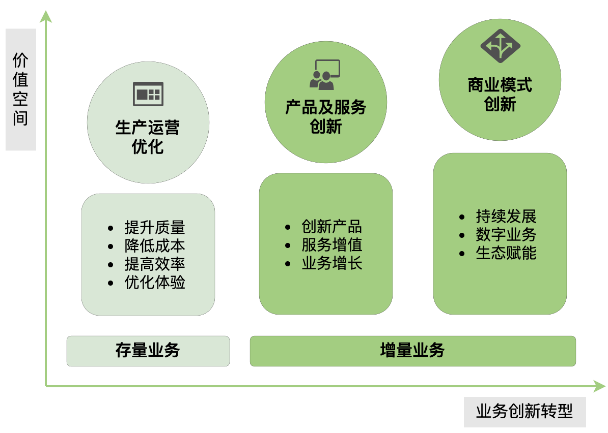
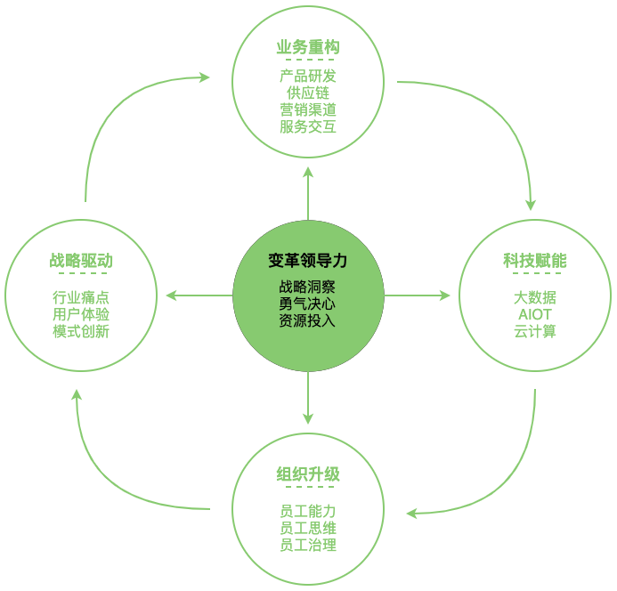
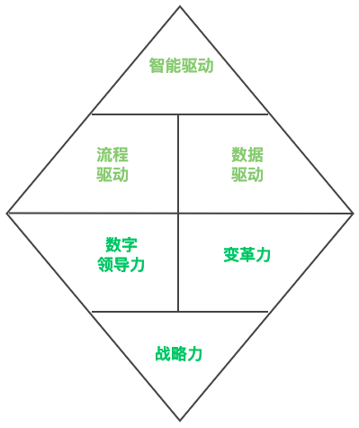

数字化转型
=============

说起“数字化转型”，应该是当下商业界又一个新的时代浪潮，千行百业均已感受到了这波浪潮的热度和影响。少部分先行企业或早已乘浪起航，通过成功的数字化转型，在红利逐渐消逝的商业竞争中取得了先机；部分企业已明确要逐浪前行，只求不被时代抛下；也有部分企业面对大潮涌来不得已被裹挟其中，却在迷茫中跌跌撞撞；还有些企业仍然在观望，毕竟潮水退去总有很多被淹没的“弄潮儿”时时警醒着众人。

其实，上述几类企业的选择无所谓对错。其实就连“数字化转型”本身，目前商业界也没有一个清晰明确的共识定义和标准的方法论。不同阶段、不同规模、不同能力的企业是否该进行数字化转型应该是建立在对自身了解、对数字化转型理解后，理性的评估和选择，而不是莽撞的快赶硬上。

## 一、首先，什么是数字化转型

* **谷歌**：数字化转型是利用现代化数字技术（包括所有类型的公共云、私有云和混合云平台）来创建或调整业务流程、文化和客户体验，以适应不断变化的业务和市场需求。
* **亚马逊**：数字化转型的本质是信息技术和能力驱动商业的变革。企业数字化转型的三个关键是：
    * 第一，建立起数字化的企业战略、模式和文化；
    * 第二，企业掌握驾驭数字化新技术的能力；
    * 第三，将数据视为企业的战略资产。
* **IDC（国际数据公司）**：数字化转型是利用数字化技术（如云计算、移动化、大数据/分析、社交和物联网）能力来驱动组织商业模式创新和商业生态系统重构的途径或方法。
* **Gartner**：数字化（Digital）是通过二进制代码表示物理项目或活动。数字化转型是指数字业务转型（Digital BusinessTransformation），是利用数字技术支持能力来创建一个强大的新数字商业模式的过程。
* **国务院发展研究中心相关课题组《传统产业数字化转型的模式和路径》**：数字化转型是利用新一代信息技术，构建数据的采集、传输、存储、处理和反馈的闭环，打通不同层级与不同行业间的数据壁垒，提高行业整体的运行效率，构建全新的数字经济体系。
* **中国信通院信息化与工业化融合研究所副所长刘默**：数字化转型是以数据为核心驱动，以新一代信息技术与各行业全面融合为主线，以提质降本增效为目标，变革生产方式、业务形态、产业组织方式与商业模式的过程，包含“数字化、网络化、智能化”的全部内容。其中，数据是转型的关键要素，价值创造是转型的根本目的，优化提升与创新变革是转型的主要内容。

&nbsp;

从以上众多行业知名企业和机构的定义中，我们可以提炼出数字化转型几个关键词：
* **数据**（采集、传输、存储、价值挖掘）
* **数字化能力**（战略、组织和人）
* **数字化技术**（云计算、AI、5G、物联网、大数据、区块链等）
* **商业模式**（生产方式、管理组织形式、业务形态）。

通过数字化转型，企业能够迈向更强大的商业模式，实现营收增长和未来长远的发展。

## 二、数字化企业特点
* **百度百科**：所谓数字化企业，是指那些由于使用数字技术，改变并极大地拓宽了自己的战略选择的企业。数字化企业具有自己的战略特点，其建立了一种企业模式，能够以新的方式创造和捕捉利润，建立新的、强大的客户和员工价值理念。
* **埃森哲**：真正的数字化企业并非只是依靠新技术取得成功。企业文化、战略和运营方式才是令数字化企业脱颖而出、拥有竞争优势的关键所在……数字化企业会不断寻求、识别并开发新的数字化业务模式，始终确保以客户和员工为中心。
* **Gartner**：数字化企业是以客户为中心，通过数字化技术推动自身业务重塑和转型的企业。

数字技术在企业内的影响越来越深远的过程，大体可以分成三个阶段：**信息化阶段、数字化阶段和智能化阶段。**

### 信息化阶段
企业进行信息化的目的一般是提升价值链上某个单一环节的效率，比如使用OA（办公自动化）、PLM（产品生命周期管理）、ERP（企业资源计划）、MES（制造执行系统）、CRM（客户关系管理）等软件。

信息化的主要特征是关键业务流的在线实现，依赖“人工”式的数据采集，实现了流程及数据的标准化。之于企业而言，信息化阶段造成的最大问题是数据联通性差，企业内部的系统孤岛、数据孤岛现象普遍，无法统筹价值链的整体提升。
### 数字化阶段
企业进行数字化的目的主要在数据价值挖掘和业务赋能及创新上。数字化解决上述信息化过程中面临的系统联通性差和数据孤岛的问题。

数字化以数据为核心，利用数字化技术（云计算、AI、5G、物联网、大数据、区块链等），形成业务数据化、数据资产化、资产服务化、服务价值化的闭环。

### 智能化阶段
企业进行智能化的主要目的是希望在企业运营上实现系统与系统对接，依靠算法做智能决策，以降低对个体经验的依赖，提高决策效率，扩大判断维度。

智能化阶段也伴随着人工智能、AIoT技术的成熟和大量应用在物物互联、人机交互场景中。

&nbsp;

**可以看到：信息化和数字化、智能化之于企业一个重要不同点在于：信息化被看作是工具，是一项基础设施，而数字化、智能化，更多地被认为是企业在发展业务时所设计的大框架中的核心能力。**

## 三、数字化之于企业的价值

图 数字化转型之于企业的价值 

    
## 四、企业如何进行数字化转型——方法论推荐

### 1、杨国安教授：杨五环理论模型
杨五环包括战略驱动、业务重构、科技赋能、组织升级、变革领导力五大环节
* **战略驱动**，是指在战略上要想清楚为什么要推动数字化。
* **业务重构**，是指企业从广度和深度上用数字技术重构价值链乃至生态链时，它势必要考虑从哪里切入、每个阶段的节奏如何。
* **科技赋能**，是指用什么数字科技来提升企业的价值链。
* **组织升级**，是指要让数字化能够落地，你的员工能力、员工思维、员工治理得适应数字时代的需求。
* **变革领导力**，是指在变革之际最高领导者的战略洞察、勇气决心、资源投入是否足够。

图 数字化转型杨五环（参照书籍《数智革新杨五环》）

#### 战略驱动
需要清晰以下问题：为什么要进行数字化转型？我所在的行业面对哪些重要的机遇与挑战？行业/公司现在的痛点是什么？消费者未被满足的需求是什么？数字化能在其中发挥什么作用？数字化在公司未来的战略中会扮演什么角色？智能化技术应用于公司业务场景还有多远？不进行数字化转型，公司会有什么危机？

#### 业务重构
企业的价值链条很长，包括产品与研发、供应链管理、营销与用户增长、服务与交互、采购与物流等。数字化转型的战略要落地，如何选择最核心的切入点？数字化转型不是有与没有的状态，而是要坚持长期主义，企业不断做深、做广的过程。

从业务价值链的哪里切入，然后再往哪里去，步骤到底是什么？答案与行业痛点、公司战略密切相关。比如零售业的切入点一般是在营销和渠道端，制造业一般是在供应链端。

#### 科技赋能
想清楚切入点后，接着要弄清楚哪些科技能力适合赋能业务。数字化技术（云计算、AI、5G、物联网、大数据、区块链等）几乎适合于所有行业。很多企业、行业系统都需要上云，需要算法来处理自己的数据，需要建设数据中台、业务中台。

#### 组织升级
数字化转型之所以不成功，往往不是技术能力的问题，而是组织和团队不具备相应的能力来支撑转型。

* 员工能力上，企业能否吸引数字化转型所需的互联网或技术人才，以科技提升运营效率或用户体验？如何保留他们？如何帮助他们与业务团队有机结合，打造既懂业务又懂技术的项目团队？如何培训员工接受和使用这些新工具？
* 员工思维上，推行数字化转型时企业内往往会出现新旧两类商业模式并存的现象，身处其中的员工如果不支持转型，往往是因为激励机制并不统一。
* 员工治理上，公司组织架构是否调整得更加扁平？能否打通不同部门的“烟筒”或数据孤岛，建设共享数据、内容或技术的平台？有没有让前线员工借着科技得到更多授权？架构共享中台+敏捷业务团队的组织模式，是诸多优秀案例企业在组织架构上的演进方向，兼顾业务团队的自主性和企业的协同效应。

#### 变革领导力
平稳增长时期的领导力与变革时期的领导力是不一样的，后者要求企业最高领导者具备更强的战略洞察能力、勇气决心和资源投入。数字化转型这场变革是地地道道的“一把手”工程，只有企业最高领导者发挥的领导力与前四环紧密交融在一起，才能推动转型的落地。变革领导力在“杨五环”中是发动机，也是唯一一个贯穿始终的环节。

### 2、《华为数字化转型》：钻石模型

图 华为数字化转型钻石模型（参照书籍《华为数字化转型》）

**华为数字化转型最重要的一个特征是**：数字化转型从一开始就不是单纯的IT项目，完全不同于当时大部分企业的信息化建设工作。华为数字化转型的目标是公司的管理体系建设，因此华为的数字化一直与管理变革、业务转型、流程重整紧密地结合在一起，是以业务需求为导向、流程与IT相结合的端到端的业务变革。

#### 华为数字化转型之道：三力

战略力、数字领导力和变革力是最为关键的数字化转型成功因子，也是华为管理变革与数字化转型过程中的核心理念和管理方法，是企业数字化转型之“道”。

（1）**战略力**。战略力明确了企业数字化转型的本质，是数字化转型的纲领、方向和定位，企业要避免开展数字化转型像无头苍蝇一样四处碰壁的现象。企业需要依靠战略力，建立数字化转型的共同目标和共享愿景，将数字化转型从领导想做、个别部门要做，变成企业必须做、大家一起做的共同战略。

（2）**数字领导力**。企业领导者在数字化转型过程中的决策，往往是决定数字化转型成败的关键要素。技术只是数字化转型成功的关键之一，更主要的还是企业有没有数字领导力，有没有推动企业数字化转型的决策能力和指挥能力。

（3）**变革力**。变革力的本质是用规范化的制度管理数字化转型的执行落地过程。特别值得强调的是，变革的本质是对人的行为的重塑，因此变革要强调转型过程改变人的行为的重要性。

**综上所述**：数字化转型之道可被归纳为：有了正确的方向和定位（战略力），有了企业领导者拥抱时代的新型领导力（数字领导力），有了变革管理机制的有效运作（变革力），企业就掌握了数字化转型的基本规律。

#### 华为数字化转型之术：三个驱动

《华为数字化转型》书中认为数字化企业是具备连接、在线、共享、智能4大关键特征的企业
* **连接**，是企业数字化转型的基础。数字化企业首先是在基础层面互联互通、打通内外部连接的企业。
* **在线**，是指在连接的基础上，通过业务流程化和流程数字化，实现业务在线、组织在线。
* **共享**，企业要注意逐步推进“大共享”的管理理念。成功的数字化应该包括两个关键共享服务：共性业务的平台化和服务化，数据的资产化和业务的可视化，从而推动企业在管理上朝着平台型组织转变。
* **智能**，企业智能是建立在大数据和人工智能基础上的运营全面智能化，是企业具备“连接”“共享”“在线”特征之后的延伸，是企业数字化转型的高阶目标。

这4个关键特征，除了“连接”是数字化基础和使能的共性手段，其他特征的实现都依赖于“三个驱动”的转型之术——流程驱动、数据驱动、智能驱动。
* **流程驱动**：聚焦“在线”特征，通过业务流程化和流程数字化，实现业务在线、组织在线。
* **数据驱动**：聚焦“共享”特征，实现共性业务的平台化和服务化，实现数据的资产化和业务的可视化。
* **智能驱动**：聚焦“智能”特征，实现业务流程场景智能，实现业务管理决策智能，支撑企业在不确定的多场景中保有可持续增长的态势。

