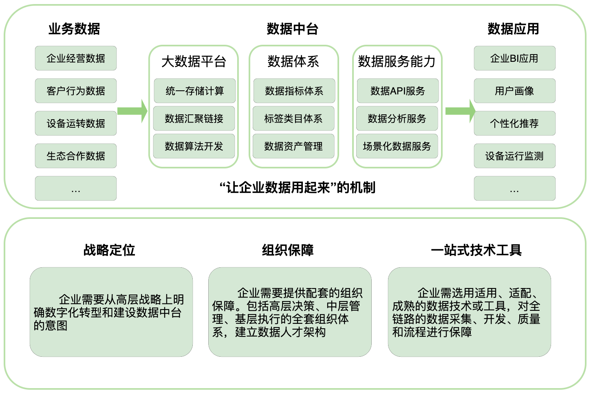
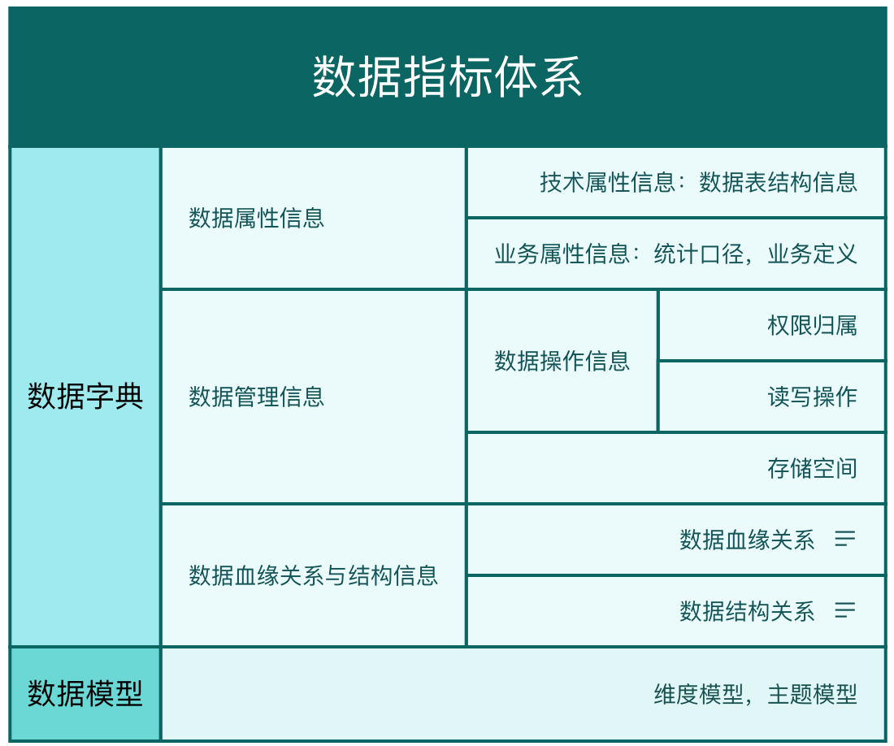
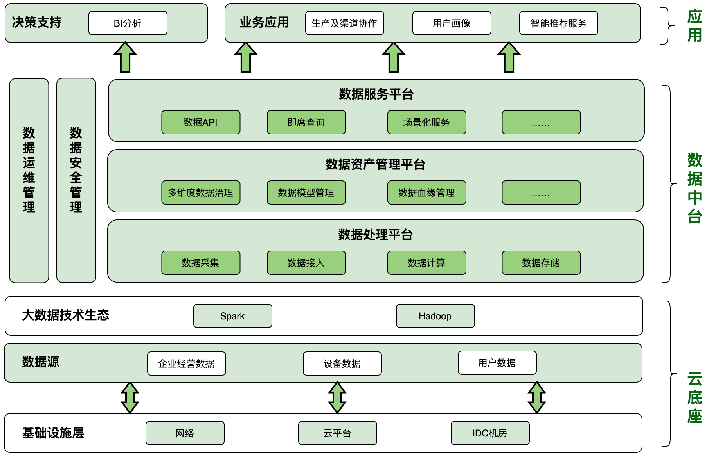
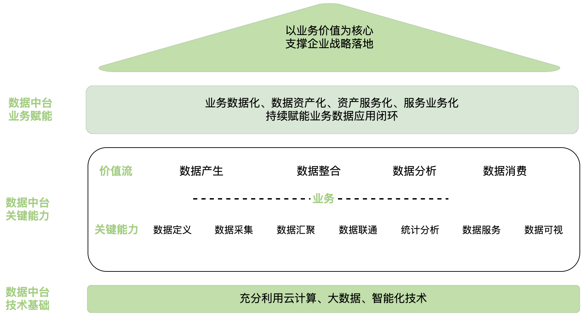
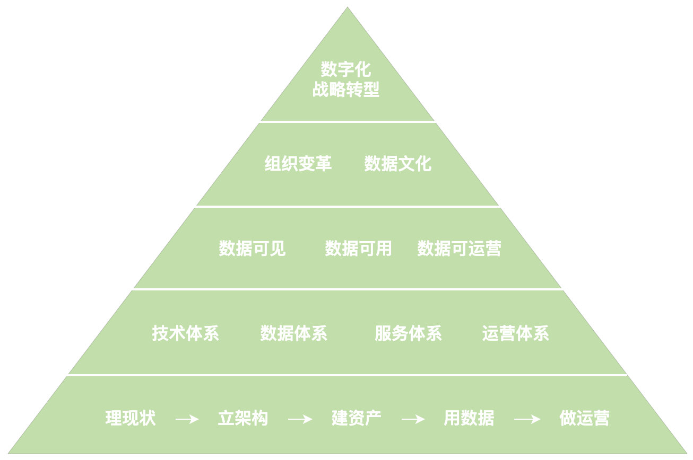
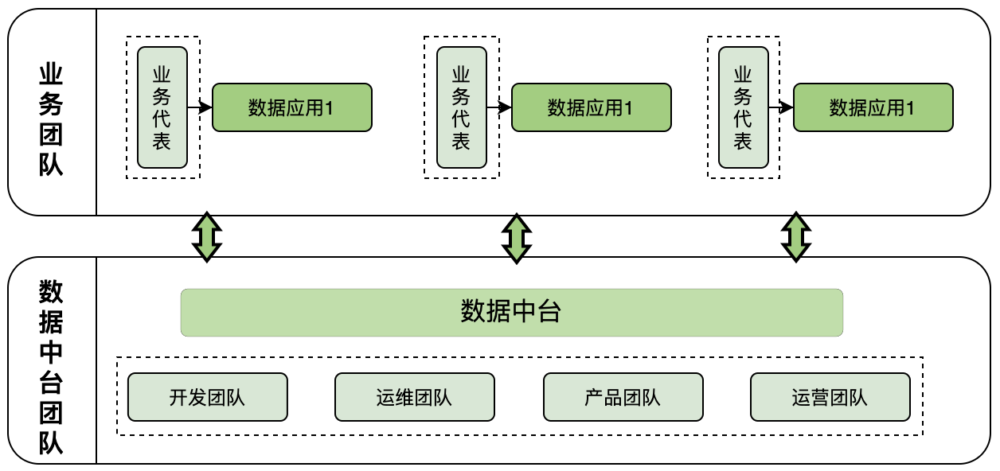
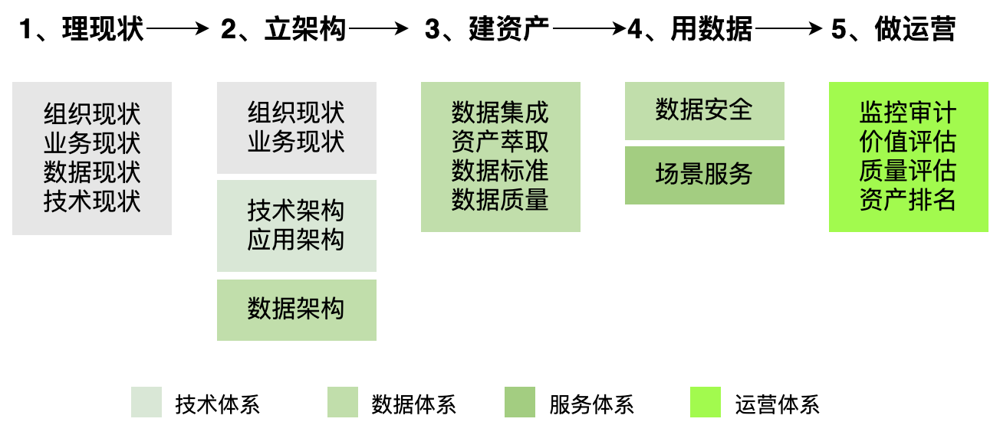
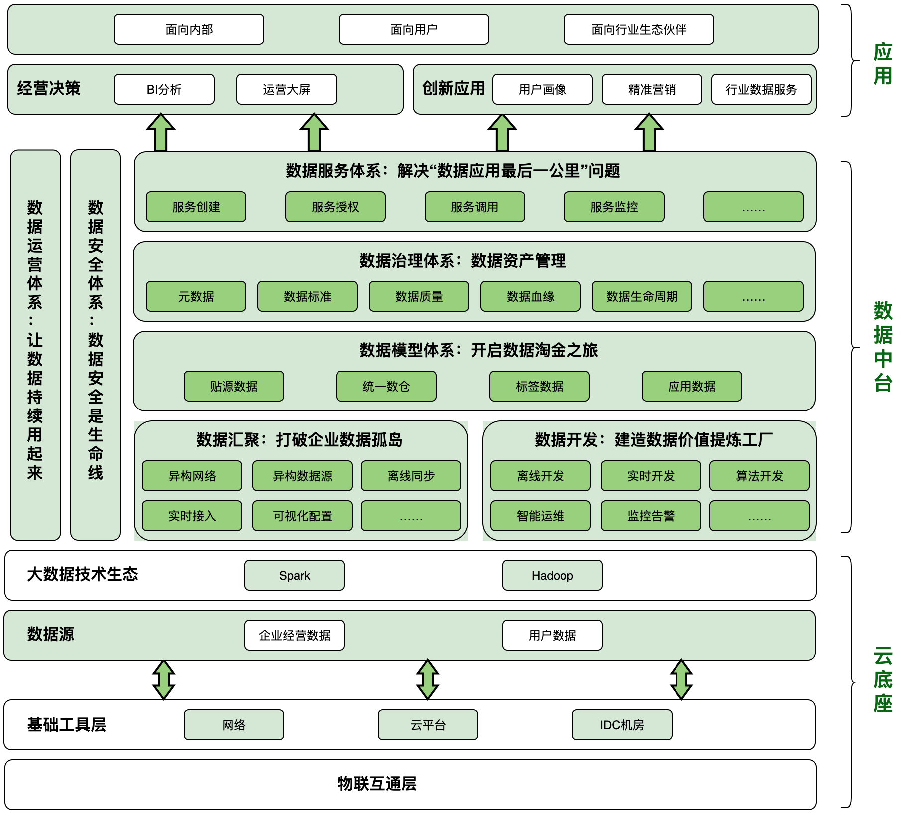

数据中台
=============
> 开篇注：我们大家都需要纠正一个观念，不要把数据中台单纯看成一个技术平台

### 数据中台与数字化转型的关系
* 数据中台是企业开展数字化转型的战略落地实践，是企业数字化转型的必然产物，是使用数字化技术对企业的组织重构、流程再造与技术升级。
* 数据中台建设的最终目的是实现企业的数字化转型，通过打通数据壁垒，构建数据采集、治理、分析与利用所形成的闭环，提高企业运营效率，使企业能够对市场变动进行快速反应，从而进行商业模式创新、提升用户体验、提供个性化产品服务。

### 理解中台
中台是将企业的核心能力沉淀和聚集到中台层上，前台应用以中台为支撑，向轻量化、敏捷化转变。中台打破了应用系统的壁垒，从企业全局梳理和规划业务流程，重构了组织架构、业务架构、数据架构、技术架构。
>如：业务中台是抽象业务流程的共性形成通用业务服务能力，而数据中台则是抽象数据能力的共性形成通用数据服务能力。

## 一、何为数据中台
业界对数据中台解读的林林总总
* 数据中台是数据技术、数据服务模式与数据运营机制的结合体。
* 数据中台通过提供工具、流程和方法论，实现数据能力的全局抽象、共享和复用，赋能业务部门，提高实现数据价值的效率。
* 数据中台提供数据能力的共享和复用，前端业务部门可以快速获得全局的数据洞见及现成的数据工具，快速推出由数据支持的产品。
* 以数据治理与数据建设等数据管理活动为特征的中台称为数据中台

提炼综合后，并结合个人的实践经历，我个人更认可书籍《**数据中台：让数据用起来**》中对数据中台的定义：

<b>数据中台是一套可持续“让企业的数据用起来”的机制，是一种战略选择和组织形式，是依据企业特有的业务模式和组织架构，通过有形的产品（和技术）和实施方法论支撑，构建的一套持续不断把数据变成资产并服务于业务的机制。</b>

上面的定义指明了：
* **狭义上**：数据中台不仅仅是技术，也不仅仅是产品，而是是一种强调资源整合、集中配置、能力沉淀、分步执行的运作机制，是一系列数据组件或模块的集合，指向企业的业务场景。
* **广义上**：数据中台更是一种企业组织管理模式和理念，集公司战略、组织、技术革新于一体，数据中台的构建为管理部门和业务部门拓展了管理边界与商业边界。

图 “让企业的数据用起来”的机制（ 参照 《数据中台：让数据用起来》）

## 二、数据中台的价值
### 解决企业当前面临的数据问题

1. 各个部门重复开发数据，浪费存储与计算资源；业务数据孤岛问题严重，数据利用率低

<b>通过数据中台</b>

* 建设统一的数据开发、管理和应用规范，形成标准统一的数据资产，夯实数据互通的基础，打破数据壁垒。
* 打通企业各个部门之间的数据，形成统一的数据开发和使用规范，在企业各个部门之间实现数据能力的抽象、共享和复用。

2. 数据标准不统一，数据使用成本高

<b>通过数据中台</b>

* 统一数据标准的同时（指标体系），数据中台会向各业务线提供数据资产聚合、共享和管理的能力，让数据互通共享

### 价值实现
通过高效的数字化运营，实现“**快速市场响应，精细化运营，开源节流**”
* 比对手更早洞察市场的动向；
* 比对手更了解用户的反应；
* 比对手成本（如生产和管理成本）更低；
* 推出比对手的产品更符合用户需求的产品；
* 比对手更快地将产品推向市场；
* 比对手更快地迭代产品。

## 三、数据中台的能力
### 1. 数据处理能力——数据的汇聚整合
* **管理简便**：可视化的任务配置以及丰富的监控管理功能
* **数据集成与运营**：数据中台能接入、转换、写入或存储企业多种来源的数据
* **数据目录与治理**：用户可以方便定位所需数据，理解数据
* **数据安全**：确保数据的访问权限
* **数据可用**：用户可以简便、可扩展地访问异构数据，可用性及易用性高

### 2. 数据模型能力——数据的提纯加工
数据中台必须连通全域数据，通过统一的数据标准和质量体系，建设提纯加工后的标准数据资产体系，以满足企业业务对数据的需求
* **面向业务主题的数据资产平台**
* **和业务紧密结合的标签体系**
* **数据质量保障体系**

### 3. 数据服务能力——数据的服务化
* **提供丰富的数据分析功能**
* **提供友好的数据可视化服务**
* **提供便捷的数据服务开发环境，方便业务部门开发相关数据应用**
* **提供（如预测分析、智能推荐等）AI服务**

所以，数据中台的开发部门应当使数据中台具备与DaaS（Data as a Service）平台相似的能力：
* **需要的数据都能够随时获得，并且能保证数据的可用性及正确性；**
* **要有方便的数据处理流程，有一套标准，能够很方便地进行数据处理；**
* **要有数据服务，提炼出有价值的数据后，能够通过数据服务将其开放出来进行共享和使用；**
* **要有数据应用，能轻松地进行A/B测试、做大屏、进行数据监控等。**

### 4. 数据中台的应用能力——数据的价值变现
#### 数据驱动下的决策部门
* **快速智能的商业决策支持**：数据中台能够为管理决策层提供全局、多维度的报表来反映各条业务线的情况。
* **精细化的运营和管理**：实现业务和组织的数字化运营，对全公司进行高效的数字化运营。
* **内部数据能力的共享和复用**：通过数据中台，管理决策层可以清晰看到公司目前有哪些数据资产，哪些业务已经有了数据、应用和接口，如何提升某条业务线的运营效率，还有哪些数据需要收集、处理和分析。同时，还能够避免重复造轮子，及时发现冗余或者无用的数据。
* **完善的ROI管理**：大数据项目通常需要大量资源，因此我们经常会看到巨大的成本和不清晰的部门和项目分配。为了最合理地使用资源，确保核心业务的可用性，我们需要数据中台为每个数据应用进行精确的ROI规划和管理。

#### 数据驱动下的业务部门
对于业务部门来讲，对数据中台的需求贯穿了整个产品生命周期
* **获得市场洞见**：通过对现有用户和市场数据的分析，了解市场和用户的情况。
* **预测产品的市场**：在将产品全面推向市场之前了解市场可能的反馈。
* **监控产品的性能**：在产品推出后快速了解产品运营的各种指标。
* **持续跟踪用户行为及反馈**。
* **自动发现市场的异常并快速响应**。

## 四、数据中台的建设——业务视角
### 早期的实践——以数据规范化管理为主，少数细分场景应用为目标
> 我最早接触类似数据中台理念在2018年，某区域SAP供应商提供的企业数据（治理）中台咨询案
#### 三步走策略
* 一是建立统一的企业级数据指标体系，解决数据来源多元化和标准不统一的问题；
* 二是建立与企业能力相适应的数据研发、分析、应用和资产管理平台；
* 三是建立支持一线业务的数据服务与数据应用平台。

#### 1. 数据指标体系建设
* 首先，对企业当前的数据现状进行盘点，了解企业现有的数据情况，梳理企业的数据需求。
* 进行需求分析与框架设计，聚合数据的各种使用场景，确保核心数据均能线上化，同时一定要制定数据安全方案。
* 根据以上准备进行数据指标体系的建设，如下图所示：

图 数据指标体系的建设内容 

#### 2. 搭建数据资产管理平台
* **进行多维度的数据治理**：主数据治理、元数据治理、数据质量管理、数据标准管理、数据安全管理；
* **数据模型管理**：根据底层数据的使用情况，如数据表的关联信息、SQL脚本信息（数据聚合与查询信息等），来获取元数据，使用元数据进行数据建模。数据模型完成了各数据源之间的映射关系设计，为数据主题建设提供了实施路线图。
* **数据血缘管理**：对数据产生的链路进行跟踪管理，如数据的产生、处理、流转等过程。

#### 3. 搭建数据服务于数据应用平台
* **数据服务**：以数据服务API或者数据产品的方式开放数据查询/分析服务、场景化数据定制服务……；
* **数据应用**：商业智能（BI）系统、‘产供销’协同数字化系统、基于用户画像的推荐机制……。

<b>逻辑架构图如下</b>

### 当前的实践方案——更加系统全面
> 自去年以来，在多次学习书籍《数据中台：让数据用起来》后，非常认可书中对数据中台的理解和实践，目前是以本书中的思想和方法论在做实践

### 数据战略

图 数据中台战略示意图（ 参照 《数据中台：让数据用起来》）

### 持续让数据用起来的价值框架
形成“**业务数据化——>数据资产化——>资产服务化——>服务业务化**” 业务与数据打通的闭环。

<b>实践分享:</b>
* **业务数据化**：通过《B端机构使用的管理系统》、《连接B端机构与C端用户的互联网平台》、《渠道运营管理系统》、IOT设备……，将业务数据、用户行为数据、设备运行数据采集存储下来。
* **数据资产化**：通过将以上数据汇聚、清洗、存储、计算、挖掘，搭建基于业务主题的数据集市，以及基于用户/客户画像的标签体系，并搭建出《数据资产管理系统》。
> 数据资产化阶段包括‘数据治理过程’，个人认为是建设数据中台最核心也是最复杂的业务环节
* **资产服务化**：创建不同维度、不同粒度的数据服务API，开放不同的认证授权访问《数据资产管理系统》……
* **服务业务化**：开发不同的数据应用来支撑业务，比如支撑决策和行动的BI系统、渠道运营系统，支撑精细化用户运营的智能运营分析系统。

### 数据中台建设方法论

图 数据中台建设方法论（ 参照 《数据中台：让数据用起来》）

####  1 种战略规划
不能把数据中台的建设看做是技术或者工具，而是一种企业战略，是建立在企业数字化转型下的战略规划。**数据中台的目标是实现企业经营的数据化、精细化、智能化，本质是建设一套可持续让企业数据用起来的机制**。需要有相应的组织、制度、流程、资源的保障。也决定了它是“一把手”工程，要求企业管理者必须要有变革领导力，以战略驱动数据中台的建设。

<b>实践感触:</b>

在我经历的两次较长期的企业数字化转型实践中，实实在在的感受到“一把手”的变革力、数字领导力、企业的战略力对数字化转型（数据中台建设）的切实影响。
* **实践之一**：虽然“一把手”认识到其重要性，但在建设初期也只是作为企业的一种探索和尝试，并没有战略级的规划和长远计划，数据中台的建设很容易成为一种作用有限的数据系统应用，仅用在了供高层使用的企业BI系统和支撑产销协同的渠道数字化系统，后期在企业改变渠道战略后数据中台也相应跟随者停滞了，失去了“中台”的意义。
* **实践之二**：某传统企业“一把手”为了实现企业的数字化转型专门成立了一家科技公司，我们将数据中台作为企业数字化转型的中枢来搭建，在这种定位下将数据中台进行了企业多方面的应用，如经营决策、用户探索、产品创新…… ，除此之外最大的收获是基于此中台对经营数据和产品创新应用的商业洞察，孵化出了新的商业模式，使得企业获得了一笔千万元级的投资。
 
####  2 种保障条件
1. **数据中台的组织架构**

图 数据中台的组织架构

<b>如上述示意图：</b>

**首先**，数据中台建设的过程中一定要有各业务代表的参与，如决策部门、市场部门、销售部门、产品运营部门等，均应派出业务代表与数据中台团队对接数据需求、应用需求、治理需求……，这样才能使数据中台围绕以业务价值为核心的战略准则。

**另外**，数据中台团队并不是仅有产研团队来进行中台实现，一定要有运营团队建立数据运营体系切实做到“**让数据持续用起来**”。

2. **建立企业的数据文化**

**数据文化与数据中台是相辅相成的关系**，数据中台的建设需要数据文化的支撑，同时建设过程及应用过程又是在沉淀加深企业的数据文化。

企业的数据文化主要体现在组织要提升**数据的采集意识、数据的标准化意识、数据的使用意识、数据的安全意识**。

<b>实践建议:</b>

文化虽然是务虚的，但却可以采用“固化于制，外化于行”的方式影响和构建。

对此，我们做了很多努力，如进行相应岗位数字技能设计，调整组织；执行关键人员的沟通计划；制订培训计划；调整相应的绩效评估和激励方案。同时，关键的是利用流程和工具的使用，采用“先僵化、后优化、再固化”的华为变革理论，形成重视数据、了解数据、运用数据的数据文化。

####  3 个目标准则

1. **数据可见**

数据可见最重要的是实现数据的可视化，可视化是数据中台的门面，也是数据中台最基本的功能。数据可视化呈现主要是通过图表等形式进行数据展现，便于用户快速、准确理解信息。常见的数据可视化涉及数据处理过程的可视化呈现、指标特征的可视化呈现，以及业务的可视化呈现等很多层面。

<b>实践建议：</b>

由于企业内不同岗位的人员拥有不同的知识背景，数据可视化要求能够结合场景进行呈现方式的转化，以符合不同岗位人员的使用习惯。比如我们的实践中，时常会有产品或研发同事为了“炫技或美观”使用复杂的图表展现形式，造成了一些业务同事的理解困难，数据可视化**简单实用**始终是第一指标。

2. **数据可用**

* **数据可视化**：上述数据可见便是数据可用的一种体现。
* **数据质量保障**：在数据生命周期内保障数据质量是数据可用的首要条件，这也是进行数据治理的基本要求。
* **数据指标可用**

<b>实践分享:</b>

比如我们使用的OSM模型，由目标（ Objective ）、 策 略（ Strategy ）、 度 量（Measurement）组成，通过定义目标、确定策略、明确度量将大的运营目标逐一拆解，对应到可落地的运营策略和可度量的运营动作上，从而确保我们梳理指标时不会偏离“主航道”。
* **数据服务可用**：数据 API、数据应用的可用性衡量。 

3. **数据可运营**

* **数据质量的量化管理**：根据数据处理过程中的指标统计构建质量量化模型，从而数据开发团队可以依据衡量标准进行优化。
* **数据价值的量化管理**：数据价值建立在对企业的业务价值提升的基础之上，需建立数据价值评估的有效指标，从而数据中台团队可以依据衡量标准进行优化。

####  4 套建设内容
数据中台的建设内容包含**技术体系、数据体系、服务体系、运营体系**四大体系
1. **技术体系——数据中台的支撑**

<b>我们的实践：</b>

* 大数据技术族的引进：Hadoop 技术生态、Spark 技术生态、Elasticsearch 等。
* 数据工台工具技术组件：数据汇聚、数据开发、数据资产管理、数据服务管理等。
> 以上技术与工具可依据企业当前阶段的战略、组织、成本进行自研、采用云服务、采购整套解决方案的选择，我在不同的企业背景下经历过厂商云服务和自研的实践。比如战略层面的考虑，如自由化定制，避免被云服务厂商锁定……；成本层面的衡量指标是 TCO （总体拥有成本）—— 不管自研还是采用云服务都要以其一定周期内的综合成本做衡量。

2. **数据体系——数据中台的核心**

<b>我的感受：</b>

对于数据中台来说，难点并不是技术，而是数据体系建设。数据体系建设包括统一数仓、数据集市、数据标签等数据模型的建立，也包括整个数据治理的过程——数据梳理与建模、元数据管理、数据标准管理、主数据管理、数据质量管理、数据安全治理、数据的集成与共享。

3. **服务体系——让数据中台被用起来**

<b>实践分享:</b>

数据中台的建设的本质目的是被企业各支撑、决策、业务部门用起来，产生组织或业务价值。所以在数据中台建设之初就要明确其为“服务型”平台的本质，让数据中台团队成为服务型组织，在数据价值流的准备期、交付期、运营期均要主动与需求部门的代表进行关键流程点的协作和确认，比如需求阶段、数据开发阶段、服务及应用提供阶段、运营监控阶段均要与业务部门设置关键协作点。

4. **运营体系——让数据中台产生持续不断的价值**

运营体系包括平台流程规范执行监督、平台资源占用的监管及优化推动、数据质量的监督及改进推动、数据价值的评估、数据服务的推广等。

<b>实践分享:</b>

数据中台的建设过程应该是迭代地、持续地、长期地、没有终点地。但是，却依赖一个前提条件，就是必须让数据中台持续不断的产生价值，否则数据中台会被当做成本黑洞受到诸多的限制甚至被中止。这也是为我们服务的咨询公司透漏几乎所有失败数据中台项目的首要原因。

####  5个关键步骤

图 中台建设的5个关键步骤（ 参照 《数据中台：让数据用起来》）

### 我们目前数据中台的逻辑架构

图 当前实践数据中台的逻辑架构图

## 五、写在最后

从以上对数据中台的全局描述中，相信每一个人都体会到了数据中台的建设是一个庞大而系统的工程。不能目标不聚焦，贪大求全；不能范围蔓延，需求失控；更不能核心驱动力不清晰，为了建设而建设。
* **首先**，一定要明确进行数据中台建设的原因及核心驱动力，要回归企业的本质，从“降本、增收、提效”等企业核心目标出发，进行战略制定、组织和实施。
* **其次**，数据中台建设不可能一蹴而就，需要严控范围，避免落入漫无边际的内耗中。可采取“总体规划，局部先行”的迭代演进策略。根据企业自身的实际情况和阶段性目标，先从“降本、增收、提效”三大目标中企业最关注的环节入手，渐进的开展。