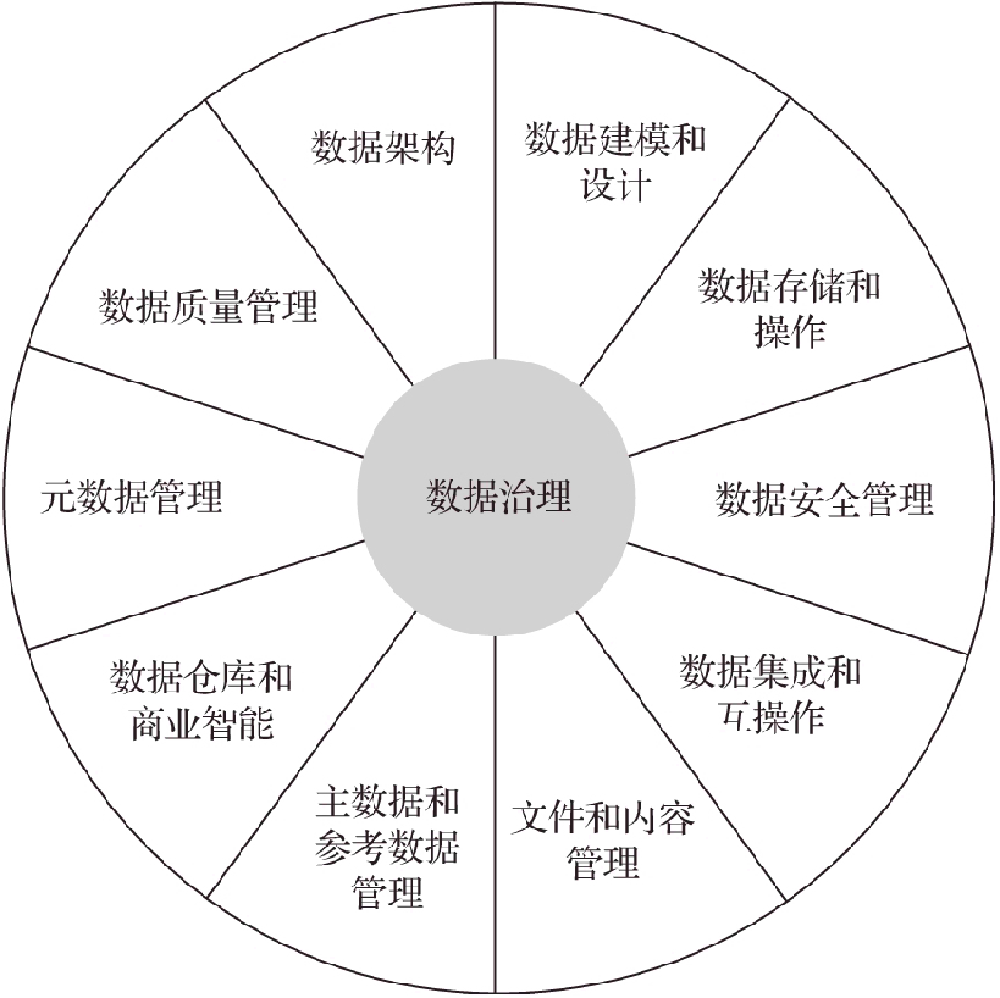
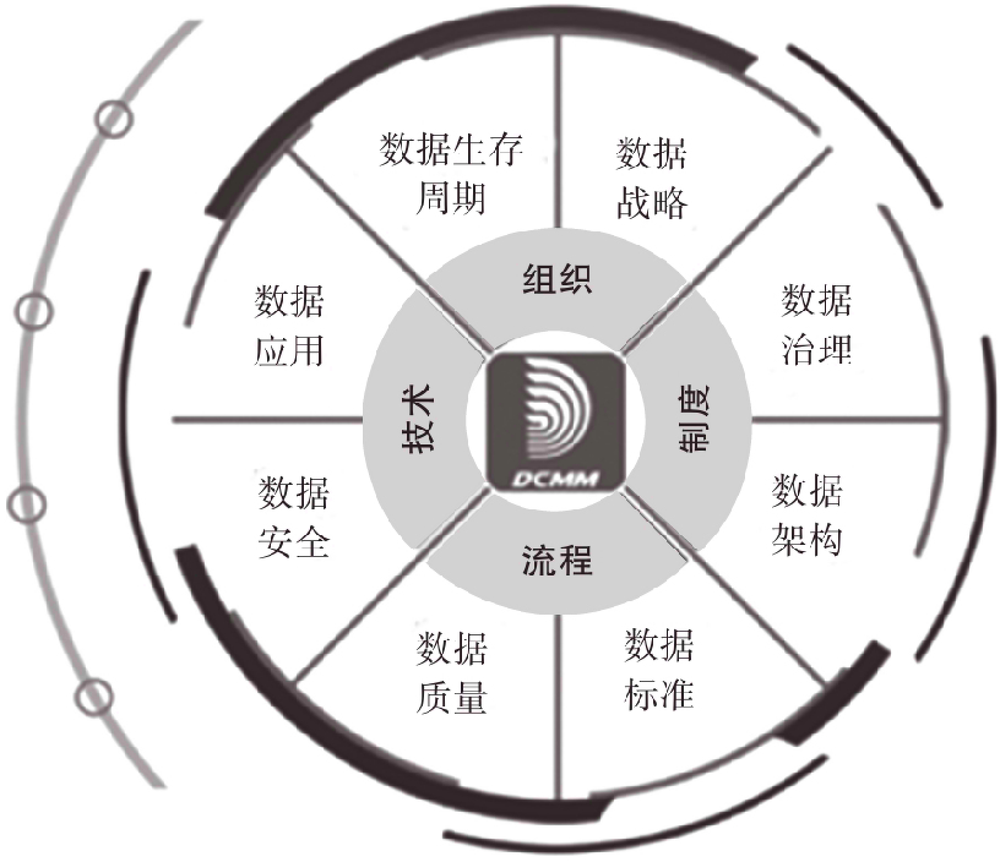
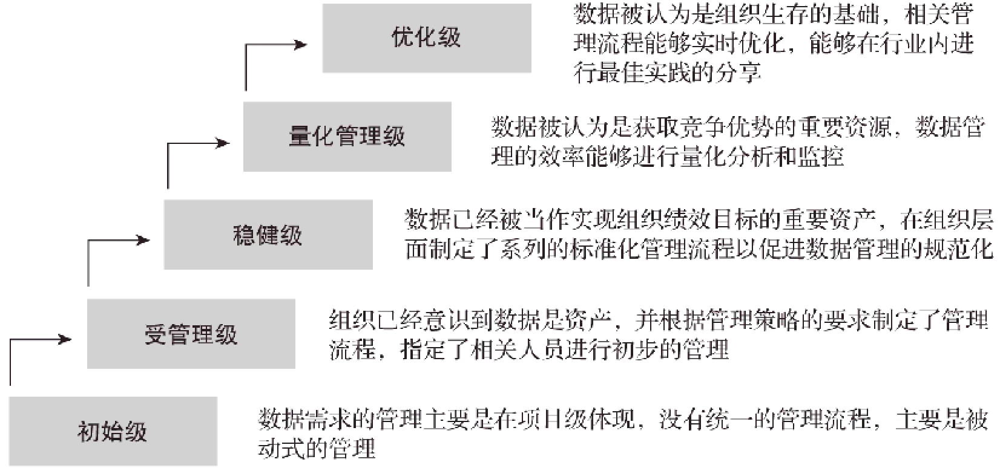
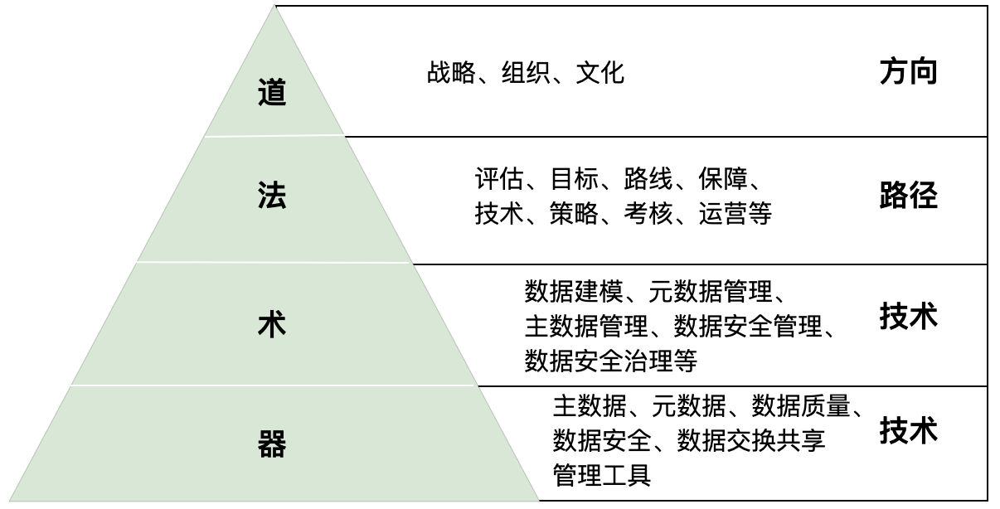

数据治理的理解与治理框架学习
=============

前述篇章已经讲明：数字化转型的实质是企业或行业“降本、增收、提质”，是以数据驱动的、精细化运营、业务创新增长和商业模式创新。而数据治理则是数字化转型成功的前提与基石，业内甚至流传着“数字转型，治理先行”的说法。

# 理解数据治理

## 一、数据治理的背景
企业数据的管理和使用还存在很多问题，致使数据不能很好地利用起来，从而让企业的数据没能成为数据资产，反而变成了拖累企业的包袱。
* **黑暗数据问题**：黑暗数据也叫睡眠数据，是指被收集和处理但又不用于任何用途的数据。据统计，企业的数据中有50%～80%可能是睡眠数据，始终无人知晓。
* **数据孤岛问题**：企业想利用好数据，就必须打通数据孤岛。打通数据孤岛是一项复杂的工程，其困难不仅在于技术，还来自业务。数据本身是因业务和流程而产生的，只有对企业业务和流程进行细致梳理和深度理解，才能真正实现数据的打通。
* **数据标准问题**：各业务部门、开发团队的数据标准不一致，数据打通、整合过程、使用过程中都会出现很多问题。
* **数据质量问题**：数据的可信性是影响数据分析和管理决策的重要因素，然而企业数据普遍存在着不一致、不完整、不准确、不正确、不及时等问题。数据质量问题得不到有效解决，数据价值化、数据业务化就无从谈起了。
* **数据的安全风险**：数据安全关系着企业的品牌甚至“生死”。

## 二、数据治理是什么？
“数据治理”是一个涉及企业战略、组织架构、数据标准、管理规范、数据文化、技术工具的综合体，所以不同的岗位往往有不同的视角和认识。

* **对于企业管理者而言**，数据治理是企业发展战略的组成部分，是指导企业进行数字化变革的基石，需要将数据治理纳入企业的顶层规划进而进行分级工作部署，以实现企业数字驱动转型的目标。

* **对于业务人员而言**，他们所期望是能够通过数据治理将企业数据开放出来，让他们知道有哪些数据，这些数据是怎么定义的、有什么作用，让他们在用数据的时候能够方便地获取，并且数据质量是有保障的。

* **对于数据治理架构师而言**，关注的是如何定义数据，让抽象的数据变成可读、可理解的信息；要有一个完整的数据地图或数据资产目录，盘活企业的数据资产，方便用户随时找到想要的数据；要做好数据质量管理，提升数据质量并提升数据的使用率。

* **对于开发人员而言**，首先希望企业要做好数据源中数据的治理，也就是业务系统中的数据质量要高，这需要业务和产品端的努力，避免之后数据治理过程中出现的“垃圾进、垃圾出”的情况。之后就是做好从数据源或数据湖中数据的抽取、加载、转换、处理和融合，保障数据仓库中数据的可用性和准确性。

综合而言，**所有为提高数据质量而展开的技术、业务和管理活动都属于数据治理范畴。数据治理的最终目标是提升数据利用率和数据价值，通过有效的数据资源管控手段，实现数据的看得见、找得到、管得住、用得好，提升数据质量和数据价值。企业数据治理非常必要，它是企业实现数字化转型的基础，是企业的一个顶层策略，一个管理体系，也是一个技术体系，涵盖战略、组织、文化、方法、制度、流程、技术和工具等多个层面的内容。**

## 三、数据治理相关术语
#### 1. 数据元
**数据元由三部分组成**：对象、特性和表示。数据元是组成实体数据的最小单元，或称原子数据。例如个人信息中，手机号为数据元，“189******”为数据元的值；性别也是数据元，“男”和“女”为数据元的值。

**数据元的主要作用**：作为最小颗粒度的数据，数据元是对数据进行标准化定义的基础，也是构建统一、集成、稳定的行业数据模型的基础。在企业数据治理中，数据元是需要标准化的对象，一个数据元对象有且只有一个数据特性，每个数据特性对应一个数据表示。例如：人员的性别中的“男”是一个数据元对象，用数字“1”来表示。

#### 2. 元数据
**元数据是描述数据的数据或关于数据的结构化数据**。比如说数据是物料，那么元数据就是仓库里的物料卡片；如果说数据是文件夹，那么元数据就是夹子的标签；如果说数据是书，那么元数据就是图书馆中的图书卡。

**元数据的主要作用**：在数据治理中，元数据是对数据的描述，存储着数据的描述信息。我们可以通过元数据管理和检索我们想要的“物料”。可见元数据是用来描述数据的数据，让数据更容易理解、查找、管理和使用。元数据也是建设数据仓库的基础，是构建企业数据资源全景视图的基础，清晰的血缘分析、影响分析、差异分析、关联分析、指标一致性分析等是数据资产管理的重要一环。

#### 3. 主数据
主数据是企业内需要在多个部门、多个信息系统之间共享的数据，如客户、供应商、组织、人员、项目、物料等。主数据（也称“基准数据”）变化较慢。主数据是企业开展业务的基础，只有得到正确维护，才能保证业务系统的参照完整性。

主数据的3大特性、4个超越：
* 3大特性：高价值性、高共享性、相对稳定性。
* 4个超越：超越业务，超越部门，超越系统，超越技术。

**主数据的主要作用**：在数据治理中，主数据用来解决企业异构系统之间核心数据不一致、不正确、不完整等问题。主数据是信息系统建设和大数据分析的基础，被认为是企业数字化转型的基石。

#### 4. 业务数据
业务数据是业务活动过程或系统自动产生的既定事实的数据，也称交易数据。业务数据和不同企业的业务类型相关，比如我们做的家校信息化产品，产品功能产生的数据就属于我们的业务数据；比如我们生产销售了很多IOT设备，生产数据、库存数据、销售数据也属于我们的业务数据；另外APP采集的用户行为数据及IOT设备运行及采集的数据也属于我们的业务数据。

**业务数据的主要作用**：业务数据主要面向企业经营及应用，为企业及业务提供服务。

#### 5. 主题数据
主题数据是根据数据分析的需要，按照业务主题对数据所做的一种组织和管理方式，其本质是为了进行面向主题的分析或加速主题应用的数据。

**主题数据的主要作用**：主题数据是分析型数据，是按照一定的业务主题域组织的，服务于人们在决策时所关心的重点方面。

#### 6. 数据仓库
数据仓库（Data Warehouse，DW）是一个面向主题的、集成的、相对稳定的、反映历史变化的数据集合，用于支持管理决策。数据仓库是数据库的一种概念上的升级，可以说是为满足新需求而设计的一种新数据库，需要容纳更加庞大的数据集。

**数据仓库的主要作用**：数据仓库是为企业所有级别的决策制定过程提供所有类型数据支撑的战略集合，有以下三个主要作用：
* 数据仓库是对企业数据的汇聚和集成，数据仓库内的数据来源于不同的业务处理系统，包含主数据和业务数据。数据仓库的作用就是帮助我们利用这些宝贵的数据做出最明智的商业决策。
* 数据仓库支持多维分析。多维分析通过把一个实体的属性定义成维度，使用户能方便地从多个维度汇总、计算数据，增强了用户的数据分析处理能力，而通过对不同维度数据的比较和分析，用户的数据处理能力得到进一步增强。
* 数据仓库是数据挖掘技术的关键和基础。数据挖掘技术是在已有数据的基础上，帮助用户理解现有的信息，并对未来的企业状况做出预测。在数据仓库的基础上进行数据挖掘，可以对整个企业的发展状况和未来前景做出较为完整、合理、准确的分析和预测。
> 为了提升数据仓库的数据质量，确保数据分析的准确性，数据仓库的建设需要实施数据治理的策略。

#### 6. 数据湖
根据维基百科的定义，数据湖是一个以原始格式存储数据的存储库或系统。它按原样存储数据，而无须事先对数据进行结构化处理。数据湖可以存储结构化数据（如关系型数据库中的表）、半结构化数据（如CSV、日志、XML、JSON）、非结构化数据（如电子邮件、文档、PDF）和二进制数据（如图形、音频、视频）。数据湖不是一个产品或工具，它是融合了数据采集、数据处理、数据存储、机器学习、数据挖掘等技术和工具的解决方案。

**数据湖的主要作用**：数据湖可以更方便、以更低的成本解决不同数据结构的统一存储问题，同时还能够为机器学习提供全局数据。我们可以将数据湖理解为一个融合了大数据集成、存储、处理、机器学习、数据挖掘的解决方案。

## 四、数据治理治什么？
数据治理的对象必须是重要的数据资源，是关乎企业商业利益的数据资源，这样的数据资源方可称为“数据资产”。

### 如何定义数据资产
* 数据资产要是企业日常的生产经营活动中积累的数据，或者由于业务需要而被企业实际控制的数据。
* 由企业拥有或者控制的数据
* 预期会给企业带来经济利益
* 成本或价值可衡量
> 数据成本一般包括采集、存储和计算的费用（人工费用、IT设备等直接费用和间接费用等）以及运维费用（业务操作费、技术操作费等），这是相对容易计量的。数据价值主要从数据资产的分类、使用频次、使用对象、使用效果和共享流通等维度计量。

### 数据资产的利益相关方
* 数据的生产者，即通过业务交易或事项产生数据的人或组织。
* 数据的拥有者或控制者。生产数据的人不一定拥有数据，例如我们上网产生的各种数据都不归我们自己所有，而是落在了各个互联网公司的数据库中。
* 数据价值和经济利益的受益者。

数据治理就是对数据生产者、拥有者或控制者、数据价值受益者进行规范和协调，让数据能够规范化、高质量输出。

* **数据的标准化**：定义统一的数据标准，让数据资产的利益相关方用同一种“语言”沟通。数据的标准化包含几个层面：数据模型标准化，主数据和参考数据的标准化，指标体系的标准化。
* **流程的优化**：数据治理有两个核心目标一个是提升质量，另一个是控制安全。做好企业业务流程的优化可能会对隐私保护起到一定的作用。通过业务流程优化，规范数据从产生、处理、使用到销毁的整个生命周期，以使数据在各阶段、各流程环节中安全可控、合规地使用。另外，通过一定的流程优化，通过对相关流程进行监管，按照数据的质量规则进行数据校验，并采用符合“垃圾进，垃圾出”的数据采集、处理、存储原则，以提升数据质量，赋能业务应用。

### 小结

**数据治理是一个非常复杂的系统工程：**
* 管理上，数据治理是企业战略层面的策略，而不是战术层面的方法；
* 业务上，通过数据治理要让数据能够管得住、看得见、找得到、用得好；
* 技术上，涉及数据建模、数据集成、数据交换、数据清洗、数据处理、数据质量管理的方方面面。

## 五、数据治理的价值

1. **降低业务运营成本**：有效的数据治理能够降低企业IT和业务运营成本。一致性的数据环境让系统应用集成、数据清理变得更加自动化，减少过程中的人工成本；标准化的数据定义让业务部门之间的沟通保持顺畅，降低由于数据不标准、定义不明确引发的各种沟通成本。
2. **提升业务处理效率**：有效的数据治理可以提高企业的运营效率。高质量的数据环境和高效的数据服务让企业员工可以方便、及时地查询到所需的数据，然后即可展开自己的工作，而无须在部门与部门之间进行协调、汇报等，从而有效提高工作效率。
3. **改善数据质量**：有效的数据治理对企业数据质量的提升是不言而喻的，数据质量的提升本就是数据治理的核心目的之一。高质量的数据有利于提升应用集成的效率和质量，提高数据分析的可信度，改善的数据质量意味着改善的产品和服务质量。
4. **控制数据风险**：企业拥有可靠的数据就意味着拥有了更好的风险控制和应对能力。
5. **增强数据安全**：有效的数据治理可以更好地保证数据的安全防护、敏感数据保护和数据的合规使用。通过数据梳理识别敏感数据，再通过实施相应的数据安全处理技术，例如数据加密/解密、数据脱敏/脱密、数据安全传输、数据访问控制、数据分级授权等手段，实现数据的安全防护和使用合规。
6. **赋能管理决策**：有效的数据治理有利于提升数据分析和预测的准确性，从而改善决策水平。

# 数据治理框架

## 一、主要行业标准
* **DAMA（Data Management Association，国际数据管理协会）**：定义了数据治理、数据架构管理、数据开发、数据操作管理、数据安全管理、参考数据和主数据管理、数据仓库和商务智能管理、文档和内容管理、元数据管理、数据质量管理这10个领域，以及目标和原则、活动、主要交付物、角色和职责、技术、实践和方法、组织和文化这7个环境因素，为数据管理提供了完整的结构体系。 

图 DAMA标准 

* **DCMM（Data Management Capability Maturity Assessment Model，数据管理能力成熟度评估模型）**：DCMM充分结合大数据特点和国内数据治理现状，形成数据战略、数据治理、数据架构、数据标准、数据质量、数据安全、数据应用、数据生命周期8个核心领域及28个过程域，重点关注数据的管理过程和方法。相较于国外的 DAMA 等理论体系，DCMM 体系的特点是更加符合中国的数据治理现状，如在体系中增加了数据战略、数据标准等核心领域。

图 数据管理能力成熟度评估模型 

&nbsp;

图 数据管理能力成熟度评估模型 

## 二、企业数据治理的9个要素
1. **数据战略**：首先，企业的数据战略应当与业务战略保持一致，指明数据治理的方向。然后，企业需规划出明确的目标、范围、实施路劲并具备可执行的数据战略。
2. **组织机制**：企业需要进行组织机制转型，追求精简和灵活，明确各部门在企业数据治理中的角色、定位、职责和分工，以满足数字时代企业数据治理组织建设的要求。
3. **数据文化**：数据文化是企业所有人员对数据价值的一致认同，具体表现为：用数据说话，用数据管理，用数据决策，用数据创新。
4. **管理流程**：数据治理的目标是提升数据质量，让数据源于业务，回馈业务。与传统的数据管理不同的是，数据治理作为一项驱动企业创新的工作，应当与企业的业务流程进行深度融合，通过优化业务流程，实现业务效率提升，创造数据价值。应当将数据治理作为一项能为企业创造价值的重要业务，而不只是一项支撑性的工作。
5. **管理制度**：企业应该建立起数据治理相应的管理流程和制度，让执行层面有标准可依，并且得到很好的贯彻执行。
6. **数据**
7. **人才**
8. **技术**：企业的数据治理应做好全面规划，结合企业实际业务需求选择合适的技术路线，将数据治理贯穿于数据的“采、存、管、用”整个生命周期中。涉及的数据治理技术主要包括数据建模、数据标准、数据质量、数据安全、数据集成、数据处理、数据使用等。
9. **工具**：数据治理包含元数据管理系统、数据标准化管理系统、数据清洗与加工工具、数据质量管理系统、数据安全管理系统、数据集成与共享系统等。

## 三、企业数据治理的4个层面

图 企业数据治理的4个层面 

### 1. 战略层面（道）
战略层面包括数据战略、组织机制、数据文化，重点在于指明哪些决策要制定，由谁来负责。数据战略是顶层的策略，为数据治理指明方向。这是企业数据治理之“道”。
### 2.管理层面（法）
管理层面包括理现状与定目标、数据治理能力成熟度评估、数据治理路线图规划、数
据治理保障体系建设、数据治理技术体系建设、数据治理策略执行与监控等，强调数据治
理的流程、制度和方法。这是企业数据治理之“法”。
### 3.执行层面（术）
执行层面包括建立数据治理各项技术能力，实现对各项数据资源的有效管理和控制，强调数据治理的具体操作和技术，例如数据梳理与建模、元数据管理、主数据管理、数据质量管理、数据安全治理等。这是企业数据治理之“术”。
### 4.工具层面（器）
为了全面提升数据治理的效能，工具层面强调对于技术和工具的使用。企业数据治理涉及的工具有主数据管理工具、元数据管理工具、数据质量管理工具、数据安全管理工具、数据交换共享工具等。这是企业数据治理之“器”。

