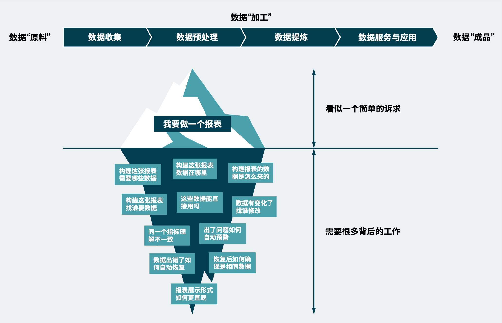

数据工程体系——数据工程概述
=============

**随着数据重要性的不断提升、数据在企业内的流转越来越常见。数据工程则是帮助企业高效地挖掘数据价值，持续地赋能业务增长，加速数据到资产的升华过程的最佳实践。**

### 数据在企业流转的问题
企业通过数据想干什么，可以分成以下四个阶段：

* 通过数据描述企业正在发生什么，清楚地了解企业的“数据形态”。
* 通过数据回答企业为什么正在发生这些变化，探明企业遇到的问题、发展的变化都是由什么引起的。
* 通过数据帮助企业在遇到问题时进行示警，明确下一步行动的方向在哪里。
* 通过数据帮助企业应对数据展示出的业务状态，动态调整投入以确保得到预期的产出。 

图 报表实现过程中的数据流转

如上图所示，数据从“原料”到“成品”并非是简单的将数据接进来、展示出去，而是将数据自动化地从系统中获取到、按照业务逻辑对数据进行补全和纠错、通过统一的各部门都认可的计算逻辑来进行计算、用更友好和直观的方式将数据展现出来。企业对数据收集、处理、计算、使用的过程有快慢之分，这快慢之分的核心就是企业在数据工程实践好坏的区别。

### 什么是数据工程
数据工程包含了需求、设计、构建、测试、维护演进等阶段，涵盖了项目管理、开发过程管理、工程工具与方法、构建管理、质量管理，是一套为了应对规模化生产和使用数据、为业务提供数据支撑，最终产生价值的体系。同时定义了在落地实施过程中如何确保需求准确性、设计灵活性、开发便捷性、维护低成本性、架构可修改性等保障性能、质量的原则。

总的来说，

* 数据工程是一套体系
* 数据工程是用来加速数据到价值过程的规模化最佳实践
* 数据工程是软件工程的一部分
* 数据工程不是传统软件工程在数据领域的简单重现 

### 数据工程的价值
数据工程并不是单一的大数据系统或平台的落地，因此数据工程的价值并不能仅从普通的信息系统的角度来看。 数据工程的好与坏，往往与企业的组织架构、团队协作、实施能力等息息相关。而针对企业所处数字化转型的不同阶段、所处行业业务特点以及企业本身组织架构，数据工程价值凸显的点也往往不尽相同。

在企业层面，数据工程的实现从业务出发，在企业层面打造高响应力且更加智慧的业务，加速从数据到价值的服务产生过程。数据工程化的实现，能将分散在企业内部各业务系统中的信息流数据进行融合、打通，对内实现共享的数据入口进行统一化、标准化。同时，标准化的入口支持企业外部系统或数据的快速接入。通过收集、汇总、清理、结构化、存储，达到数据治理的效果，并实现数据溯源。它能将企业发展不同阶段的分散数据进行汇聚，将数据价值构建成各种服务支撑业务，对外能够更好地服务企业客户，实现真正的“以客户为中心”。 最终数据工程可以挖掘数据的价值，帮助企业创新业务、提高效率，将数据从成本变成资产。

在团队层面，数据工程可以实现减少内耗，提升效率，解决数据开发与数据产生价值的协作问题。可以在满足企业各部门自身需求的同时，统一数据标准、解决数据孤岛问题，降低各业务的联动成本，提供组织内部的协作，支撑业务快速响应。可以更科学地构建整体架构，实现基于中台的数据统一，真正为业务创新和服务带来价值。

在人员层面，良好的数据工程实践可以降低人员成本，解决很多企业的开发人员、技术人员没有数据能力的问题。通过集中地对跨部门数据的采集、融合、治理、组织管理、智能分析，可以大大缩减人员规模，降低人力成本。一致化的工程实践可以提升开发质量阈值，降低开发人员的理解难度，解放运维工作，让开发人员更专注于业务价值。

图 数据工程的价值体现

