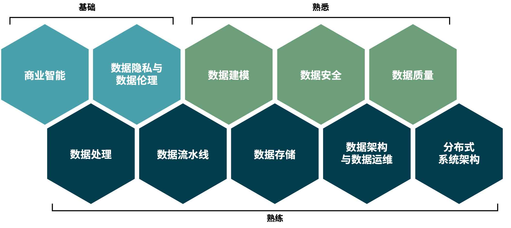
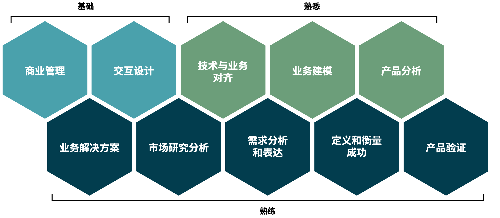
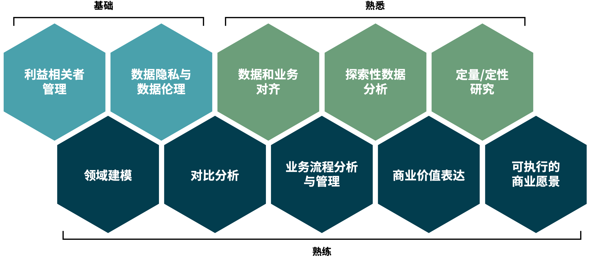
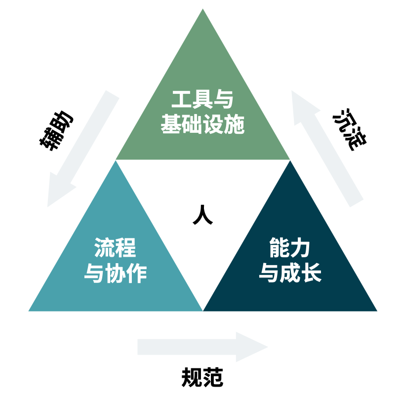

数据工程体系——数据工程能力建设
=============

### 数据研发能力建设
数据工程实现与落地过程中涉及到方方面面的工作，从确认需求到后期运营；从质量管控到安全保障；从设计到实施等多个维度。意味着数据工程落地过程中需要有跨部门的合作；企业的业务与数据融合后的流程管控；对技术能力的更高的要求。这也对企业落地数据工程带来更大的挑战，挑战来源于数据工程落地的时候并非单纯的技术问题，而是技术、数据、业务相融合后的结合体。因此数据工程落地能力有以下几个方面的诉求： 

* **数据战略制定与数据思维推广**。数据作为新一代的生产资料，明确企业的数据战略规划有助于在企业内部建立数据能力的基础。
* **数据工程能力定位**。数据工程能力涉及到愿景对齐、落地实施、持续运营三个大的方向，在实际操作过程中也很可能会贯穿企业数据与业务部门，因此数据能力应该以中心化的方式还是以去中心化的方式需要结合企业内部实际情况来进行评估，但是企业需要有明确的数据能力沉淀方向。
* **数据工程人员培养**。数据工程的落地，归根结底还是需要由人来完成。构建企业自身的人员能力培养机制、搭建企业人员数据能力提升通道是数据工程能力持续迭代的重要保障，如下图所示的数据工程师能力模型，企业需要明确自身发展路径上的数据工程能力诉求，以便更好的寻找和培养数据工程人才。

图 数据工程师能力诉求样例

图 数据产品经理能力诉求样例

图 数据业务分析师能力诉求样例

* **数据工程的跨部门合作**。数据工程落地过程需要业务、数据、技术相融合才能更好的体现出业务价值，那么也就意味着企业需要有一套跨部门协作的流程和机制。
* **数据工程知识沉淀**。数据工程能力的规模化前提在于能够快速的复制，并将数据工程能力落地，这对企业的知识沉淀提出了新的挑战，即当人员流动时、外部环境变化时，企业是否能够快速的沉淀、积累相关知识，并与上述人员培养机制相结合，完成知识到应用的过程。

因此企业需要结合自身的诉求和现状制定合适的数据研发能力建设策略，确定数据工程能力需要落在哪里；围绕数据战略的数据思维推广；提升落地工作中可复用的内容来节省成本；构建快速响应变化的流程和机制；沉淀知识为组织赋能，最终实现数据工程的落地，持续为企业带来更多价值。

### 数据工程成熟度评估

**通过科学的数据工程成熟度评估体系，可以帮助企业识别数据工程级别，明确优化方向。**

在明确了数据工程落地所需的能力之后，如何以低成本、高效率将数据工程进行落地，就成为了企业需要关注的重点，也侧面反映了企业研发管理能力的强弱。而在数据工程落地之后评估落地质量，则要构建企业数据成熟度评估体系。

数据工程就是企业通过数据研发过程交付业务价值的过程，在这个过程中经历的时间越短、消耗的资源越少、交付的质量越高、后期扩展性以及可维护性越高，则我们可以说数据工程越成熟。整个阶段可以划分为交付阶段和运营阶段，这两个阶段可以同时存在，交付阶段以数据研发效能为评估核心，运营阶段则以数据持续运营为核心。

图 数据工程落地三要素的关系

企业管理者往往会将效率与速率混为一谈，速率只关乎速度，而效率关乎资源，其可以从不同维度考量，包括：时间、人力、金钱、资产等等。所有的核心都是人，如何围绕研发团队构建一整套体系，可以描述、反馈以及提升研发效率，才是研发效能成功构建的关键。

* **基础设施与工具**。基础设施是研发团队的生命线，良好的基础设施能够极大的加速研发效率。数据工程由于技术生态繁杂，单传统批数据处理工具就有 Hadoop 生态数十种工具链，更不用说在机器学习领域的各种框架、算法以及相关的引用库，有可能一个引用库版本错误就可以导致整个项目无法启动，而不完善的基础设施会占用开发人员大量精力。数据工程的基础设施的终极形态应该是云服务那样的一站式、一键式环境搭建工具，并能够提供完整的 DevOps 能力。工具是在数据领域抽象出来的一系列研发能力集合。大多数企业往往容易忽略研发工具体系的长尾效应，即企业过分追求端到端、全流程、一站式，功能齐全的工具，在数据领域，一站式带来的效能提升并没有想象的高，专业的事情交给专业的工具去做，理想的形态应该是在标准化接口下的可插拔式的工具集合。
* **流程与协作**。当前大多数企业的研发效能体系建设还停留在基础设施与工具的构建上，而这只是研发效能的一部分。研发的核心是研发团队，有团队必然有协作，有协作必然有流程，流程太长会导致效率低下，而流程过少会导致管理手段失效，在软件研发领域经常提到的敏捷、SCRUM、瀑布等都是流程与协作的经典模式，选择什么样的流程与协作模式，需要根据不同企业的需求、团队规模、人员水平等共同考量。比如小规模团队，面对快速变化的业务需求，敏捷的工作方式就比较合适。而面对确定业务需求，有明确交付时间节点的企业，可能瀑布模式就是一个比较适合的模式。
* **人员能力与成长**。不同企业规模不同，需要管理的研发团队结构也不同，有的企业数据研发团队全部为自有人员，有的企业规模较大并且引入了大量的外派开发人员，并且研发团队人员能力参差不齐。研发效能一般会随着研发团队人员规模的扩大而不断降低，但由于规模的提升，研发速率也会提升。面对这种情况，我们对于研发效能的基本要求就成了如何保证研发效能基线，不至于研发效能下降太快。面对这种情况，要守住研发效能基线，就要围绕研发人员的能力做好三点：
    * **首先是加快信息流动性，减少信息孤岛**。可参考措施有：构建统一文档、定期培训、定期不同团队可根据自身情况量体裁衣。
    * **其次是细化分工**。细化分工能够明确每个团队成员的工作，降低每个节点的能力需求。当然，细化分工并不意味着固化分工，频繁的信息流动与基于员工兴趣的定期的轮岗可以提升整个研发团队的稳定性。
    * **最后是注重能力培养**。数据工程研发能力并不是一锤子买卖，数据领域技术日新月异，团队需要为成员提供途径提升能力，提升研发团队的进化能力。
* 研发效能评价体系。评价研发效能, 最终是通过一系列成体系化的指标来衡量的。指标需要经过精心设计, 常见的有：
    * **速率类型指标**, 比如构建与部署速率, 需求到落地速率等;
    * **质量类指标**, 比如缺陷数量、缺陷比例、测试覆盖率等;
    * **耗时类指标**, 比如修复流水线耗时、平均修复缺陷耗时、脚手架构建耗时等等。

  这些指标一般是从时间、质量、数量、频率等多个维度衡量研发效能 , 企业可根据自身情况构建适合自身的 研发效能评价体系。
  
* **数据运营评价体系**。数据运营的评价指标与研发效能关注点不同，可以通过构建完整的指标体系来度量，指标体系构建亦可参见研发效能指标体系的维度，如速率类、数量类、比率类等指标，数据运营的评价主要包含:
    * **数据运维指标**，比如系统宕机率、错误定位时间耗时、运维人员规模等;
    * **数据服务响应**，如是否支持可伸缩的数据服务、是否支持升级与降级、系统响应时长;
    * **数据持续探索**，数据获取便捷程度、数据探索便捷程度以及数据探索成果孵化能力等，而数据探索成果孵化性能、新服务，又与数据研发效能息息相关。