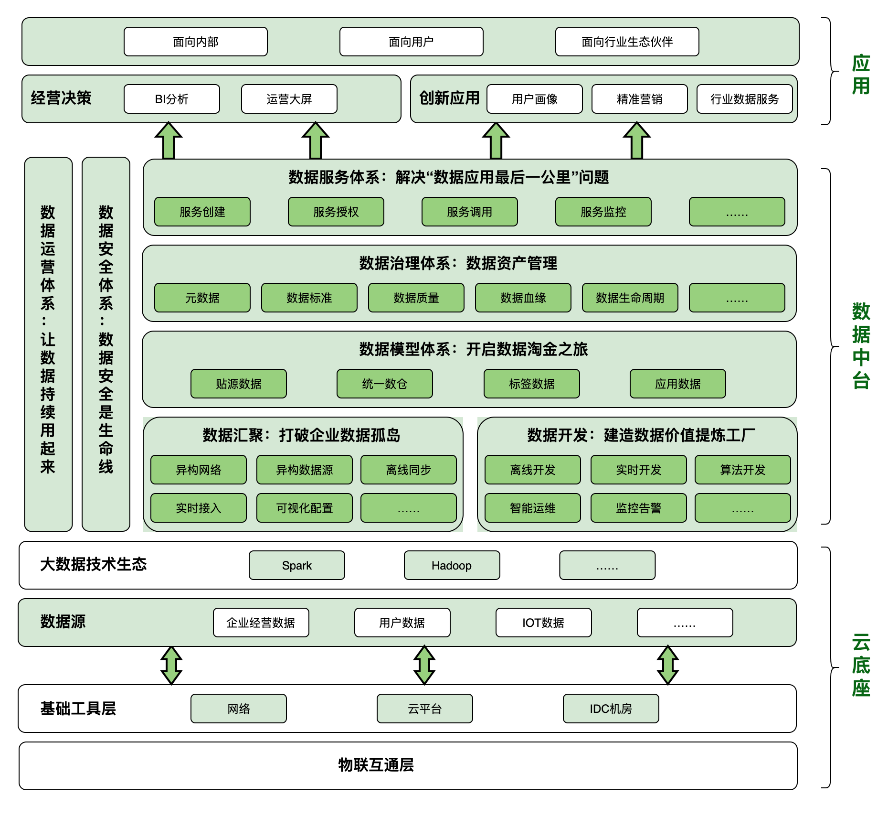
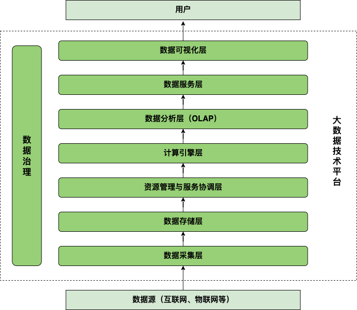

大数据技术体系导览
=============
- [大数据技术体系导览](#大数据技术体系导览)
  - [业务目标](#业务目标)
  - [技术架构概览](#技术架构概览)
  - [技术及工具](#技术及工具)
    - [数据采集技术](#数据采集技术)
    - [分布式存储技术](#分布式存储技术)
    - [分布式计算框架](#分布式计算框架)
    - [OLAP 生态体系](#olap生态体系)
    - [BI 数据可视化](#bi数据可视化)
    - [中间件](#中间件)
    - [集群调度体系](#集群调度体系)
    - [大数据平台搭建](#大数据平台搭建)
    - [海量数据全文检索引擎](#海量数据全文检索引擎)
    - [数据挖掘分析](#数据挖掘分析)
    - [大数据架构设计](#大数据架构设计)
- [数据治理](#数据治理)

## 业务目标
* **数据汇聚**：打破企业数据孤岛
* **数据开发**：建造数据价值提炼工厂
* **数据模型体系**：开启数据淘金之旅
* **数据治理体系**：数据资产管理
* **数据服务体系**：解决“数据应用最后一公里”问题
* **数据运营体系**：让数据持续用起来
* **数据安全体系**：数据安全是生命线

## 技术架构概览

## 技术及工具

### 数据采集技术
| 
 离线采集工具 |    描述     | 
|:--------:|---------------|
| **Sqoop** | 由 Apache 开源的一个可以将 Hadoop 和关系数据库中的数据相互转移的工具，可以将关系数据库（如 MySQL、Oracle、PostgreSQL 等）中的数据导入 Hadoop ，也可以将 Hadoop 中的数据导出到关系数据库中。 | 
| **DataX** | 由阿里巴巴开源的一个异构数据源离线同步工具，用于实现包括关系数据库（如 MySQL、Oracle 等）、HDFS、Hive、HBase、FTP 等各种异构数据源之间稳定且高效的数据同步。 | 
| **Kettle** | 是一款开源的 ETL 工具（新名称是PDI Pentaho Data Integeration）。Kettle 支持图形化的 GUI 设计界面，可以管理来自不同数据库的数据，然后可以以工作流的形式流转，在做一些简单或复杂的数据抽取、质量检测、数据清洗、数据转换、数据过滤等方面有着比较稳定的表现。 | 

| 
 实时采集工具 |    描述     | 
|:--------:|---------------|
| **Maxwell** | 由 Zendesk 开源的一个基于 MySQL 数据库的增量日志（Binlog）解析工具，可以将 MySQL 中的增量数据以 JSON 格式写入 kafka、Kinesis、RabbitMQ  及 Redis 中。 | 
| **Canal** | 由阿里巴巴开源的一个基于 MySQL 数据库的增量日志（Binlog）解析工具，可以提供增量数据订阅及消费，支持将 MySQL 中的增量数据采集到 Kafka、RabbitMQ、Elasticsearch 及 HBase 中。 | 
| **Flume** | 由 Apache 开源的日志采集工具，是一个高可用、高可靠、分布式的海量日志采集、处理、聚合和传输的系统。 | 
| **Nifi** | Apache NiFi是一个易用、可靠的数据处理与分发系统，Apache NiFi的设计目标是自动化管理系统间的数据流。Apache Nifi是一个基于WEB-UI用户界面，具有很强交互性和易用性，为不同系统间或系统内提供数据流管理与处理的系统。 | 

### 分布式存储技术
| 
 分布式文件系统 |    描述     | 
|:--------:|---------------|
| **HDFS** | HDFS（Hadoop Distributed File System）是 Apache 的顶级开源项目，解决了海量数据存储的问题，具有良好的扩展性、容错性以及易用的API。它的核心思想是将文件切分成等大的数据块，以多副本的形式存储到多个节点上。 |

| 
 分布式结构化存储系统|    描述     | 
|:--------:|---------------|
| **HBase** | HBase 的全称是 Hadoop Database。它是一个高可靠、高性能、面向列、可伸缩的 NoSQL 分布式存储数据库。HBase 可以支持对海量数据的增删改查，支持实时数据读写。其底层数据存储在 HDFS 中。 | 
| **Kudu** | Kudu是一个强类型的纯列式存储数据库。平衡了 Hadoop 与 HBase 的缺点，兼顾高吞吐率和低访问延迟两个特性。 | 

| 
 分布式缓存存储系统|    描述     | 
|:--------:|---------------|
| **Redis** | Redis 是基于内存的 NoSQL 数据库。key-value存储；支持分布式集群，可以实现海量数据存储；基于内存运行，性能高效。 | 

#### 数据湖（湖仓一体架构）下一代存储解决方案
湖仓一体是一种新型的开放式架构，打通了数据仓库和数据湖，将数据仓库的高性能及管理能力与数据湖的灵活性融合了起来，底层支持多种数据类型并存，能实现数据间的相互共享，上层可以通过统一封装的接口进行访问，可同时支持实时查询和分析，为企业进行数据治理带来了更多的便利性。

| 
 技术特性 |    描述     | 
|:--------:|---------------|
| **支持事务** | 类似数据库，湖仓一体能在并发执行作业的场景中提供 ACID 保证。 | 
| **数据的模型化和数据治理** | 湖仓一体可以支持各类数据模型的实现和转变，支持DW模式架构，例如星型模型、雪花模型等。该系统应当保证数据完整性，并且具有健全的治理和审计机制。 |
| **开放性** | 采用开放、标准化的存储格式（例如Parquet等），提供丰富的API支持，因此，各种工具和引擎（包括机器学习和Python / R库）可以高效地对数据进行直接访问。支持多种数据类型（结构化、半结构化、非结构化）：湖仓一体可为许多应用程序提供数据的入库、转换、分析和访问。数据类型包括图像、视频、音频、半结构化数据和文本等。|
| **BI支持** | 湖仓一体支持直接在源数据上使用BI工具，这样可以加快分析效率，降低数据延时。另外相比于在数据湖和数据仓库中分别操作两个副本的方式，更具成本优势。 |

| 
 技术特性 |    描述     | 
|:--------:|---------------|
| **Hudi** | Apache Hudi 最初由 Uber 工程部门开发，是一种专为键值数据的增量插入更新和删除而设计的数据存储格式。它的名字是 Hadoop Update Delete and Incremental（Hadoop 更新删除与增量）的缩写。数据以列存格式（如 Parquet 文件）和行存格式（如记录对 Parquet 文件增量修改的 Avro 文件）的组合进行存储。 | 
| **Iceberg** | Apache Iceberg 最初由 Netflix 构建，是海量数据集的另一个开放存储格式。与专注更新键值数据的 Hudi 有所不同，Iceberg 更关注单表扩展到 PB 级的通用数据存储，并且具有更新表结构的特性。 | 
| **DeltaLake** | Delta Lake 是 Linux 基金会托管的开源项目，由 Apache Spark 的初创者构建。和其他几个项目类似，它也是一种提供了事务保证并支持表结构强化和更新的开放型数据存储格式。 | 

### 分布式计算框架

| 
 离线计算引擎 |    描述     | 
|:--------:|---------------|
| **MapReduce** | 是基于 HDFS 的第一代批处理计算引擎，主要用于解决大规模数据集的分布式并行计算。其核心思想是，将计算逻辑抽象为 Map（数据切分）和 Reduce（计算结果聚合） 阶段进行处理。 | 
| **Spark** | Spark 是一个高性能 DAG（Directed Acyclic Graph）计算引擎，它通过引入 RDD（Resili-ent Distributed Datasets，弹性分布式数据集）模型，能够灵活处理分布式数据集。Spark 引擎很重要的特性是基于内存进行计算，所以它的计算速度可以达到 MapReduce 的数十倍甚至上百倍。 | 

| 
 实时计算引擎 |    描述     | 
|:--------:|---------------|
| **Spark Streaming** | Spark Streaming 属于 Spark 生态，它在 Spark 批处理的基础上实现了“微批”处理（本质上还是基于 Spark 批处理技术），可以实现“秒”级别延迟的近实时数据计算。Spark Streaming 可用于进行大规模、高吞吐量、中延迟、容错（有状态、Checkpoint机制、Exact-Once语义）的实时数据流处理。 | 
| **Flink** | Flink 是一个开源的分布式、高性能（高吞吐、低延迟）、容错（有状态、Checkpoint机制、Exact-Once语义）的实时数据计算框架，同时它也支持批处理。对于 Flink 而言，批处理只是实时计算的一个极限特例。 | 

### OLAP 生态体系
|  |    描述     |  特点  |
|:--------:|---------------|---------|
|**Hive**|Hive 是一个基于 Hadoop 的数据仓库工具，可以用于对 Hadoop 文件中的数据集进行数据整理、特殊查询和分析存储。Hive 提供了类似于关系数据库 SQL 语言的查询语言——Hive QL，HQL 语句在底层会被转化为 MapReduce 任务去执行，不过由于 MapReduce 是基于磁盘的，计算效率相对较低。从 Hive 3.x 版本开始，官方建议使用 Tez 引擎或者 Spark 引擎来提高 Hive 的计算性能。|ROLAP，离线处理|
|**Impala**|Impala 是 Cloudera 公司推出的一个新型查询系统，可以提供对 HDFS、HBase 中数据的高性能、低延迟的交互式 SQL 查询，它的主要出现主要是为了提高海量数据下的 SQL 分析效率。Impala 的计算引擎是通过 C++ 自研的 MPP 引擎，性能可以达到 Hive 的 10~100倍。|ROLAP，离线处理，MPP引擎|
|**Presto**|Presto 是 Facebook 开源的交互式计算引擎，能够处理 TB 甚至 PB 级数据量。它并不提供数据的存储服务。为此，Presto 采用了插件化设计思路，支持多种数据源，包括Hive、HDFS、MySQL、Cassandra、HBase和Redis等，用户也可根据需要，通过Connector插件，将自己的数据存储系统接入Presto查询引擎。Presto 的计算引擎是通过 Java 自研的 MPP 引擎。|ROLAP，离线处理，MPP引擎|
|**Kylin**|Kylin 是 eBay 开源的分布式分析型数据仓库，Kylin的核心思想是利用空间换时间，它通过预计算，将查询结果预先存储到HBase上以加快数据处理效率。Kylin 支持标准 SQL。|MOLAP，离线处理，MR/Spark引擎|
|**Druid**|Druid（德鲁伊）是一个高性能的实时多维 OLAP 分析引擎，可以在复杂的海量数据下进行交互式实时数据分析，处理 TB 级别的数据响应在“毫秒”级。它主要是针对时间序列数据提供低延时的数据写入，以及快速交互式查询。|MOLAP，实时处理，列式存储|
|**ClickHouse**|ClickHouse 是一个用于联机分析处理的列式数据库管理系统，它可以提供海量实时数据的快速写入，以及快速实时查询，目前主要应用于实时数据仓库领域。|ROLAP，实时处理，列式存储|
|**Doris**|Doris 是一个现代化的 MPP 分析型数据库产品，“亚秒”级响应，可以有效支持实时数据分析，其典型应用场景和 ClickHouse 类似，目前在企业中常用于构建实时数据仓库。|ROLAP，实时处理，MPP引擎|
|**Phoenix**|Apache Phoenix 是一种 SQL On HBase 的实现方案，它基于 HBase 构建了一个分布式关系型数据库，能够将 SQL 转化成一系列 HBase scan 操作，并以 JDBC结果集的方式将结果返回给用户。Apache Phoenix 自带查询优化引擎，结合使用HBase Coprocessor，相比于直接使用 HBase API，能够达到更低的访问延迟和更高的性能。|SQL On HBase|

### BI 数据可视化
| 
 开源 BI 工具 |    描述     | 
|:--------:|---------------|
| **Superset** | Superset的Airbnb开源的数据可视化工具，目前属于Apache孵化器项目，主要用于数据分析师进行数据可视化工作。Superset 的后端用 Python 开发，主要用到的开源组件包括 - Flask App Builder（简称 FAB）|
| **DataEase** |DataEase 是国内飞致云开源的数据可视化分析工具，帮助用户快速分析数据并洞察业务趋势，从而实现业务的改进与优化。DataEase 支持丰富的数据源连接，能够通过拖拉拽方式快速制作图表，并可以方便地与他人分享。 DataEase 后端使用了 Java 语言的 Spring Boot 框架，并使用 Maven 作为项目管理工具。| 

### 中间件

| 
 分布式协调服务 |    描述     | 
|:--------:|---------------|
| **Zookeeper** | ZooKeeper作为一个高可用的分布式服务框架，主要用来解决分布式集群中应用系统的一致性问题。它可以减轻分布式应用程序所承担的协调任务。 | 

| 
 分布式消息系统 |    描述     | 
|:--------:|---------------|
| **Kafka** | Kafka 源自 LinkedIn，是一种高吞吐量、持久性的分布式发布订阅消息（也可作为流处理系统）系统，具有分布式、高可用的特性。 | 
| **Pulsar** | Pulsar 源自 Yahoo，Pulsar的设计思想和大多数的消息队列中间件都不同，可以说是一种云原生的新型消息和流数据基础设施。如：存储计算分离架构可保障高可扩展性，可以充分发挥云的弹性优势；跨地域复制，可以满足跨云数据多备的需求；分层存储，可充分利用如AWS S3等的云原生存储，有效降低数据存储成本。 | 

### 集群调度体系

| 
 分布式资源调度系统 |    描述     | 
|:--------:|---------------|
| **Yarn** | 为了能够对集群中的资源进行统一管理和调度，Hadoop 2.0 引入了数据操作系统 YARN。YARN 的引入大大提高了集群的资源利用率，并降低了集群管理成本。首先，YARN 能够将资源按需分配给各个应用程序，这大大提高了资源利用率，其次，YARN 允许各类短作业和长服务混合部署在一个集群中，并提供了容错、资源隔离及负载均衡等方面的支持，这大大简化了作业和服务的部署和管理成本。 | 

| 
 分布式任务调度系统 |    描述     | 
|:--------:|---------------|
| **Oozie** | Oozie 是早期且老牌的大数据作业调度工具，Oozie 是完全面向 Hadoop 生态环境设计的，内置了很多面向 Hadoop 的组件，开发者可以直接在 Oozie 里配置 HDFS、Map-Reduce 和 Spark 作业，Oozie 基于输入和输出事件的作业触发机制大大降低管理作业依赖的难度，只是它基于 XML 的配置较为繁琐。 | 
| **Azkaban** | Azkaban 是 LinkedIn 开源的一款任务调度工具。早期的 Azkaban 使用 properties 文件描述作业，最新的版本已经改用更简洁和高效的 YAML 文件来配置。Azkaban 凭借着轻量级、简单易用等特性，成为常用的分布式任务调度系统。 | 
| **Airflow** | Airflow 是 Airbnb 发起的一个势头强劲的工作流引擎，它有比较好的扩展机制，大数据平台上的各种主流作业类型都可以找到相应的支持插件。Airflow 使用 Python 描述作业，依赖于 crontab 命令，这相比 Oozie 的 XML 和 Azkaban 的 YAML 要有更强的描述性，但是门槛也相对较高。 | 

### 大数据平台搭建
| 
 大数据平台工具 |    描述     | 
|:--------:|---------------|
| **HDP** |全称是 Hortonworks Data Platform。由 Hortonworks 公司基于 Apache hadoop 进行了封装，借助于 Ambari 工具提供界面化安装和管理，并且集成了大数据中的常见组件，可以提供一站式集群管理。HDP 属于开源免费大数据平台，没有提供商业化服务，国内使用者较少。| 
| **CDH** |全称是 Cloudera Distribution for Hadoop。由 Cloudera 公司基于 Apache hadoop 进行了商业化，借助于 Cloudera Manager 工具提供界面化安装和管理，并且集成了大数据中的常见组件，可以提供一站式集群管理。国内使用较多，但从2021年1月31日开始，所有 Cloudera 软件都需要有效的订阅，并且只能通过付费墙进行访问，但是CDH6.3.3 的以下的开源版本在有下载离线安装包的情况下，还可以使用。| 

### 海量数据全文检索引擎
| 全文检索引擎 |    描述     | 
|:--------:|---------------|
| **Lucene** |Lucene 是 Java 家族中最为出名的开源搜索引擎，在 Java 生态中属于标准的全文检索程序。Lucene 提供了两大核心引擎：索引引擎和搜索引擎。通过这两个引擎可以实现对数据建立索引，并且可以根据用户的复杂查询请求快速返回满足条件的结果数据。| 
| **Solr** |Solr 是一个高性能、采用 Java 开发、基于 Lucene 的全文检索服务。它对 Lucene 做了封装，使用起来更加方便，并且对外提供类似于 WebService 的接口，可以通过 HTTP 请求进行操作。|
| **Elasticsearch** |Elasticsearch 是一个分布式的全文检索引擎。它对 Lucene 的功能做了封装，具有实时搜索、稳定、可靠、快速等特点。Elasticsearch 最重要的一个特点是天生支持分布式。| 

### 数据挖掘分析
| 
基于Python |    描述     | 
|:--------:|---------------|
| **计算模块 Numpy** | NumPy 库的名字由“Numerical Python”缩写而来，NumPy 库的主要特点是引入了数组的概念，是以矩阵为基础的数学计算模块。 | 
| **分析模块 pandas** | pandas 库基于 NumPy，广泛应用于完成数据快速分析、数据清洗和准备等工作。pandas 库提供了非常直观的数据结构及强大的数据管理和数据处理功能，某种程度上可以把 pandas 库看成 Python 版的 Excel。与 NumPy 库相比，pandas 库更擅长处理二维数据。pandas 库主要有 Series 和 DataFrame 两种数据结构。 | 
| **可视化模块 Matplotlib** | Matplotlib 库是 Python 中一个出色的数据可视化工具包。 | 
| **sklearn** | sklearn（Scikit-learn） 的定位是通用机器学习库。主要适合中小型的、实用机器学习项目，尤其是那种数据量不大且需要使用者手动对数据进行处理，选择合适模型的项目。这类项目往往在CPU上就可以完成，对硬件要求低。| 
| **TensorFlow** | TensorFlow 的定位主要是深度学习库。 主要适合已经明确了解需要用深度学习，且数据处理需求不高的项目。这类项目往往数据量较大，且最终需要的精度更高，一般都需要GPU加速运算。| 

| 
基于Spark |    描述     | 
|:--------:|---------------|
| **Spark MLlib** | MLlib，一个构建在Spark DataFrame之上的机器学习库，是一种分布式机器学习实现。MLlib 对机器学习流水线进行了抽象，提供了一系列实施特征工程（包括特征抽取、转换和选择等）和构建机器学习模型相关的通用组件和算法，包括聚类算法、分类算法、推荐算法等。 | 

| 
基于Flink |    描述     | 
|:--------:|---------------|
| **Flink ML** | Flink ML是 Flink 内部的机器学习工具库，不过Flink ML还在发展过程中，有待成熟和完善。 | 

### 大数据架构设计
| 
 数仓构建 |    描述     | 
|:--------:|---------------|
| **离线数仓** | 离线数仓一般借助于 Sqoop、Flume、HDFS、Hive 等技术组件，通过定时任务每天拉取增量数据，然后创建各个业务不同维度的数据，对外提供“T+1”的数据服务，数据延迟度较高。 | 
| **实时数仓** | 企业往往有一些需要实时处理的数据业务，为了解决离线数仓的高延迟问题，需要使用实时数仓，对实时数据进行分析处理并产出结果，让数据在第一时间发挥价值。目前，主流的实时数仓架构有：Lambda 架构和 Kappa 架构。 | 

## 数据治理
数据治理是一个非常复杂的系统工程：
* **管理上**，数据治理是企业战略层面的策略，而不是战术层面的方法；
* **业务上**，通过数据治理要让数据能够管得住、看得见、找得到、用得好；
* **技术上**，涉及数据建模、数据集成、数据交换、数据清洗、数据处理、数据质量管理的方方面面。

| 数据治理内容    |    描述     | 
|:---------:|----------|
| 
 **数据梳理与建模** | 数据梳理即对数据资产的梳理，是企业进行数据治理的基础。通过对数据资产的梳理，企业可以知道自己到底有哪些数据，这些数据都存在哪里，数据的质量如何，从而摸清企业数据现状为数据建模提供支撑。 | 
| **元数据管理** | 在数据治理中，元数据是对数据的描述，存储着数据的描述信息。我们可以通过元数据管理和检索我们想要的“物料”。可见元数据是用来描述数据的数据，让数据更容易理解、查找、管理和使用。元数据管理是指确保正确创建、存储和控制元数据，以便在企业中一致的定义数据有关的活动。| 
| **数据标准管理** | 数据标准管理涉及数据标准的制定、发布、宣贯、执行、验证和优化，是一个将数据标准在企业各部门之间、各系统之间进行交换和共享的过程，也是使不同参与者就数据标准达成共识，并积极参与定义和管理数据标准的过程。| 
| **主数据管理** | 主数据是企业内需要在多个部门、多个信息系统之间共享的数据，如客户、供应商、组织、人员、项目、物料等。在数据治理中，主数据用来解决企业异构系统之间核心数据不一致、不正确、不完整等问题。主数据管理包含主数据梳理和识别、主数据分类与编码、主数据清洗、主数据集成等过程。| 
| **数据质量管理** | 数据质量管理是对数据从计划到获取、存储、共享、维护、应用、消亡的生命周期里可能出现的数据质量问题进行识别、测量、监控和预警等一系列管理活动。   | 
| **数据安全管理** | 数据安全的治理贯穿于数据采集、传输、存储、处理、交换和销毁的整个生命周期中，每个阶段都需要合理、合规的使用数据，防止数据泄露，保护数据安全。 | 
| **数据集成与共享** | 数据集成和共享是对企业内部各系统之间、各部门之间，以及企业与企业之间数据移动过程的有效管理。通过数据集成来横贯整个企业的异构系统、应用、数据源等，实现企业内部 ERP、CRM、数据仓库等各异构系统的应用协同和数据共享。通过数据集成来连通企业与企业之间的数据通道，实现跨企业的数据共享，发挥数据价值。  | 
