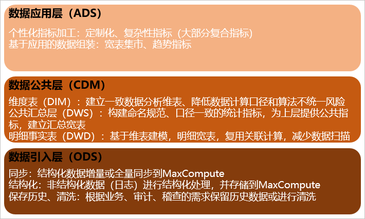
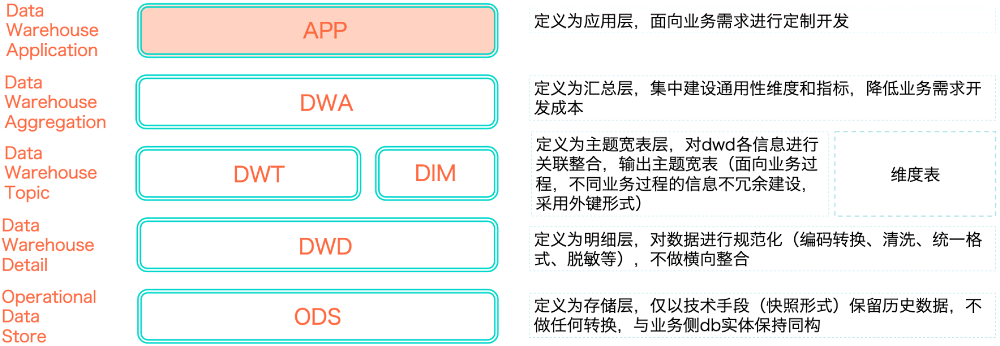
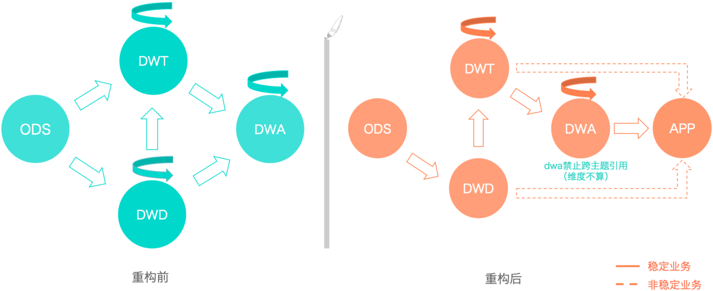
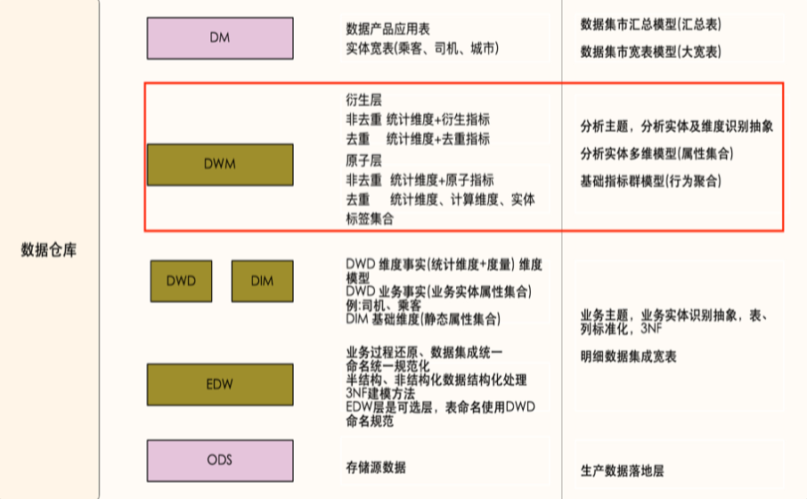
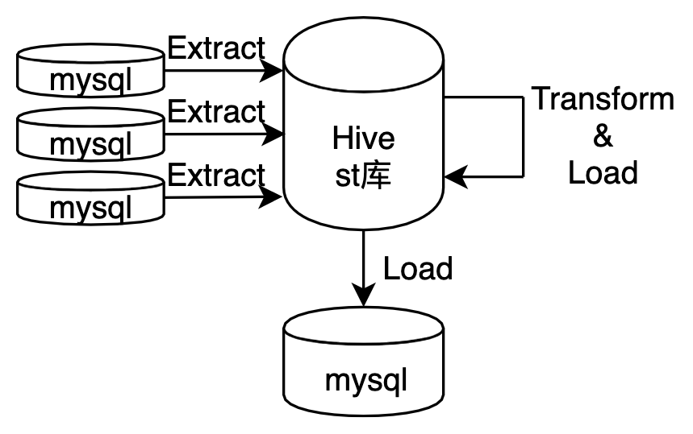
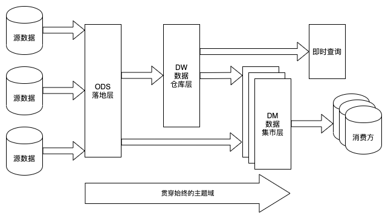
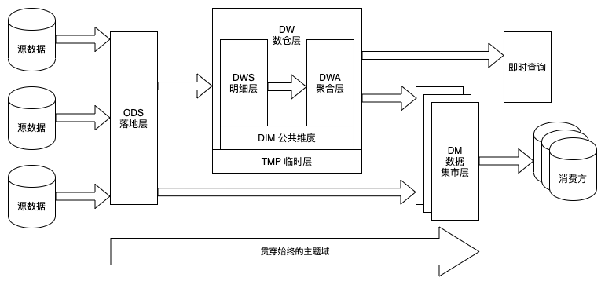
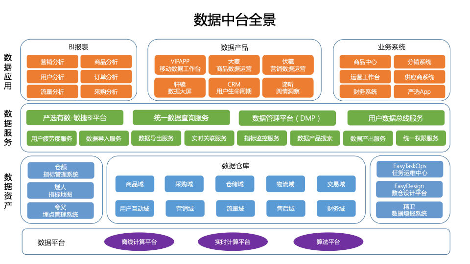

数仓分层
=============

### 阿里云
资料：<https://help.aliyun.com/document_detail/126215.html>

基于阿里巴巴OneData方法论最佳实践，在阿里巴巴的数据体系中，建议将数据仓库分为三层：**数据引入层（ODS，Operational Data Store）**、**数据公共层（CDM，Common Dimenions Model）和数据应用层（ADS，Application Data Store）**。

数据仓库自顶向下的分层和各层用途如下图所示。

* **数据引入层（ODS，Operational Data Store，又称数据基础层）**：将原始数据几乎无处理地存放在数据仓库系统中，结构上与源系统基本保持一致，是数据仓库的数据准备区。这一层的主要职责是将基础数据同步、存储到 MaxCompute（阿里云服务）。
* **数据公共层（CDM，Common Dimenions Model）**：存放明细事实数据、维表数据及公共指标汇总数据。其中，明细事实数据、维表数据一般根据ODS层数据加工生成。公共指标汇总数据一般根据维表数据和明细事实数据加工生成。**CDM层又细分为维度层（DIM）、明细数据层（DWD）和汇总数据层（DWS）**，采用维度模型方法作为理论基础， 可以定义维度模型主键与事实模型中外键关系，减少数据冗余，也提高明细数据表的易用性。在汇总数据层同样可以关联复用统计粒度中的维度，采取更多的宽表化手段构建公共指标数据层，提升公共指标的复用性，减少重复加工。
    * **维度层（DIM，Dimension）**：以维度作为建模驱动，基于每个维度的业务含义，通过添加维度属性、关联维度等定义计算逻辑，完成属性定义的过程并建立一致的数据分析维表。为了避免在维度模型中冗余关联维度的属性，基于雪花模型构建维度表。
    >在Dataphin（阿里云服务）中，维度层的表通常也被称为维度逻辑表。
    * **明细数据层（DWD，Data Warehouse Detail）**：以业务过程作为建模驱动，基于每个具体的业务过程特点，构建最细粒度的明细事实表。可以结合企业的数据使用特点，将明细事实表的某些重要属性字段做适当冗余，也即宽表化处理。
    > 在Dataphin中，明细数据层的表通常也被称为事实逻辑表。
    * **汇总数据层（DWS，Data Warehouse Summary）**：以分析的主题对象作为建模驱动，基于上层的应用和产品的指标需求，构建公共粒度的汇总指标表。以宽表化手段物理化模型，构建命名规范、口径一致的统计指标，为上层提供公共指标，建立汇总宽表、明细事实表。
    >在Dataphin中，汇总数据层的表通常也被称为汇总逻辑表，用于存放派生指标数据。
* **数据应用层（ADS，Application Data Store）**：存放数据产品个性化的统计指标数据，根据CDM层与ODS层加工生成。

### 华为云
资料：<https://support.huaweicloud.com/productdesc-dgc/dgc_07_004.html>
* **SDI**：Source Data Integration (SDI)又称贴源数据层。SDI是源系统数据的简单落地。
* **DWI**：Data Warehouse Integration (DWI)又称数据整合层。DWI整合多个源系统数据，源系统进来数据会有整合、清洗，基于三范式关系建模。
* **DWR**：Data Warehouse Report (DWR)又称数据报告层。 DWR基于多维模型，和DWI层数据粒度保持一致。
* **DM**：Data Mart (DM) 又称数据集市。DM面向展现层，数据有多级汇总。

### 美团
资料：<https://tech.meituan.com/2019/10/17/meituan-saas-data-warehouse.html>

&nbsp;

美团数仓数据流向

* 正常流向：ODS>DWD->DWT->DWA->APP，当出现ODS >DWD->DWA->APP这种关系时，说明主题域未覆盖全。应将DWD数据落到DWT中，对于使用频度非常低的表允许DWD->DWA。
* 尽量避免出现DWA宽表中使用DWD又使用（该DWD所归属主题域）DWT的表。
* 同一主题域内对于DWT生成DWT的表，原则上要尽量避免，否则会影响ETL的效率。
* DWT、DWA和APP中禁止直接使用ODS的表， ODS的表只能被DWD引用。
* 禁止出现反向依赖，例如DWT的表依赖DWA的表。

### 滴滴
资料：<https://mp.weixin.qq.com/s/-pLpLD_HMiasyyRxo5oTRQ>

主要采用维度建模方法进行构建，基础业务明细事实表主要存储维度属性集合和度量/原子指标；分析业务汇总事实表按照指标类别(去重指标、非去重指标)分类存储，非去重指标汇总事实表存储统计维度集合、原子指标或派生指标，去重指标汇总事实表只存储分析实体统计标签集合。

指标体系在数仓物理实现层面主要是结合数仓模型分层架构进行指导建设，滴滴的指标数据主要存储在DWM层，作为指标的核心管理层。

### 有赞
资料：<https://mp.weixin.qq.com/s/7hUUuOdsOHvB3oleQcW4Vg>

**一、混沌期**

在有赞大数据的初期，严格来说是没有数仓概念的：没有分层，没有主题域，也没有规范。

没有 ETL 工具，没有工作流的概念（或者说所有任务就是一个工作流），没有调度平台，当然更不会有数据字典和血缘关系了。

所有的数据处理任务都是用 python 写的，SQL 自然也就都作为字符串写在 python 文件里了。在一个大 python 项目里，任务之间的依赖关系，则是维护在一个配置文件里的。

**二、建设期**

（1）ODS 落地层

落地层 (Staging Area) 最初是作为介于业务源数据和数据仓库 ETL 之间的缓冲区而存在的。在 Hive 里它表现为一个独立的库，所有来自业务方的表都会先落到这个库里。

（2）DW 数仓层

数据仓库层在 Kimball 的数据仓库架构中应该映射的是数据展现层 (Presentation Area)，它承载了最复杂的 ETL 逻辑和建模，也是维度建模集中体现的一层。
>* 分层的误区
>
>Kimball 并没有对它做更细的层级划分。我们则依样画葫芦，根据当时业界较为通行的做法将整个数仓层又划分成了 dwd、dwb 和 dws 三层。然而我们却始终说不清楚这三层之间清晰的界限是什么，或者说我们能说清楚它们之间的界限，复杂的业务场景却令我们无法真正落地执行。
>
>由于缺乏维度层，我们的维表显得无处安放；由于缺乏临时层，我们的中间结果和对外发布的表混在了一起。最终，三级分层只完成了我们的数据流向规范——从 dwd 到 dwb 再到 dws，层级之间不可逆向依赖。

（3）DM 数据集市层

数据集市层 (Data Mart) 根据主题域的不同在物理上进行划分——它表现为多个相互独立的库，各个数据集市之间不允许做数据依赖。每个数据集市可以由该主题域的使用方在数据仓库规范下自行开发和建设。

**二、成熟期**

从业务层面看，数据仓库的核心是展现层和提供优质的服务。ETL 及其规范、分层等所做的一切都是为了一个更清晰易用的展现层。

**数仓层内部的划分不是为了分层而分层，它是数据仓库经过了建模和 ETL 之后真正开始对外提供服务的地方，因此数仓层内的划分更应该符合使用者的思维习惯。DW 内的分层没有最正确的，只有最适合你的。**

### 网易严选
资料：<https://mp.weixin.qq.com/s/7PQocW3Fg97kOXdvpSttQA>

**数据仓库分层没有绝对的规范，适合的就是最好的，特别是企业已经有一个初版的数仓的时候，需要做好改造成本和可理解性之间的平衡。**

以业务数据的流向划分，目前严选数据把模型分为三层，ods，dw和dm层。其中ods是操作数据层，保留最原始的数据；dw包含dwd和dws层，这两层共同组成中间层；dm是应用层，基于dw层做汇总加工，满足各产品、分析师和业务方的需求。

* **ODS层（操作数据层）**：不对外开放，把业务系统数据同步到数仓。数据格式保留业务系统的数据格式；目前主要通过datahub解析binlog来实现的，目前严选的ods层数据同步主要以全量数据为主。
* **DWD层（明细层）**：对外开放，主要作用是沉淀一些公共的逻辑，常用维度属性的关联等，下游经常在一起使用的模型会在这一层做宽表处理，减少事实表和维表的关联，减少重复的关联加工。
* **DWS层（汇总层）**：对外开放，主要沉淀严选数据的公共指标，dws层是整个严选数据对外开放和使用的核心，是严选最核心的数据资产。
* **DIM层（维表）**：对外开放，主要是一些常用维表，比如商品维表、sku维表、渠道维表。
* **DM层（应用层）**：对产品开放使用，支持数据产品、报表的使用，主要是不公用复杂指标的汇总和计算。