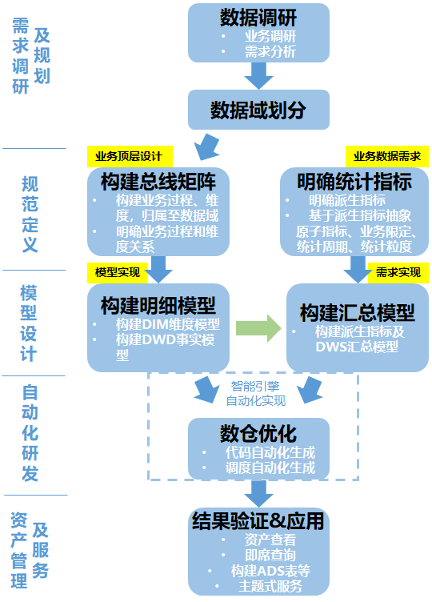
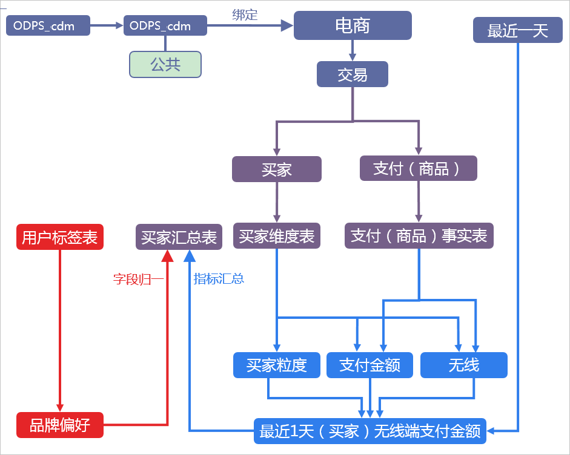

阿里云数仓规划
=============
- [阿里云数仓规划](#阿里云数仓规划)
  - [数仓构建流程](#数仓构建流程)
      - [基本概念](#基本概念)
      - [数仓概念示意图](#数仓概念示意图)
      - [数仓概念实例](#数仓概念实例)
  - [数据调研](#数据调研)
      - [确定需求](#确定需求)
      - [分析业务过程](#分析业务过程)
  - [架构设计与规范定义](#架构设计与规范定义)
      - [划分数据域](#划分数据域)
      - [定义维度与构建总线矩阵](#定义维度与构建总线矩阵)
      - [明确统计指标](#明确统计指标)
  - [模型设计](#模型设计)
      - [技术架构选型](#技术架构选型)
      - [数仓分层](#数仓分层)
        - 1、[数据引入层（ODS）](#1、数据引入层（-ods）)
        - 2、[维度层（DIM）](#2、维度层（-dim）)
        - 3、[明细数据层（DWD）](#3、明细数据层（-dwd）)
        - 4、[汇总数据层（DWS）](#4、汇总数据层（-dws）)
  - [主题式查询](#主题式查询)

本文资料链接：<https://help.aliyun.com/document_detail/125731.html>

## 数仓构建流程

#### 基本概念
* **业务板块**：业务板块定义了数据仓库的多种命名空间，是一种系统级的概念对象。当数据的业务含义存在较大差异时，您可以创建不同的业务板块，让各成员独立管理不同的业务，后续数据仓库的建设将按照业务板块进行划分。
  > 在Dataphin中，项目可以归属至业务板块以实现规范建模功能，同一个业务板块中可能包含多个不同的项目，所以业务板块与项目的关系为1：N。
* **数据域**：数据域主要用于存放同一业务板块内不同概念的指标。例如，您可以划分出商品域、交易域、会员域等，用于存放不同意义的指标。
* **业务过程**：业务过程即业务活动中所有的事件，通常为不可拆分的事件。创建业务过程，是为了从顶层视角，规范业务中的事务内容的类型及唯一性。
* **维度**：维度即进行统计的对象。通常，维度是实际客观存在的实体。
  >Dataphin遵循Ralph Kimball的维度建模理论，创建维度，即从顶层规范业务中实体（或称主数据）的存在性及唯一性。维度及维度组合，也是派生指标的统计粒度。
* **指标**：指标分为原子指标和派生指标。派生指标是以原子指标为基准，组装统计粒度、统计周期及业务限定而生成的。
    * **原子指标**是对指标统计口径、具体算法的一个抽象。根据计算逻辑复杂性，
    * > Dataphin将原子指标分为两种：
        >* **原生的原子指标**：例如支付金额。
        > * **衍生原子指标**：基于原子指标组合构建。例如，客单价通过支付金额除以买家数组合而来。
    * **派生指标**是业务中常用的统计指标。为保证统计指标标准、规范、无二义性地生成，
      > OneData方法论将派生指标抽象为四部分：**派生指标=原子指标+业务限定+统计周期+统计粒度**。例如，如果支付金额为原子指标，则最近7天买家支付金额（统计粒度为买家、时间周期为最近7天）和最近7天买家支付宝支付金额（统计粒度为买家、业务限定为支付宝支付、时间周期为最近7天）都可以作为派生指标
* **业务限定**：统计的业务范围，用于筛选出符合业务规则的记录（类似于SQL中where后的条件，不包括时间区间）。原子指标是计算逻辑的标准化定义，业务限定则是条件限制的标准化定义。
* **统计周期**：统计的时间范围，也可以称为时间周期。例如最近1天、最近30天等（类似于SQL中where后的时间条件）。
* **统计粒度**：统计分析的对象或视角，定义数据需要汇总的程度，可以理解为聚合运算时的分组条件（类似于SQL中group by的对象）。粒度是维度的一个组合，指明您的统计范围。例如，某个指标是某个卖家在某个省份的成交额，则粒度就是卖家、省份这两个维度的组合。如果您需要统计全表的数据，则粒度为全表。在指定粒度时，您需要充分考虑到业务和维度的关系。统计粒度也被称为粒度，是维度或维度组合，一般用于派生指标构建，是汇总表的唯一性识别方式。

#### 数仓概念示意图 

#### 数仓概念实例

## 数据调研
#### [确定需求](https://help.aliyun.com/document_detail/125830.html)
确定数仓构建的目标与需求，进行全面的业务调研。需要了解真实的业务需求是什么，以及确定整个业务系统能解决什么问题。
#### [分析业务过程](https://help.aliyun.com/document_detail/125831.html)
用户在业务系统中，通过埋点或日常积累的方式，获取了充足的业务数据。为梳理数据之间的逻辑关系和流向，需要理解用户的业务过程及数据系统。

## 架构设计与规范定义
#### [划分数据域](https://help.aliyun.com/document_detail/125902.html)
数据仓库是面向主题的应用，主要功能是将数据综合、归类并进行分析利用。数据仓库模型设计除横向的分层外，通常还需要根据业务情况纵向划分数据域。数据域是联系较为紧密的数据主题的集合，是业务对象高度概括的概念层次归类，目的是便于数据的管理和应用。

#### [定义维度与构建总线矩阵](https://help.aliyun.com/document_detail/125936.html)
根据阿里巴巴OneData方法论，明确每个数据域中有哪些业务过程后，您需要开始定义维度，并基于维度构建总线矩阵。

#### [明确统计指标](https://help.aliyun.com/document_detail/126177.html)
统计指标包括派生指标、原子指标、业务限定、业务过程和统计粒度（即维度）。在设计模型前，建议先完成该部分工作，以便设计出易于使用的数据仓库。

## 模型设计
#### [技术架构选型](https://help.aliyun.com/document_detail/126409.html)
根据阿里巴巴OneData方法论最佳实践，在设计数据模型前，需要完成技术架构的选型。
>本例中使用阿里云大数据产品Dataphin配合MaxCompute，完成整体的数据建模和研发流程。
>
>完整的技术架构如下。其中，Dataphin的数据集成及同步负责完成源业务系统数据引入。MaxCompute作为整个大数据开发过程中的离线计算引擎。Dataphin则基于OneData方法论——OneModel、OneID、OneService，囊括了数据建模研发、运维中心、监控报警、数据资产等在内的一系列功能。

#### [数仓分层](https://help.aliyun.com/document_detail/126215.html)
基于阿里巴巴OneData方法论最佳实践，在阿里巴巴的数据体系中，建议将数据仓库分为三层：数据引入层（ODS，Operational Data Store）、数据公共层（CDM，Common Dimenions Model）和数据应用层（ADS，Application Data Store）。

##### 1、[数据引入层（ODS）](https://help.aliyun.com/document_detail/126973.html)
基于阿里巴巴OneData方法论最佳实践，ODS层存放从业务系统获取的最原始的数据，是其他上层数据的源数据。业务数据系统中的数据通常为长期累积的、非常细节的数据，且访问频率很高，是面向应用的数据。

##### 2、[维度层（DIM）](https://help.aliyun.com/document_detail/137615.html)
建立一致数据分析维表，可以降低数据计算口径和算法不统一风险。以维度作为建模驱动，基于每个维度的业务含义，通过定义维度及维度主键，添加维度属性、关联维度等定义计算逻辑和雪花模型，完成属性定义的过程并建立一致的数据分析维表。同时您可以定义维度主子关系，子维度的属性将合并至主维度使用，进一步保证维度的一致性和便捷使用性。

##### 3、[明细数据层（DWD）](https://help.aliyun.com/document_detail/126689.html)
基于阿里巴巴方法论最佳实践，事实表（事实模型，又称事实逻辑表）作为数据仓库维度建模的核心，紧紧围绕着业务过程进行设计。业务过程是通过事实表的度量、引用的维度与业务过程有关属性的方式获取。
> Dataphin支持两种类型的事实表：
> * 事务型事实表：用于描述业务过程，跟踪空间或时间上某点的度量事件，保存的是最原子的数据，也称为原子事实表，表名后缀一般为di。
> * 周期快照型事实表：以具有规律性的、可预见的时间间隔（例如每天、每月、每年等）记录事实，一般表名后缀为df。

##### 4、[汇总数据层（DWS）](https://help.aliyun.com/document_detail/126913.html)
汇总数据层以分析的主题对象作为建模驱动，基于上层的应用和产品的指标需求构建公共粒度的汇总表。汇总数据层的一个表通常会对应一个统计粒度（维度或维度组合）及该粒度下若干派生指标。

## [主题式查询](https://help.aliyun.com/document_detail/138886.html)
主题式查询是基于Dataphin加工出的逻辑表，运用逻辑SQL对数据进行的AdHoc查询。
> 基于Dataphin加工出的逻辑表，运用逻辑SQL对数据进行的AdHoc查询

