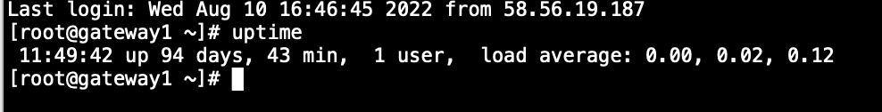

附：服务性能指标
=============
### QPS（Queries Per Second 每秒能够响应的查询次数）
 
QPS 是一台服务器每秒能够相应的查询次数，即1秒内完成的请求数量，是对一个特定的查询服务器在规定时间内所处理流量多少的衡量标准。如在因特网上，作为域名系统服务器的机器的性能经常用每秒查询率来衡量。每秒的响应请求数，也即是最大吞吐能力。
### TPS（Transactions Per Second，每秒处理的事务数目）

一个事务是指一个客户机向服务器发送请求然后服务器做出反应的过程。客户机在发送请求时开始计时，收到服务器响应后结束计时，以此来计算使用的时间和完成的事务个数，最终利用这些统计分析作出评估。

TPS 的过程包括：客户端请求服务端、服务端内部处理、服务端返回客户端。

> 例如，访问一个web页面的展示可能会请求服务器多次，包括一次 html，一次 css，一次 js，一次images，那么访问这一个页面就会产生 1 个“T”，产生 4 个“Q”。
#### QPS 与 TPS 的区别
如果是对一个接口（单场景）压测，且这个接口内部不会再去请求其它接口，那么 TPS 等于 QPS。否则，若这个接口内部还会再去请求其它接口（如上述html，css，image等），那么 TPS 不等于 QPS。

### RT（Response Time 响应时间）
响应时间是指执行一个请求从开始到最后收到响应数据所花费的总体时间，即从客户端发起请求到收到服务器响应结果的时间。

响应时间一般由网络传输时间、CPU执行时间、线程等待时间（IO等待，sleep, wait）时间组成，QPS和RT成反比关系。
### RPS（Requests Per Second） = QPS = 吞吐率
吞吐率是服务器并发处理能力的量化描述，和响应时间成反比，单位是 reqs/s，指的是某个并发用户数下单位时间内处理的请求数。某个并发用户数下单位时间内能处理的最大的请求数，称之为最大吞吐率。

### 并发用户数
并发用户数就是指在某一时刻同时向服务发送请求的用户总数从服务的角度来看，实际并发用户数也可以理解为服务当前维护的代表不同用户的文件描述符总数，也就是并发连接数（建立的TCP连接数）。
> 不同于并发请求数，一个用户也许会发出多条请求

### 最佳线程数

性能压测的情况下，起初随着并发用户数的增加，吞吐率会上升，当到了一定的阀值之后，并发用户数增加吞吐率并不会增加，或者增加不明显，同时请求的响应时间却大幅增加，这个阀值我们认为是最佳线程数。

刚好消耗完服务器的瓶颈资源的临界线程数，公式如下

> 最佳线程数量 =（（线程等待时间 + 线程CPU执行时间）/ 线程CPU执行时间）* CPU数量

#### 特性：
* 在达到最佳线程数的时候，线程数量继续递增，则吞吐率不变，而响应时间变长，持续递增线程数量，则吞吐率开始下降
* 每个系统都有其最佳线程数量，但是不同状态下，最佳线程数量是会变化的
* 服务器瓶颈可以是 CPU、内存、锁资源，IO
* 超过最佳线程数，会导致资源的竞争；超过最佳线程数，响应时间会递增。

#### 为什么要找最佳线程数
* 过多的线程只会造成，更多的内存开销，更多的 CPU 开销，对提升吞吐率确毫无帮助
* 找到最佳线程数后通过简单的设置，可以让服务更加稳定，得到最高、最稳定的吞吐率输出
 
#### 最佳线程数的获取：
* 通过并发用户数慢慢递增来进行性能压测，观察吞吐率，响应时间
* 公式计算：最佳线程数量 =（（线程等待时间 + 线程 CPU 执行时间）/ 线程 CPU 执行时间）* CPU 数量

#### 影响最佳线程数的主要因素
##### IO
IO 开销较多的应用其 CPU 线程等待时间会比较长，所以线程数量可以开的多一些，相反则线程数量要少一些
##### CPU
对于耗CPU的计算，这种情况一般来讲只能开到CPU个数的线程数量。 

### 系统平均负载
系统平均负载指是处于可运行状态和不可中断状态的进程的平均数量。即单位时间内，系统处于可运行状态和不可中断状态的平均进程数，也就是平均活跃进程数，它和 CPU 使用率并没有直接关系。

* 可运行状态的进程，包括正在使用CPU的进程，和正在等待CPU的进程。
    * 对应于ps命令输出的STAT列中状态为R的进程。
    * 状态R：running or runnable (on run queue)

* 不可中断状态的进程，表示正在等待其它系统资源的进程，例如等待磁盘I/O。
    * 对应于ps命令输出的STAT列中状态为D的进程。
    * 状态D：uninterruptible sleep (usually IO)。
    * 不可中断状态实际上是系统对进程和硬件设备的一种保护机制。比如，当一个进程向磁盘读写数据时，为了保证数据的一致性，在得到磁盘回复前，它是不能被其他进程或者中断打断的。

因此，在平均负载把不可中断状态的进程考虑进去之后，我们称之为系统平均负载或Linux平均负载，而不是CPU平均负载。

以上表示1分钟、5分钟、15分钟的负载情况

**情况一**：
* 如果平均负载为0.0，则表示系统处于空闲状态。
* 如果1分钟的平均值高于5分钟或15分钟的平均值，则表示负载正在增加。
* 如果1分钟的平均值低于5或15分钟的平均值，则表示负载正在减少。
* 如果平均负载高于系统的CPU数量，那么系统可能会遇到性能问题。
**情况二**：
* 如果 1 分钟、5 分钟、15 分钟的三个值基本相同，或者相差不大，那就说明系统负载很平稳。
* 但如果 1 分钟的值远小于 15 分钟的值，就说明系统最近 1 分钟的负载在减少，而过去 15 分钟内却有很大的负载。
* 反过来，如果 1 分钟的值远大于 15 分钟的值，就说明最近 1 分钟的负载在增加，这种增加有可能只是临时性的，也有可能还会持续增加下去，所以就需要持续观察。一旦 1 分钟的平均负载接近或超过了 CPU 的个数，就意味着系统正在发生过载的问题，这时就得分析调查是哪里导致的问题，并要想办法优化了。

如果平均负载为2，在只有1个CPU的系统中，那么有一半的进程可能竞争不到CPU。

#### 平均负载与 CPU 使用率
平均负载是指单位时间内，处于可运行状态和不可中断状态的进程数。所以，它不仅包括了正在使用 CPU 的进程，还包括等待 CPU 和等待 I/O 的进程。

而 CPU 使用率，是单位时间内 CPU 繁忙情况的统计，跟平均负载并不一定完全对应。比如：
* CPU 密集型进程，使用大量 CPU 会导致平均负载升高，此时这两者是一致的；
* I/O 密集型进程，等待 I/O 也会导致平均负载升高，但 CPU 使用率不一定很高；
* 大量等待 CPU 的进程调度也会导致平均负载升高，此时的 CPU 使用率也会比较高。

#### 平衡负载多少正常
当平均负载高于 CPU 数量 70% 的时候，你就应该分析排查负载高的问题了。一旦负载过高，就可能导致进程响应变慢，进而影响服务的正常功能。

对于具有多个CPU的系统，通常可以先将平均负载除以处理器数量。然后再通过查看CPU的使用率、IO等待、上下文切换等进行排查问题。

&nbsp;
[ 回到章节：《一、找问题》 ](./一、找问题.md)