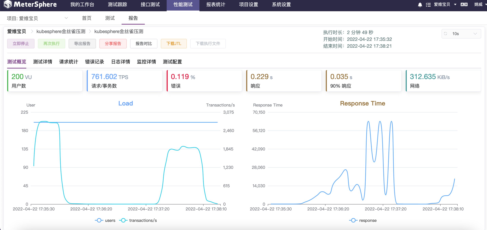

一、找问题
=============
### 1. 对平台业务的了解
平台业务现状决定着服务的特点，如平台的有效用户量/设备量，业务平峰期、业务高峰期、业务低谷期的情况

> **以我们业务为例**：
> 
> 典型的2B再2C的业务，为幼儿园提供SaaS系统和链接家庭的家校互动平台。累计服务了数万幼儿园与千万规模的家庭用户。
> - 园所端的用户体量涉及不到高并发与高性能，只需保证高可用即可。
> - 家长端有千万级的用户规模，是高并发、高可用、高性能服务的标准场景。
> - 源于用户使用场景，在清晨家长送孩子与中午时间家长休息时是使用APP的高峰期，幼儿园工作日白天属于平峰期，夜晚和周末属于低谷期。
> - 源于业务发展特点，在每年的开学季是业务的高峰期+增峰期，原有系统面临着极大的挑战和压力。

### 2. 对衡量系统性能数据指标的了解
实际工作中发现很多后台同事对基本的性能衡量指标缺乏了解，无法评估系统的性能水平。

> **一些常见衡量指标**
> - **RT（响应时间）**
> 
>   系统对请求作出响应的时间
> - **Throughput（吞吐量）**
> 
>   吞吐量是指系统在单位时间内处理请求的数量，和响应时间成反比
> - **并发用户数**
> 
>   同时在线（建立TCP长连接）用户数
> - **RPS（Requests Per Second）**
>   - **QPS（ Queries Per Second）**
> 
>       对于一个查询服务，每秒的响应请求数
>   - **TPS（Transactions Per Second ）**
>   
>       服务器每秒处理的事务数。TPS包括一条消息入和一条消息出，加上一次数据库访问
> - **平均负载（Load averages）**
> 
>   是指单位时间内，处于可运行状态和不可中断状态的进程数。所以，它不仅包含了正在使用 CPU 的进程，还包括等待 CPU 和等待 I/O 的进程。
>   - CPU 密集型进程，使用大量 CPU 会导致平均负载升高，此时这两者是一致的
>   - I/O 密集型进程，等待 I/O 也会导致平均负载升高，但 CPU 使用率不一定很高
>   - 大量等待 CPU 的进程调度也会导致平均负载升高，此时的 CPU 使用率也会比较高
> 
> ……
> 
> **压测报告示例**    
> 
> 
图 MeterSphere压测报告

### 3. 对技术框架、技术组件的了解
实际工作中发现很多同事对所采用的技术框架、技术组件仅仅限于了解和基本应用，但掌握不透彻，应用有限，无法发挥其有效价值。

> 服务端架构中常见的微服务，数据库（关系型、NoSQL），消息队列，云服务组件等。

### 4. 对技术原理的了解
浅尝辄止是做好技术工作的大忌，如果对技术原理缺乏了解，造成潜在问题的同时，出现问题无法快速定位问题。

> 如我们在某年开学季遭遇的服务不可用问题，由于系统某几个接口响应超时产生了级联影响，导致集群单服务器堆积了太多的TCP并发连接，相应耗尽了系统的多种核心资源。同事却因为这种表现现象却直接选择水平拓展资源，而没意识到是接口响应缓慢导致并发连接累积造成socket 句柄资源耗尽和CPU等待造成的高负载的问题，既浪费了资源又没解决问题。
> 在这个场景中涉及到
> - 对TCP和Socket编程原理的理解
> - 长连接：是指在一个连接上可以连续发送多个数据包，在连接保持期间，如果没有数据包发送，需要双方发链路检测包。
> - 短连接：短连接是指通讯双方有数据交互时，就建立一个连接，数据发送完成后，则断开此连接，即每次连接只完成一项业务的发送。
> - 并发连接：并发连接指客户端向服务器发起请求并建立了TCP连接的总和
> - ……

### 5. 系统的全局观
涵盖系统开发、系统测试、服务治理、运维保障

>除去技术开发环节，在系统测试环节的故障注入、压力测试……等演练，在服务治理环节的自动缩扩容、熔断降级……等演练，在运维保障环节的监控、告警、处理机制等。

### 6. 技术债务情况
业务复杂度、数据复杂度、技术复杂度

> - 在需求和业务积累过程中导致系统架构复杂化、数据架构复杂化，需要择期进行系统重构。
> - 在前期技术选型时技术框架落后，需要择期升级技术框架。